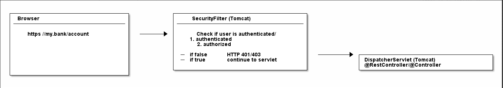

## Web Application Security: 101

**Authentication**: Khi tương tác với ứng dụng thì thường ứng dụng sẽ yêu cầu đăng nhập (có thể là user/password, ...) để biết được ông user đang tương tác là ai. 

**Authorization**: Sau bước authen thì cần phải kiểm tra ông user này có những quyền gì (role) khi tương tác với ứng dụng. Để đảm bảo ông user này chỉ được thao tác và truy cập vào những tài nguyên cho phép.

**Servlet Filter**: 



```Java
public class SecurityServletFilter extends HttpFilter {

    @Override
    protected void doFilter(HttpServletRequest request, HttpServletResponse response, FilterChain chain) throws IOException, ServletException {
        /**
         * Lấy thông tin 
         */
        UsernamePasswordToken token = extractUsernameAndPasswordFrom(request);  // (1)

        if (notAuthenticated(token)) {  // (2)
            // either no or wrong username/password
            // unfortunately the HTTP status code is called "unauthorized", instead of "unauthenticated"
            response.setStatus(HttpServletResponse.SC_UNAUTHORIZED); // HTTP 401.
            return;
        }

        if (notAuthorized(token, request)) { // (3)
            // you are logged in, but don't have the proper rights
            response.setStatus(HttpServletResponse.SC_FORBIDDEN); // HTTP 403
            return;
        }

        // allow the HttpRequest to go to Spring's DispatcherServlet
        // and @RestControllers/@Controllers.
        chain.doFilter(request, response); // (4)
    }
```
```sql
CREATE DATABASE jwt_auth;
CREATE USER 'jwt_auth'@'%';
GRANT ALL PRIVILEGES ON jwt_auth.* To 'jwt_auth'@'%' IDENTIFIED BY 'jwtAuth';
```

## Nguồn
- [devwithus.com](https://devwithus.com/spring-boot-rest-api-security-jwt/)
- https://www.javainuse.com/spring/boot-jwt
- https://medium.com/geekculture/implementing-json-web-token-jwt-authentication-using-spring-security-detailed-walkthrough-1ac480a8d970