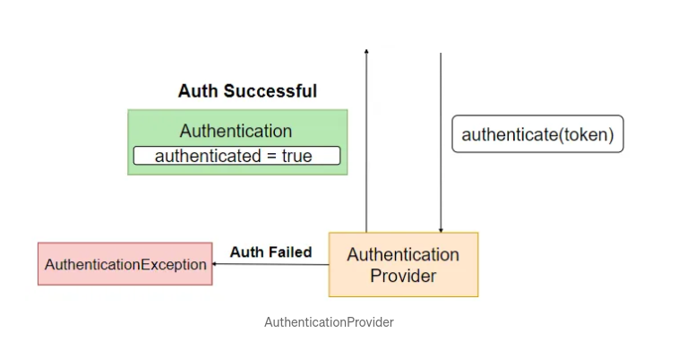

## Components

1. **Authentication Filter**: It's a filter in the FilterChain which detects an authentication attempt and forward it to authenticationManager.
2. **Authentication**: This component specifies the type of authentication to be conducted. Its is an interface. It's implementation specifies the type of `Authentication`. For example, UsernamePasswordAuthenticationToken is an implementation of the Authentication interface which specifies that the user wants to authenticate using a username and password.
3. **Authentication Manager**: Việc chính của ông này là gọi authenticate() đúng với `AuthenticatonProvider` hỗ trợ. Một application có thể có nhiều `AuthenProvider`, VD: LdapAuthenticationProvider, OpenIDAuthenticationProvider,.. Ông _Authentication Manager_ sẽ quyết định AuthenticationProvider nào bằng cách gọi hàm support(), nếu hàm support() của AuthenticationProvider nào trả về true thì nó sẽ được sử dụng để xử lý việc authentication.

    
    Trong hình trên thì thấy có 3 AuthenticationProvider, trong đó có ông `AuthenticationProvide2` là có hàm support() trả về true, tức sẽ được dùng để xử lý việc authen. Khi Authen thành công thì set authenticated = true và trả về object `Authenticaton`.

4. **Authentication Provider**: Là một interface xử lý việc authentication. Một AuthenticationProvider sẽ có hàm authenticate() tham số Authentication và xử lý authen bên trong nó. Khi authentication trả về thành công thì `AuthenticationProvider` return `Authentication` giống kiểu với `Authentication` khi truyền vào authenticate() và authenticated = true. Nếu fails thì throw exception.

    
    Hầu hết các ứng dụng sẽ sử dụng username/password để authen. Tức trước khi xử lý authen thì cần lấy thông tin user theo username. Sử dụng UserDetailService (interface của spring security) overvide lại hàm loadUserByUsername(String username) để lấy thông tin user/password, role,... của user.   
    
5. **UserDetailService**: Là interface có sẵn của spring security chịu trách nhiệm lấy thông tin user từ database. Viết class để implement `UserDetailService` Override hàm loadUserByUsername(String username) -> trả về UserDetail (username, password, roles).
    


## The Big Picture


```sql
CREATE DATABASE jwt_auth;
CREATE USER 'jwt_auth'@'%';
GRANT ALL PRIVILEGES ON jwt_auth.* To 'jwt_auth'@'%' IDENTIFIED BY 'jwtAuth';
```

## Nguồn
- [devwithus.com](https://devwithus.com/spring-boot-rest-api-security-jwt/)
- https://www.javainuse.com/spring/boot-jwt
- https://medium.com/geekculture/implementing-json-web-token-jwt-authentication-using-spring-security-detailed-walkthrough-1ac480a8d970