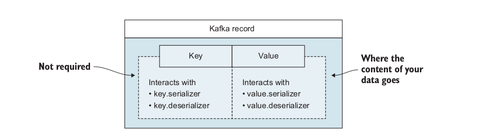

# Kafka

- [Kafka](#kafka)
  - [Introduction](#introduction)
  - [Kafka with Docker](#kafka-with-docker)
  - [Producing and consuming a message](#producing-and-consuming-a-message)


## Introduction

## Kafka with Docker

Deploy kafka với docker-compose

```yaml
version: '2'
services:
  zookeeper:
    image: confluentinc/cp-zookeeper:latest
    environment:
      ZOOKEEPER_CLIENT_PORT: 2181
      ZOOKEEPER_TICK_TIME: 2000
    ports:
      - 22181:2181
  
  kafka:
    image: confluentinc/cp-kafka:latest
    depends_on:
      - zookeeper
    ports:
      - 29092:29092
    environment:
      KAFKA_BROKER_ID: 1
      KAFKA_ZOOKEEPER_CONNECT: zookeeper:2181
      KAFKA_ADVERTISED_LISTENERS: PLAINTEXT://kafka:9092,PLAINTEXT_HOST://localhost:29092
      KAFKA_LISTENER_SECURITY_PROTOCOL_MAP: PLAINTEXT:PLAINTEXT,PLAINTEXT_HOST:PLAINTEXT
      KAFKA_INTER_BROKER_LISTENER_NAME: PLAINTEXT
      KAFKA_OFFSETS_TOPIC_REPLICATION_FACTOR: 1
```

```shell
docker-compose -f kafka-docker-compose.yml up -d
```
## Producing and consuming a message

Khi sử dụng Kafka giống như là queue, message bus hoặc data storage platform, bạn thường xuyên sử dụng Kafka bằng cách viết một `producer` để đẩy data (message) lên Kafka và viết `consumer` để đọc data (message) từ Kafka.

**1. What is message?**

Một `message` (record), message là cách mà Kafka define data. Mỗi message bao gồm: `timestamp`, `value` và optional `key`.



**2. What are brokers?**

`Brokers` có thể được coi là server side của Kafka. Trước khi có VM và K8s, bạn có thể nhìn thấy một `broker` trên một máy vật lý. Bởi vì hầu hết tất cả cluster điều có nhiều hơn một server (node).

**3. What is Topic?**

Topic là `stream of data`, luồng lưu trữ dự liệu của Kafka, có thể hiểu đơn giản là Topic giống như table trong DB. Topic name giống như table name, các row trong table giống như các messages trong topic được insert vào.

Tạo topic `kinaction_helloworld` để producing message đến topic kafka:

```shell
docker exec -it <cp-kafka-container-id> sh

kafka-topics --create --bootstrap-server kafka:29092 --replication-factor 1 --partitions 3 --topic kinaction_helloworld
```

**4. What are Partitions**

Explains:

- `--topic kinaction_helloworld`: Tên topic.
- `--partitions 3`: Định nghĩa partitions của topic, ở đây partitions=3 có nghĩa là chia topic `kinaction_helloworld` thành 3 phần
