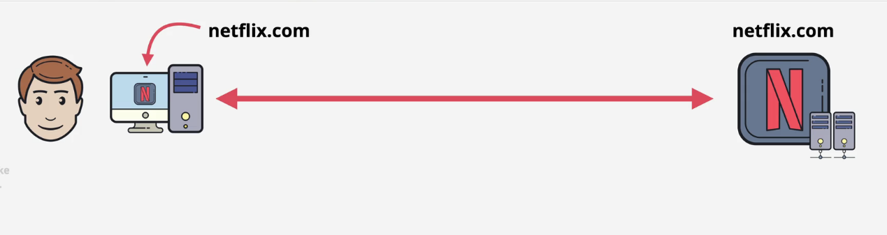
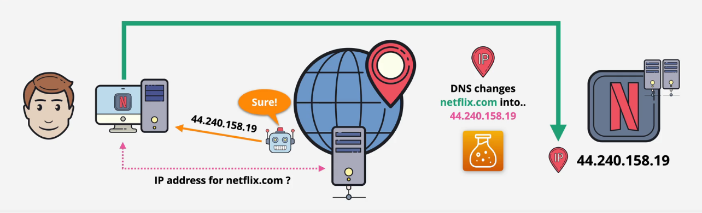
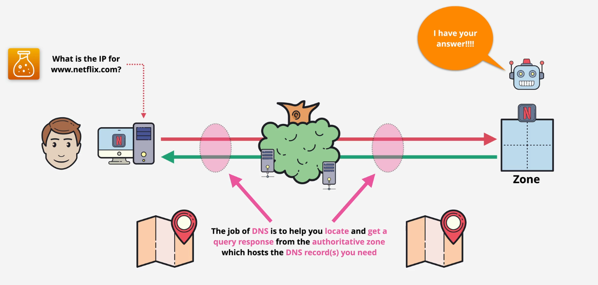
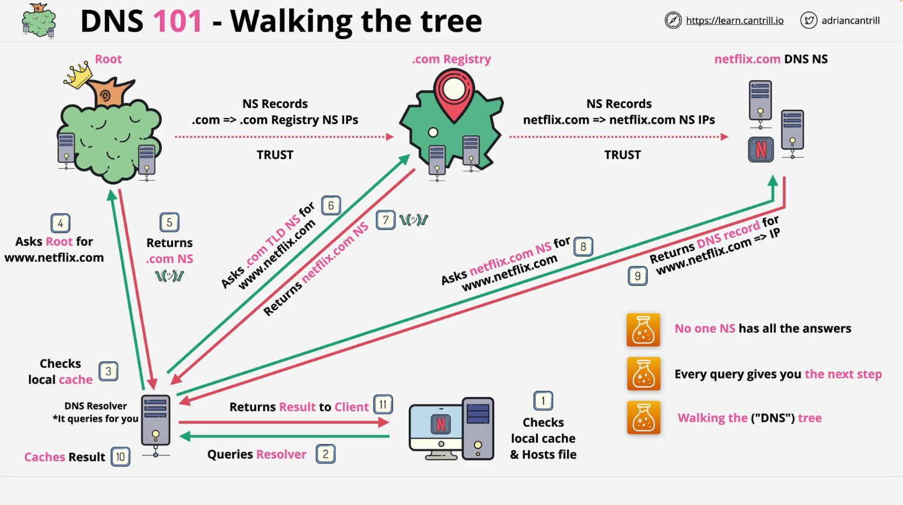

# DNS 101

- [DNS 101](#dns-101)
  - [What is does?](#what-is-does)
  - [How DNS actually work?](#how-dns-actually-work)
    - [How query work within DNS](#how-query-work-within-dns)

## What is does?

When you access to any website, example: `www.netflix.com` you might imagine that name is uesed to connect to the `netflix.com` server and stream your movie or TV show, but that's not actually how it work or any internet app works. To connect to `netflix` server, your computer and any networking in between needs the IP address of the `Netflix` servers. DNS server links names to IP address. 

**1. DNS (Domain Name System)**

The DNS (Domain name system), more commonly known as `DNS` is netwoking system that allow you resole human-friendly name to unique IP address.

**2. Domain Name**

Domain name is the human-friendly name that we used to access internet resource. For instance, `www.netflix.com` is domain name. The URL `www.netflix.com` is access with server owned by `Netflix`. The Domain name system allow you access `Netflix` servers with domain name.

**3. IP Address**

IP address is what we call a network addressable localtion. Each IP address must be unique within its network. When we are taking ablout websites. this is the entire internet. With DNS , we maps a name to that address so that you do not remember IP addess for each you access to servers.

When using DNS when accessing `Netflix`, we ask DNS for the IP Address of `netflix` and DNS Server return IP address. Your computer will use IP address (return from DNS) to access `Netflix` server. DNS change `netflix.com` to IP `44.240.158.19`.

## How DNS actually work?

When you access to website, example `www.netflix.com` you need IP address which provides services for that name, `DNS Zone` which link `www.netflix.com` to one or more IP address. The issies is how do we find this zone?

### How query work within DNS

When access to `www.netflix.com` computer need get IP address through domain name is `www.netflix.com`. Picture below describe step to query IP address through domain name.

**Giải thích:**

- **<u>Step 1</u>**: First computer check local cache and Hosts file. `Hosts file` is static file mapping `Domain name` to `IP address` and overrides DNS. If Local cache and Hosts file is aware of the DNS name, client send request to server otherwise to next step.
- **<u>Step 2</u>**: Which is where we use a `DNS resolve`. `DNS resolve` is a type of DNS server often running on a home router or within a internet provider. 
- **<u>Step 3</u>**: `DNS resolve` also has a local cache, which is used to speed up DNS querues. and so if anyone else has queried `www.netflix.com` before and it might be able to return.
- **<u>Step 4</u>**: Nếu mà không có Domain `www.netflix.com` được queries trước đó thì `DNS resolve` sẽ phải queries đến `Root zone` thông qua `root servers`. `DNS root` cũng không trả lời được câu hỏi của chúng ta bởi vì nó cũng không biết về `www.netflix.com`, mà nó giúp mình thực hiện những bước khác. `Root zone` chứa các bản gi của `.com`, từ bản ghi `.com` thì sẽ tìm ra được các IP của Name server registry `.com` (TLD).
- **<u>Step 5</u>**: `Root servers` trả về chi tiết của `.com TLD NS` cho `DNS Resolve`. Bây giờ thì `DNS resolve` có thể thực hiện query đến `.com TLD NS`.
- **<u>Step 6</u>**: `DNS resolve` thực hiện query đến `.com TLD NS` thông tin về cái domain `www.netflix.com`. Giả sử trước đó `netflix.com` domain đã được đăng ký trước đó thì `.com Register` sẽ chứa bản ghi để map từ `netflix.com` => `netflix.com` DN IPs.
- **<u>Step 7</u>**: `.com Registry` sẽ trả về cho `DNS Resolve` thông tin chi tiết về `netflix.com DNS NS`.
- **<u>Step 8</u>**: `DNS Resolve` sẽ thực hiện query đến `netflix.com DNS NS` để lấy thông tin về `www.netflix.com`. Bởi vì `netflix.com DNS NS` là có quyền với cái domain này bởi vì họ host the zone và `Zone file` cho cái domain này
- **<u>Step 9</u>**: `netflix.com DNS NS` sẽ trả về cho `DNS Resolve` cái `DNS record` mapping giữa `www.netflix.com` => IP address. 
- **<u>Step 10</u>**: Lúc này thì `DNS Resolve` sẽ cached lại kết quả để tăng tốc độ truy vấn cho những lần truy cập sau.
- **<u>Step 11</u>**: 