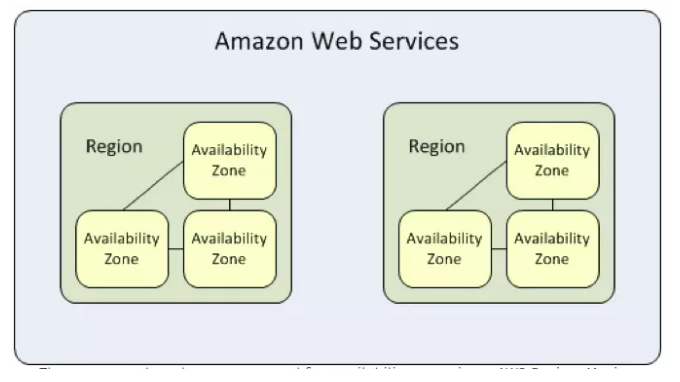
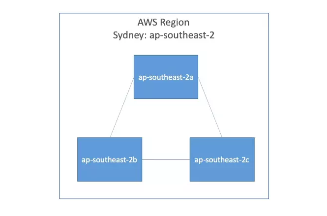
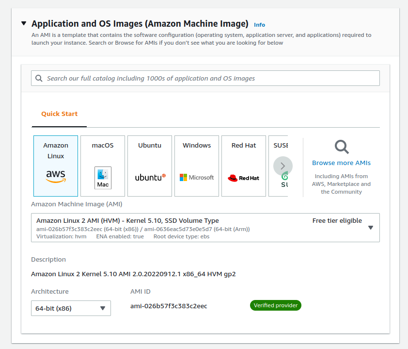
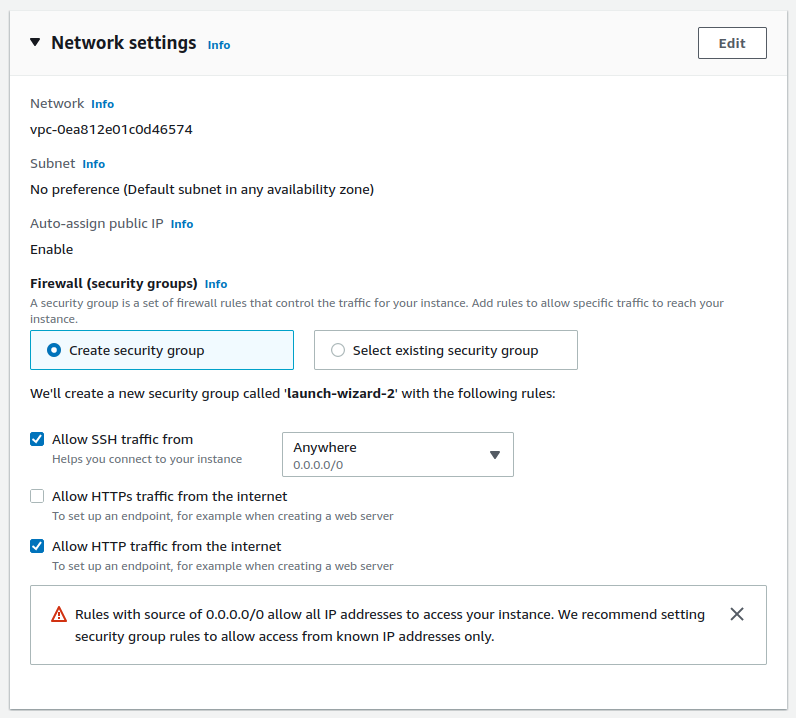
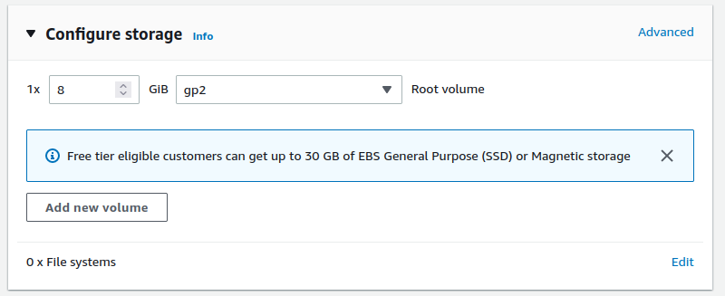
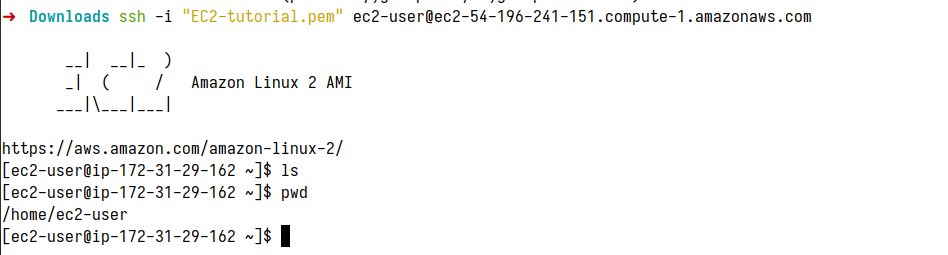

# Amazon EC2 basic

## 1. Amazon EC2 Instance

EC2 Instance là máy ảo được tạo trên server vật lý, nhưng mà ec2 instance hoạt động giống như máy chủ vật lý thật. Có thể access to storage, memory, và network. EC2 instance được tạo ra bằng những mô tả về những phần cứng mà muốn ec2 instance có.

- Các đặc tính của Amazon EC1:

  0. **Scaling:**

     - Scaling Up/Down: Tăng/Giảm (CPU, RAM,..) của instance.
     - Scaling In/Out: Tăng/giảm số lượng instance.

  1. **Security:**

     - Có thể thiết lập rank IP Private dành cho riêng EC1.
     - Sử dụng Security Group và NACLS để control inbound/outbound.

  2. **Cost:**

     - On-Demand instance: Tính theo giờ, đáp ứng nhu cầu dùng trong thời gian ngắn. Dùng bao nhiêu, trả bấy nhiêu.
     - Reserved instance: Cho phép trả trước 0 lượng server cho 1 hoặc 3 năm. Chi phí chỉ bằng 75% so với On-Demand.

**Provisioning Your Instance**

You configure your instance OS and software stack, hardware specs (CPU, memory, storage, and network performance), and env before launching it. The OS defined by Amazon Machine Image (AMI) you chose, and hardware follows the instance type.

**Instance Type**

## 2. Configuring an Environment for your instance

Deciling where your EC2 instance will live is a important as choosing a performance configuration. Here, there are three primary details to get right: Region, virtual private cloud (VPC), and tenancy model.

## 2.1 AWS Regions

AWS Region là các vị trí địa lý trên TG, nơi mà AWS tập chung xây dựng cơ sở hạ tầng. Trong mỗi region thì có nhiều availability zone (AZ), các region là độc lập.



## 2.2 AWS availability zone (AZ)



Bên trong Region sẽ có nhiều `availbility zone` (AZ), mỗi `AZ` là một hoặc nhiều datat center rời rạc. Các `AZ` sẽ tách biệt nhau về mặt địa lý nên vd 1 `AZ` bị tèo thì vẫn còn những `AZ` khác không bị ảnh hưởng. Mặc dù tách biệt nhau về mặt địa lý nhưng các `AZ` này đều được kết nối với nhau bằng một hệ thống mạng với băng thông cao và độ trễ thấp, đủ để đảm bảo các tác vụ đồng bộ dữ liệu giữa các `AZ`.

## 3. Thử tạo một EC2 instance.

1. Vào AWS Console -> chọn EC2.
2. Chọn OS (AMI- Amazon Machine Image):

   

   - Amazon linux 2 AMI nằm trong Free Tier.
   - 64 bit (x86).

3. Chọn EC2 instance type:

   

   - Chọn loại instance type (t2.micro) để dùng free tier trong năm đầu sử dụng, 1 CPU, 1GiB memory.

4. Networking settings:

   

5. Storage:

   

6. Connect EC2 via SSH:

   ```powershell
   # chmod 400 <file.pem>
   chmod 400 EC2-tutorial.pem
   # Connect to your instance using its Public DNS
   ssh -i "EC2-tutorial.pem" ec2-user@ec2-54-196-241-151.compute-1.amazonaws.com
   ```

   
