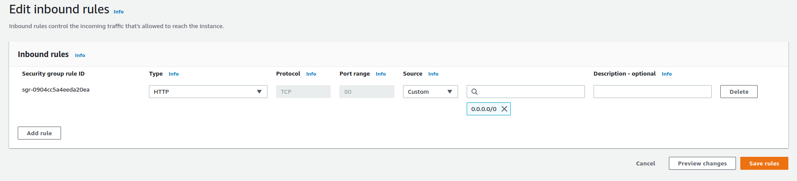
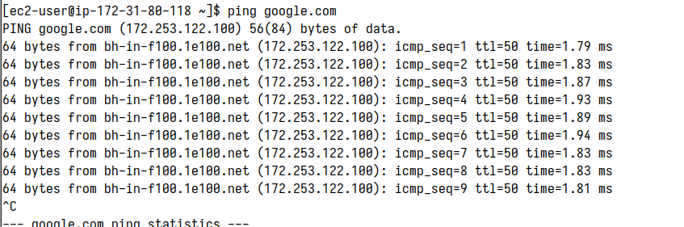

# Introduction to Security group

- Security group control how traffic allowed into or out of our EC2 instances.

- Security groups only contain `allow` rules.
- Security groups are actiong as a `filewall` on EC2 instances.
- They regulate:

  - Access to Ports.
  - Authorised IP ranges - IPv4 and IPv6.
  - Control of inbound network (from other to instances).
  - Control of outbound network (from instance to other).

## Hands-on

1. **Check Security group of ec2 instance**  
   

   Hình trên là mình có tạo một EC2 instance, khi tạo ec2 instance thì đã được tạo sẵn `security group` ở đây là: `sg-09b07af78e6fd36ce`. Có `Inbound rules` và `Outbound rules`:

   - **Inbound rules:**

     - `sgr-02da71d0b0e4b0897`:
       - `source`: 0.0.0.0/0 (có thể connected everywhere), `Port range`: 22 (có thể connected thông qua ssh).
     - `sgr-0904cc5a4eeda20ea`:
       - `source`: 0.0.0.0/0 (có thể connected everywhere), `Port range`: 80 (truy cập ec2 instance qua http).

   - **Outbound rules:**

     - `sgr-042db14b9fa304fb6`: có thể truy cập ra bên ngoài.

2. **SSH to EC2 instance**:

   - Cần phải có private key file. File này khi tạo instance thì sẽ có.
   - `chmod 400 <private-key-file>`. Ex: `chmod 400 EC2-tutorial.pem`.
   - Connect ec2 instance thông qua Public IP hoăc Public DNS. Ex: `ssh -i "EC2-tutorial.pem" ec2-user@ec2-3-91-183-21.compute-1.amazonaws.com`.

3. **Inbound rules**

   

   Vì `inbound rules` default đang là có thể connected ce2 instance thông qua ssh nên khi thử connect ec2 instance vẫn oke.

   

   Giờ thử thực hiện xóa rule có thể connected thông qua ssh rồi thử connected lại xem sao.

   

   Thử connect ec2 instance lại sau khi xóa inbound rule connect thông qua ssh.

   

   Thấy nó cứ treo ở đây mãi, chắc là không connect tới được ec2 instance thông qua ssh đâu :D.

4. **Outbound rules**

   

   Vì `Outbound rules` default đang để là từ bên trong EC2 instance có thể truy cập đến tất cả mọi thứ bên ngoài.

   

   Thử thực hiện ping đến `google.com` thì thấy là ec2 instance có truy cập đc ra ngoài.
