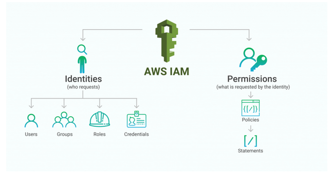
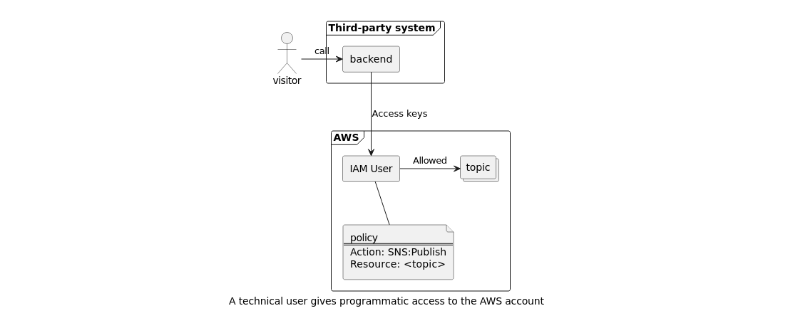
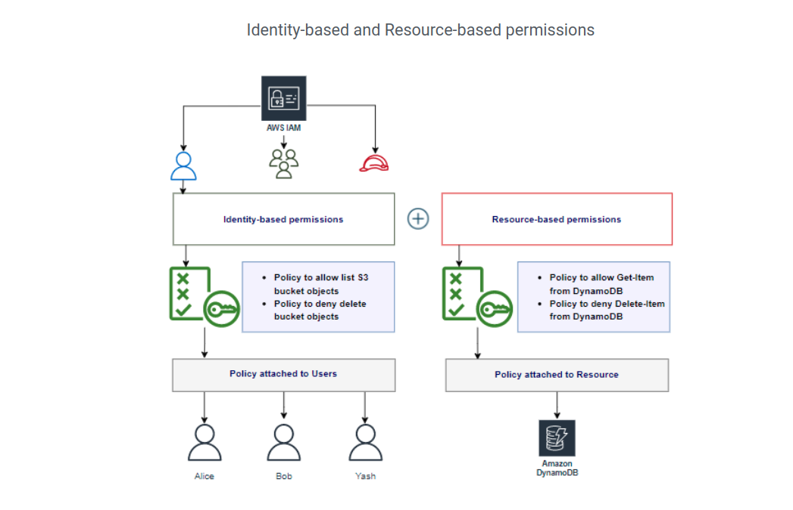
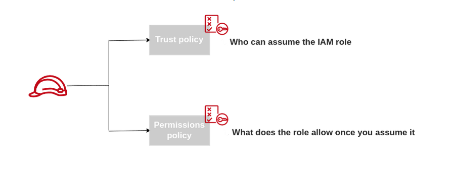
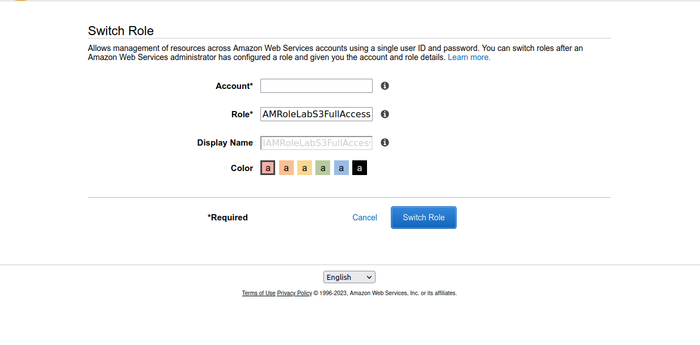
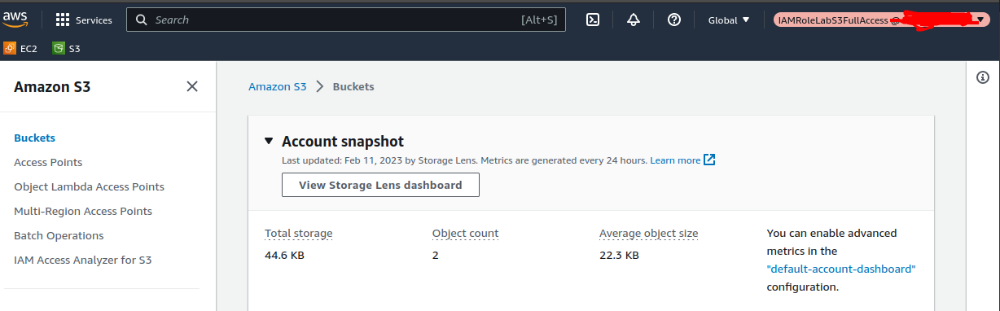
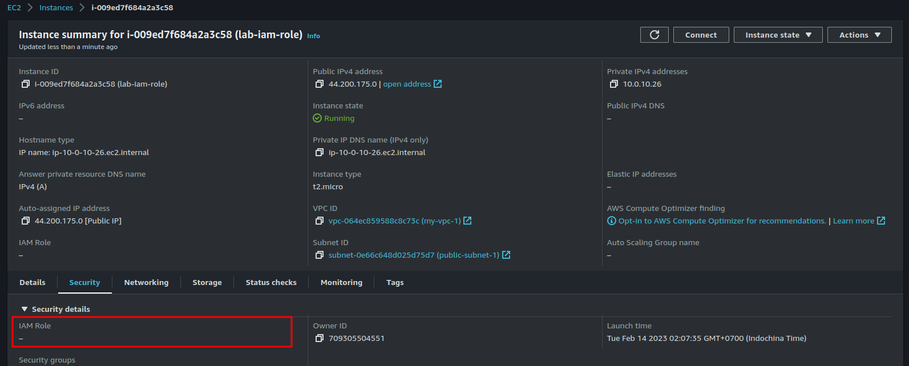
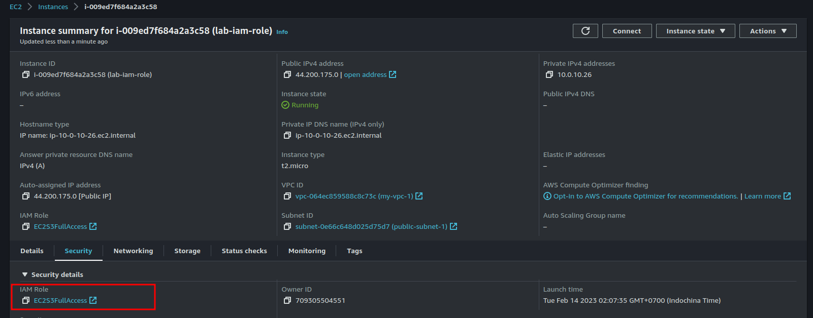

# AWS Identity and Access Management (IAM)



- [AWS Identity and Access Management (IAM)](#aws-identity-and-access-management-iam)
	- [**1. Introduction**](#1-introduction)
	- [**2. What are IAM User?**](#2-what-are-iam-user)
	- [**3. What is IAM Group?**](#3-what-is-iam-group)
	- [**4. IAM Policy and Permissions**](#4-iam-policy-and-permissions)
		- [**4.1 Types of IAM Policies**](#41-types-of-iam-policies)
		- [**4.2 Indentity-based Policies**](#42-indentity-based-policies)
		- [**2.3 Resource-based Policies**](#23-resource-based-policies)
		- [**2.4 Kết hợp giữa Identity-based Policies và Resource-based Policies**](#24-kết-hợp-giữa-identity-based-policies-và-resource-based-policies)
	- [**5. IAM Role**](#5-iam-role)
		- [**5.1 IAM Role là gì?**](#51-iam-role-là-gì)
		- [**5.2 Structure of an IAM Role**](#52-structure-of-an-iam-role)
		- [**5.3 Create an IAM Role**](#53-create-an-iam-role)
		- [**5.4 Types of IAM Roles**](#54-types-of-iam-roles)
	- [**6. IAM labs**](#6-iam-labs)

## **1. Introduction**

AWS IAM (Identity and Access Management) cho phép kiểm soát việc tương tác với các resource trên AWS. Có hai keywork ở đây là "Who" và "Permissions". "Who" refer to specific identity, which can be a **user**, **user group** or **role**. "Permissions" refer to the **policies** that attach to an identity. "Permissions" description **allow** or **deny** identity access to resource on AWS.

## **2. What are IAM User?**

Trong AWS có một loại IAM User nhưng sẽ phụ thuộc vào cách sử dụng những IAM User này thì có thể chia thành 2 loại IAM User là: `natural` và `technical` users.

`Natural` user được tạo ra cho "con người" sử dụng và thường sẽ gắn với một người nào đó, ở đây có thể là (Developer, DevOps,...). VD một ông Dev muốn truy cập S3 bucket thì sẽ được gắn các policies cần thiết cho việc truy cập S3 này. Loại user này có thể sử dụng user/password truy cập vào AWS console hoặc dùng secretKey để truy cập thông qua CLI. Nếu có nhiều user cùng công việc thì có thể tạo group và gắn policies trên group thay vì gắn cho từng user.


`Technical` users cho phép các services truy cập vào tài nguyên trên AWS. VID có một service backend cần gửi notifications đến SNS topic. Trong trường hợp này, bạn có thể tạo một user, generate accessKey và gắn các policies để user này có thể gửi notification đến SNS topic. Service backend sẽ sử dụng accessKey của technical user mới tạo để thực hiện gửi notifications đến SNS topic.



## **3. What is IAM Group?**

IAM User can placed in IAM Group. IAM Group make it easier to organies a large number IAM Users. IAM Group can attach permisstion to group level instead attach permissions to each IAM User.

Each IAM User can placed in multiple IAM Groups. Example a user can placed in DevOps Group and Developer Group. 

## **4. IAM Policy and Permissions**

IAM Policies is a set of rules let you define permisstions such as:

- Who can access to AWS resources?.
- Which AWS resoueces are allowed to access?
- What actions allowed or deny?
- When AWS resources can be acceed?



By default, IAM identity (User, user group, role) start with no permisstions. IAM identity need permisstions for access AWS resources. AWS permisstions managed by IAM Policies.

### **4.1 Types of IAM Policies**

- **Identity-based policies**: Identity-based policies are policies attach to AWS identities like IAM User, IAM Group, IAM Roles. For example, you can attach IAM Policies to IAM User called "BOB" to list item in S3 bucket. 

  - **Managed Policies**: Là những policies được gắn với IAM identity như: IAM User, IAM Group, IAM Role, có thể tái sử dụng.
  
    - **AWS Managed**: These policies are create, update, managed by AWS. By default, there are many pre-defined AWS managed policies available in your AWS account.

    - **Customer Managed**: These policies are create, update, manage by Customer. Customer can create their own policies for customized environment. By default, in your aws account dont have any customer managed policies.
  
  - **Inline Policies**: Là những policies nhúng trực tiếp vào một identity nào đó (user, group, role). Quan hệ 1-1 với identity, những policies này thì không tái sử dụng được và sẽ bị xóa đi nếu các identity bị xóa.

- **Resource-based policies**: Resource-based policies là những policies sẽ được gắn với các resource (S3, EC2,...) trên AWS.

### **4.2 Indentity-based Policies**

Identity-based policies are the easier of the two, as some variation of it is present in most system. They **define what an indentity can do**, sush as a user access to an S3 bucket.

There are two types of identites in AWS (**users** and **roles**). By attaching a policies to an identity you can give it permisstions to access resources. For example, you can attach this policy to allow a user read an object in an S3 bucket:

```json
{
	"Version": "2012-10-17",
	"Statement": [
		{
			"Action": [
				"s3:GetObject"
			],
			"Effect": "Allow",
			"Resource": "arn:aws:s3:::<bucket>/text.txt"
		}
	]
}
```
When attach the policy to an identity, a user in this case, there is no "Principal" field in the policy. The above policy defined permisstions to access S3 bucket.

**Note**: Groups are not identities but a way to attach policies to multiple user.

### **2.3 Resource-based Policies**

**Resource-based Policies** are attached to a resource. For example, you can attach resource-based policies to Amazon S3 buckets, Amazon SQS queues, VPC endpoints,.. Với resource-based policies, bạn có thể mô tả "who" có quyền truy cập đến resource và những hành động họ có thể thực hiện trên resource.

```Json
{
	"Version": "2012-10-17",
	"Statement": [
		{
      
			"Effect": "Allow", /* "Allow" hoặc "Deny"*/
			"Principal": "*", /* Mô tả các Identity (users, groups, roles)*/
			"Action": [      /* Các hành động sẽ "Allow" hoặc "Deny" */
				"s3:GetObject"
			],
			"Resource": [
				"<arn>/*"
			]
		}
	]
}
```

### **2.4 Kết hợp giữa Identity-based Policies và Resource-based Policies**

**Identity-based Policies** thì gắn các policies ở phía các Indentity (users, groups, roles), còn **Resource-based Policies** thì gắn các policies ở phía các resouseces (S3, SNS, EC2,..). Khi kết hợp cả hai loại policies này thì sẽ giúp cho việc cấp quyền cho một user thao tác trên AWS resources được chặt chẽ hơn.

VD: Ông user1 trong group Developers và group Developers này có Identity-based Policies là S3FullAccess. Nhưng vì ông user1 đang trong thời gian học việc tôi chỉ muốn cho ông user1 này quyền readOnly trên S3 thôi thì sẽ làm thế nào?

Tạo thêm 1 group nữa tên là DevelopersProbation và gắn cho quyền ReadOnly trên S3 rồi add ông user1 vào?. Cách này thì cũng được nhưng phải tạo hơi nhiều group. Có một cách khác là sử dụng Resource-based Policies để giới hạn quyền của ông user1 trên chính resource ở đây là S3.

- Identity-based Policies gắn với user1: `AmazonS3FullAccess`
```json
{
    "Version": "2012-10-17",
    "Statement": [
        {
            "Effect": "Allow",
            "Action": [
                "s3:*",
                "s3-object-lambda:*"
            ],
            "Resource": "*"
        }
    ]
}
```
- Resource-based Policies gắn trên S3 bucket.
```json
{
	"Version": "2012-10-17",
	"Statement": [
		{
			"Effect": "Allow",
			"Principal": {
				"AWS": "arn:aws:iam::<id>:user/user1"
			},
			"Action": ["s3:ListBucket", "s3:GetObject"],
			"Resource": "arn:aws:s3:::<bucket>/text.txt"
		}
	]
}
```

Quyền mà ông user1 này có sẽ là phép giao giữa `Identity-based Policies` và `Resource-based Policies`.

## **5. IAM Role**

### **5.1 IAM Role là gì?**

**Roles are not Permissions**. A role is also an authentication method like IAM Users and groups. As a user, a role is also a operator (could be a human, could be a machine).

Role do not have password or access keys. Instead, roles provide temporary security credentials to whoever asumes the role. Any of these entities can assume a role to use its permissions:

- AWS user from the same account.
- AWS user from a different account.
- AWS service.
- Federated identity.

### **5.2 Structure of an IAM Role**



**Trust policy**

These are policies that define and control which principals(IAM users, AWS services) can assume the role based on the specified conditions.

**Permission policy**

These are policies that the principals who assume the role are allowed to do once the assume it. 

### **5.3 Create an IAM Role**

*Step 1: Create custom trust policies:*
  
```json
{
	"Version": "2012-10-17",
	"Statement": [
		{
			"Sid": "Statement1",
			"Effect": "Allow",
			"Principal": {
			    "AWS": "<IAM_USER_ARN>"
			},
			"Action": "sts:AssumeRole"
		}
	]
}
```

*Step 2: Create permission policies:*

```json
{
	"Version": "2012-10-17",
	"Statement": [
	    {
	        "Effect": "Allow",
	        "Action": [
	            "s3:*",
	            "s3-object-lambda:*"
	        ],
	        "Resource": "*"
	    }
	]
}
```

*Step 3: Create "Switch role" button for switch role:*



- Account*: Account ID of IAM User (IAM user này cần phải được điền trong phần trust-policies).
- Role*: Cần ghi chính xác role muốn switch sang.

*Step 4: Bấm switch role.*



Như trên thì đã switch role thành công.

**NOTE**: Khi thực hiện assume một cái role nào đó (vd trên là role: `IAMRoleLabS3FullAccess`) thì sẽ chỉ có các permisstions mà role này được attach, các permisstions mà được attach cho IAM user sẽ không còn có hiệu lực nữa.

### **5.4 Types of IAM Roles**

AWS IAM roles can be classified into 5 major categories based on their *trust policies*:

- Service Role
- Service-Linked Role
- Web Identity role
- SAML 2.0 federation role
- Custom IAM role

**1.1. Service role**

By default even AWS services do not have access to the resources in the AWS account. `Service roles` enable AWS servies to access resources based on their requirements. `Service roles` allow AWS services to perform actions on your behalf by injeriting the permissions assigned to the service role.

**1.2. Where are service roles used?**

Most AWS services rely on service roles to to function properly. Example EC2 interact to S3 bucket such as get list bucket, putObject,..

**1.3 Create IAM roles**

Create IAM role EC2 interact S3.

*Step 1: Launch EC2 instance, this instance dont have any IAM role attached.*



*Step 2: Access IAM Service => create IAM Roles: `EC2S3FullAccess`*

- Trust policies:

```json
{
	"Version": "2012-10-17",
	"Statement": [
	    {
	        "Effect": "Allow",
	        "Principal": {
	            "Service": "ec2.amazonaws.com" /*Service EC2 được assume*/
	        },
	        "Action": "sts:AssumeRole"
	    }
	]
}
```

- Permisstions policies:
  
```json
{
	"Version": "2012-10-17",
	"Statement": [
	    {
	        "Effect": "Allow",
	        "Action": [
	            "s3:*",
	            "s3-object-lambda:*"
	        ],
	        "Resource": "*"
	    }
	]
}
```

Ở phần trên là tạo một IAM Role: `EC2S3FullAccess` với trust policies là service EC2 được assume và gán policies S3 full access.

```bash 
# Trước khi gắn IAM Role vào EC2 thì lấy danh sách s3 bucket sẽ không được.
[ec2-user@ip-10-0-10-26 ~]$ aws s3 ls 
Unable to locate credentials. You can configure credentials by running "aws configure".
[ec2-user@ip-10-0-10-26 ~]$ 

# Có thể config aws profile sử dụng accessKey trên EC2 này thì cũng có thể access vào S3. Nhưng làm như vậy thì accessKey có thể được nhìn thấy ở foler .aws => có thể sẽ không an toàn.
```

*Step 3: Attach IAM Role: `EC2S3FullAccess` to EC2 instance*


Sau khi attach IAM role thì sẽ thấy EC2 instance có IAM Role: `EC2S3FullAccess` rồi.



*Step 4: SSH vao EC2 instance để verify*

```bash
https://aws.amazon.com/amazon-linux-2/
16 package(s) needed for security, out of 16 available
Run "sudo yum update" to apply all updates.
[ec2-user@ip-10-0-10-26 ~]$ aws s3 ls 
Unable to locate credentials. You can configure credentials by running "aws configure".

# Đã access được vào S3 mà không cần config aws profile.
[ec2-user@ip-10-0-10-26 ~]$ aws s3 ls 
2023-01-31 07:59:10 thanhnb-test-policies
[ec2-user@ip-10-0-10-26 ~]$ 

```

## **6. IAM labs**

1. [Tạo iam user và iam user group.](https://github.com/nbthanh98/study/blob/master/learn-aws/iam/iam-labs.md)
2. [Tạo iam policies.](https://github.com/nbthanh98/study/blob/master/learn-aws/iam/iam-policies.md)