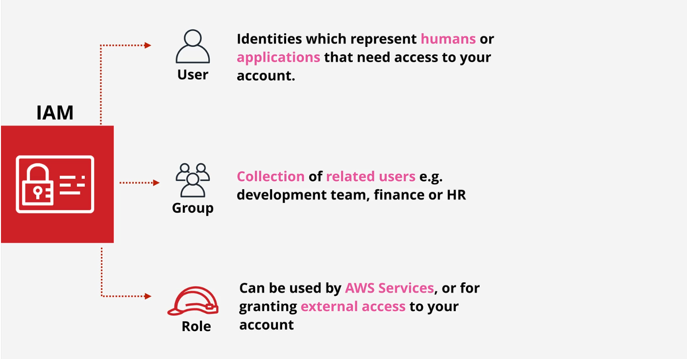

# AWS Identity and Access Management (IAM)

- [AWS Identity and Access Management (IAM)](#aws-identity-and-access-management-iam)
  - [**1. Introduction**](#1-introduction)
  - [**2. What are IAM User?**](#2-what-are-iam-user)
  - [**3. What is IAM Group?**](#3-what-is-iam-group)
  - [**4. IAM Policy and Permissions**](#4-iam-policy-and-permissions)

## **1. Introduction**

AWS IAM (Identity and Access Management) cho phép kiểm soát việc tương tác với các resource trên AWS. Có hai keywork ở đây là "Who" và "Permissions". "Who" refer to specific identity, which can be a **user**, **user group** or **role**. "Permissions" refer to the **policies** that attach to an identity. "Permissions" description **allow** or **deny** identity access to resource on AWS.

<<<<<<< HEAD
## **2. What are IAM User?**
=======
- `Identities`: Khi có một hành động nào đó tương tác với các resource trên AWS thì cần biết cái request đó là của ai (Authencation) có thể là của user, hoặc là của các entity khác. VD: Ông A đang muốn tạo một cái S3 Bucket.
- `Permissions`: Khi mà biết ông A là người request tạo S3 Bucket rồi thì cần phải biết cái request này của ông A có quyền thực hiện action đó hay không?. Thì các action mà ông A có thể làm sẽ được định nghĩa trong Policy.

`IAM Service `cho phép tạo 3 loại `IAM` khác nhau:

- `IAM user`: Là đại điện cho "người nào đó" hoặc application để truy cập tài khoản, tài nguyên. Mặc định khi tạo `IAM User` thì `IAM User` mới tạo sẽ không có quyền gì. Có 2 cách để xác thực `IAM User` đó là:

  - **Access key/secret**: Sử dụng khi sử dụng CLI/SDK hoặc cấu hình vào các application.
  - **User/password**: Sử dụng khi dùng AWS console.

- `IAM Group`: Là tạo ra một nhóm các IAM User có cùng quyền.
- `IAM Role`: Khá tưng tự như một user, trong đó user sẽ gán với permission policies để xác định user **có thể** và **không thể** làm gì trên AWS.
>>>>>>> 09ce66e09e5b7783213dd82b03cb9923df07f51d

Identity ở đây có thể là Developer, SysAdmin,... gọi chung là người (human) hoặc cũng có thể là các Applications mà cần tương tác với các resource trên AWS. If Identity is human can access to AWS resource by login to AWS Console with user/password. If Identity are applications can access to AWS resource with access keys.

## **3. What is IAM Group?**

IAM User can placed in IAM Group. IAM Group make it easier to organies a large number IAM Users. IAM Group can attach permisstion to group level instead attach permissions to each IAM User.

Each IAM User can placed in multiple IAM Groups. Example a user can placed in DevOps Group and Developer Group. 

## **4. IAM Policy and Permissions**

IAM Policies is Json document file let you define permisstions such as:

- Who can access to AWS resources?.
- Which AWS resoueces are allowed to access?
- What actions allowed or deny?
- When AWS resources can be acceed?