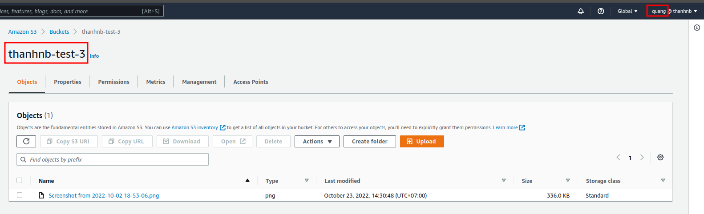
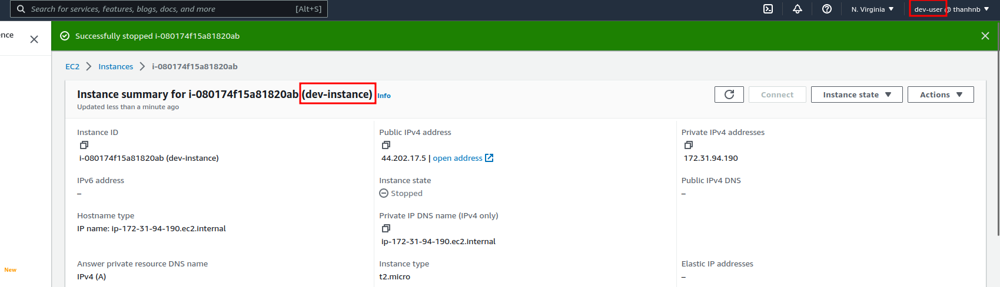
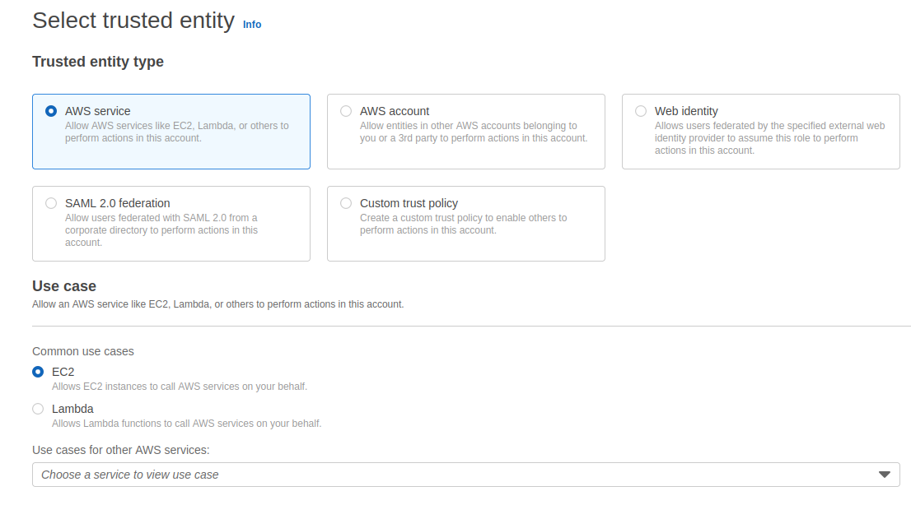

# AWS Identity and Access Management (IAM)


- [AWS Identity and Access Management (IAM)](#aws-identity-and-access-management-iam)
  - [**1. Introduction**](#1-introduction)
  - [**2. Users for authentication, and groups to organize users (hands-on 4.1)**](#2-users-for-authentication-and-groups-to-organize-users-hands-on-41)
  - [**3. Authenticating AWS resources with roles (hands-on 4.2)**](#3-authenticating-aws-resources-with-roles-hands-on-42)
  - [**4. Hands-on**](#4-hands-on)
    - [**4.1. Tạo một tài khoản mới (IAM user) và define `Policy` phân quyền truy cập đến S3 Bucket.**](#41-tạo-một-tài-khoản-mới-iam-user-và-define-policy-phân-quyền-truy-cập-đến-s3-bucket)
    - [**4.2 Assign IAM Role for EC2 Instance**](#42-assign-iam-role-for-ec2-instance)

## **1. Introduction**

Là một service giúp quản lý các quyền truy cập đến các resource của trên AWS. Resource ở đây là các users, các service của AWS (S3, lamda,...). Khi mà nghĩ đến IAM thì sẽ nghĩ đến `identities` and `permissions`:

- `Identities`: Khi có một hành động nào đó tương tác với các resource trên AWS thì cần biết cái request đó là của ai (Authencation) có thể là của user, hoặc là của các entity khác. VD: Ông A đang muốn tạo một cái S3 Bucket.
- `Permissions`: Khi mà biết ông A là người request tạo S3 Bucket rồi thì cần phải biết cái request này của ông A có quyền thực hiện action đó hay không?. Thì các action mà ông A có thể làm sẽ được định nghĩa trong Policy.
- `IAM user`: is used to authenticate people or workloads running outside of AWS.
- `IAM group`: is a collection of IAM users with the same permissions.
- `IAM role`: is used to authenticate AWS resources.
- `IAM identity policy`: is used to define the permissions for a user, group, or role.

## **2. Users for authentication, and groups to organize users (hands-on 4.1)**

Một User có thể `authenticate` bằng cách sử dụng username/password hoặc là access keys. Khi mà dùng `Management Console` thì cần user/pass, còn nếu mà dùng cli thì dùng access keys.

Để gán user có quyền được thao tác với một resouces nào đó trên AWS thì cần:

- Tạo Policy.

  Vào Management Console -> IAM -> Policy

  ```json
  {
    "Version": "2012-10-17",
    "Statement": [
      {
        "Effect": "Allow",
        "Action": "ec2:*",
        "Resource": "*",
        "Condition": {
          "StringEquals": {
            "ec2:ResourceTag/Env": "dev"
          }
        }
      },
      {
        "Effect": "Allow",
        "Action": "ec2:Describe*",
        "Resource": "*"
      },
      {
        "Effect": "Deny",
        "Action": ["ec2:DeleteTags", "ec2:CreateTags"],
        "Resource": "*"
      }
    ]
  }
  ```

  - `Version`: là fix luôn là `2012-10-17`, giống như apiVersion bên K8s vây.
  - `Statement`: là 1 mảng các object, trong các object này thì định nghĩa các action, effect, resource tương tác, ...
  - `Condition`: thêm các điều kiện.
  - Ở Policy json trên đều để `"Resource": "*"` tác động đến tất cả các resource, giờ muốn define chỉ tác động đến một số các resources cụ thể thôi thì sẽ dùng Amazon Resource Name (ARN):

    

    Lấy thông tin ARN này ở phần properties của service. Lúc đó thì cái `Policy` json sẽ như sau:

    ```json
    {
      "Version": "2012-10-17",
      "Statement": [
        {
          "Effect": "Allow",
          "Action": "ec2:TerminateInstances",
          "Resource": [
            "arn:aws:ec2:us-east-1:111111111111:instance/i-0b5c991e026104db9"
          ]
        }
      ]
    }
    ```

- Tạo IAM User, có thể gán luôn Policy cho IAM User hoặc tạo IAM User Group để có thể kế thừa lại Policy.
  - Vào Management Console -> IAM -> IAM User Group -> Tạo Group
  - Gán Policy mới tạo ở trên cho IAM User Group.
  - Tạo mới 1 IAM User rồi add vào IAM User group là oke.

## **3. Authenticating AWS resources with roles (hands-on 4.2)**

Đối với người dùng thì có thể authen qua user/pass hoặc access keys, vậy thì các resource tương tác với nhau thì authen thế nào?. Đó chính là sử dụng `IAM Role`.

VD. Giờ EC2 muốn tương tác với S3 thì cũng có thể tạo một cái IAM User thêm policy cho IAM User này để tương tác với S3 và EC2. Khi ssh vào EC2 thì dùng `aws configure`, điền `access key` và `secret access key`, cách này đã thử và vẫn chạy đc nha, nhưng theo sách thì nó không phải là `security best practices`.

Thay vì sử dụng IAM User để authen thì có thể sử dụng luôn IAM Role bất cứ khi nào cần authen AWS Resource giống như là EC2 instance. Khi mà sử dụng IAM Role thì các access key sẽ được injected vào EC2 Instance một các tự động.

- Vào Management Console -> IAM -> IAM Role
- Tạo Policy rồi gán với Role.
- Vào EC2 -> Security -> Modify IAM Role -> Chọn Role mới tạo ở trên.

## **4. Hands-on**

### **4.1. Tạo một tài khoản mới (IAM user) và define `Policy` phân quyền truy cập đến S3 Bucket.**

- Vào web consolve -> chọn dịch vụ IAM -> tạo tài khoản.

  

- Tạo Policy hoặc có thể dùng các Policy có sẵn.

  - Vào [awspolicygen](https://awspolicygen.s3.amazonaws.com/policygen.html) để thực hiện gen Policy.
  - Chọn service -> chọn Effect(Allow/Deny) -> chọn Action -> Điền ARN -> Gen Policy.

    ```json
    {
      "Version": "2012-10-17",
      "Statement": [
        {
          "Sid": "Stmt1666516164288",
          "Action": "s3:*",
          "Effect": "Allow",
          "Resource": [
            "arn:aws:s3:::thanhnb-test-3",
            "arn:aws:s3:::thanhnb-test-3/*"
          ]
        }
      ]
    }
    ```

  - Điền cái Policy mới gen đc ở trên vào phần Policy trên AWS.

    

  - Đặt tên và description cho policy => Tạo Policy.

    

- Gán Policy cho User -> chọn "Attach existing policies directly" -> search "s3-policy-test" mới tạo ở bước trên.

  

- Thực hiện tạo user là xong.
- Đăng nhập thử vào user "quang" mới tạo và access thử vào S3 bucket "thanhnb-test-3" xem có access đc hay không?

  User "quang" đã có thể truy cập đc đến S3 bucket "thanhnb-test-3".

  

  User "quang" KHÔNG truy cập đc đến S3 bucket "thanhnb-demo-s3" vì user "quang" đang không có Policy nào gắn với resource S3 bucket "thanhnb-demo-s3".

  

### **4.2 Assign IAM Role for EC2 Instance**

Lab được chia thành 4 phần:

1.  **Launch EC2 Instances with Tags (Xem chi tiết lab [tại đây](https://catalog.us-east-1.prod.workshops.aws/workshops/f3a3e2bd-e1d5-49de-b8e6-dac361842e76/en-US/basic-modules/30-iam/iam/1-iam)).**

    Sẽ tạo 2 EC2 instances: 1 instance dùng cho môi trường Dev và 1 instaince sung cho môi trường Prod. Sẽ sử dụng `tag` để phân biệt 2 instance này.

    

    - Vào [aws console](https://console.aws.amazon.com/console/home) -> search EC2 -> "Launch an instance".

      Đặt tên cho EC2 instance: `prod-instance` và thêm tag "env": "prod".

      

    - Các phần chọn "Instance type", "Network settings", "Configure storage" để default, có cái "Key pair (login)" thì tạo cái key pair mới.
    - Rồi bấm "Launch Instances" -> đợi chút cho AWS tạo Instance là Oke.
    - Thực hiện tương tự, tạo một EC2 instance với tên là "dev-instance" và tag là "env": "dev".
    - Đợi chút thì có 2 instance: `dev-instance` và `prod-instance`

      

2.  **Create AWS IAM Identities (Xem chi tiết lab [tại đây](https://catalog.us-east-1.prod.workshops.aws/workshops/f3a3e2bd-e1d5-49de-b8e6-dac361842e76/en-US/basic-modules/30-iam/iam/2-iam)).**

    

    Sẽ tạo `AWS IAM Identities`. `AWS IAM Identities` bao gồm: `IAM Users`, `IAM User groups`, and `IAM Roles`

    - Tạo `Policy` đến gán vào `IAM User group`.

      

    - Tạo `IAM User group` tên: `dev-group`.

      Vào `IAM` -> `User group` -> `create group` -> tên `dev-group` và gán policy: `DevPolicy` tạo ở trước trước -> Create group.

      

    - Tạo `IAM User` tên: `dev-user` -> thêm user này vào trong `IAM User Group`: `dev-group`.

      

3.  **Test the access for resources (Xem chi tiết lab [tại đây](https://catalog.us-east-1.prod.workshops.aws/workshops/f3a3e2bd-e1d5-49de-b8e6-dac361842e76/en-US/basic-modules/30-iam/iam/3-iam)).**

    - Login với tài khoản `dev-user` tạo trước đó.
    - Vào thử dịch vụ EC2 -> thử stop `dev-instance`.

      

      User `dev-user` vì nằm trong IAM User group `dev-group` nên có Policy là: `DevPolicy` -> có thể Stop `dev-instance` thành công.

    - Vào thử dịch vụ EC2 -> thử stop `prod-instance`.

      

      User `dev-user` vì nằm trong IAM User group `dev-group` nên có Policy là: `DevPolicy` -> có thể Stop `prod-instance` bị lỗi.

4.  **Assign IAM Role for EC2 Instance and Test the access (Xem chi tiết lab [tại đây](https://catalog.us-east-1.prod.workshops.aws/workshops/f3a3e2bd-e1d5-49de-b8e6-dac361842e76/en-US/basic-modules/30-iam/iam/4-iam)).**

    Tạo IAM Role để cho EC2 Instance có thể connect được đến S3 Bucket.

    - Tạo S3 Bucket: `test-iam-role-s3`.

      

    - Tạo IAM Role, tạo Policy để gán vào IAM Role.

      Vào IAM -> Role -> AWS Service -> EC2

      

      Tạo IAM Role: `IAMBucketTestRole` và gán Policy: `IAMBucketTestPolicy` đã tạo từ bước trước.

      

    - Vào EC2 -> Security -> Modify IAM Role -> Chọn Role `IAMBucketTestRole` mới tạo ở trên.

      

      Thực hiện SSH vào EC2 Instance, chạy `aws s3 ls` thì thấy báo lỗi trên nếu mà chưa add Role `IAMBucketTestRole` vào EC2.

      

      Còn nếu mà sau khi add Role `IAMBucketTestRole` vào EC2 thì chạy sẽ không còn báo lỗi nữa.

      
