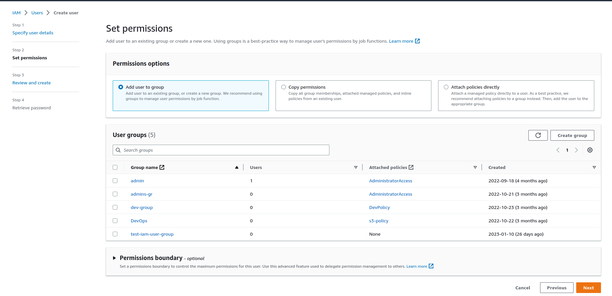

## **1. Introduction**

Phần này sẽ là các bài lab với AWS IAM.

### **2. Lab create users and user groups**

Task Details:

1. Sign into AWS Management Console.
2. Create IAM Users.
3. Create IAM Groups.
4. Validation of the lab

Step to perform labs:

1. Truy cập [AWS console](https://aws.amazon.com/console/).
2. Tìm service IAM (Identity and Access Management) => chọn User.
3. Bấm tạo mới User để sang màn hình tạo User.
    
- **Step 1**: Specify user details.
    
    

    Giải thích:
    - (1): Nhập user name ở đây là `test-iam`.
    - (2): Phần "Console password". Có thể để tự gen password hoặc custom password. Ở đây để tự gen password.
    - (3): Nếu tích phần này thì User sẽ phải đổi password mới ở lần đăng nhập đầu tiên.

- **Step 2**: Set permissions.
    
    Bước này cũng có thể bỏ qua. Nếu bỏ qua bước này thì user khi tạo ra sẽ không có quyền gì cả. Ở bước này tạm thời không thêm quyền cho user này.

    

- **Step 3**: Review and create

    

    Bước này thì review lại user sẽ tạo bao gồm: 

    - (1): Các thông tin chi tiết của user.
    - (2): Các thông tin về quyền sẽ gán cho user.
    - (3): Gán các tags để quản lý dễ hơn.
    
4. Bấm tạo mới `User groups` để sang màn hình tạo group.

- **Step 1**: Nhập tên của user group, ở đây là `test-iam-group`.
  
  

- **Step 2**: Thêm user vào trong group, ở đây thêm user `test-iam` mới tạo phía trên vào group.
  
  

- **Step 3**: Gắn các policies vào group, nếu gắn policies và group thì các user bên trong group cũng sẽ có các policies này.
  
  

- **Step 4**: Bấm tạo group là sẽ tạo được group `test-iam-group`.
  
  