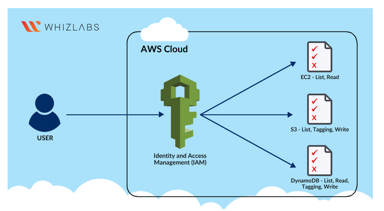
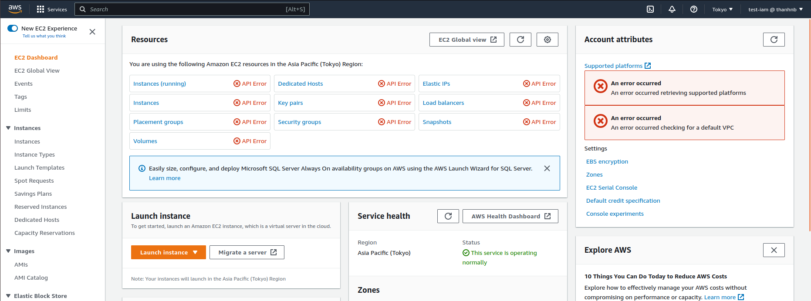
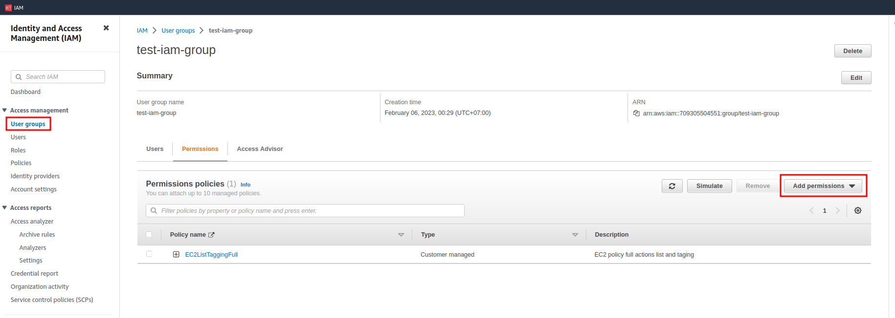
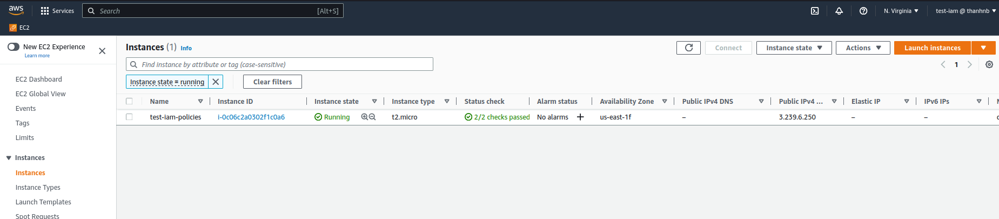
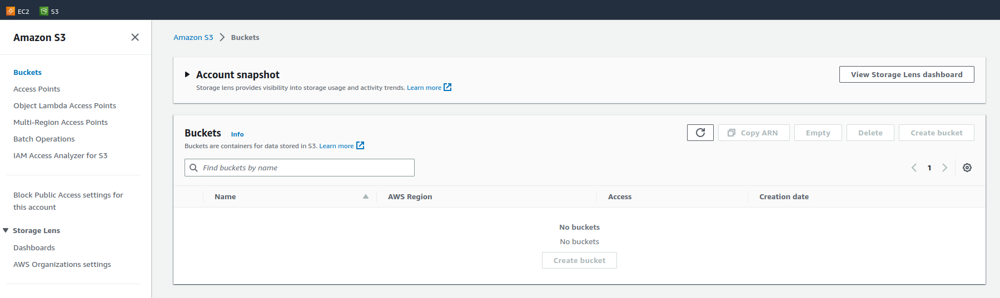
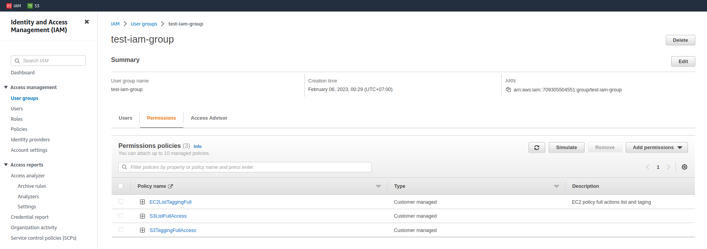

## **1. Introduction**

[Lab create IAM Policies whizlabs](https://www.whizlabs.com/labs/creating-iam-policies)

## **2. Lab create IAM Policies**



### Task Details:

- Sign in to AWS Management Console
- Create an IAM Policy for EC2.
- Create an IAM Policy for S3.
- Create an IAM Policy for DynamoDB.
- Validation of the lab.

## **3. Create an IAM Policy (List, Read, Tagging) for EC2**

1. Truy cập [AWS console](https://aws.amazon.com/console/).
2. Tìm service EC2 (Virtual Servers in the Cloud).
3. User `iam-test` đang không có quyền với EC2 nên khi vào EC2 sẽ lỗi các API.

    

4. Dùng user có quyền IAM và tạo policies cho user `iam-test` này.
5. Tạo IAM policies: `EC2ListTaggingFull` và gắn vào user group: `test-iam-group`. Vì user `iam-test` nằm trong group `est-iam-group` nên sẽ nhận được quyền gắn với group.

   ```json
   {
    "Version": "2012-10-17",
    "Statement": [
            {
                "Effect": "Allow",
                "Action": "ec2:Describe*",
                "Resource": "*"
            },
            {
                "Effect": "Allow",
                "Action": "elasticloadbalancing:Describe*",
                "Resource": "*"
            },
            {
                "Effect": "Allow",
                "Action": [
                    "cloudwatch:ListMetrics",
                    "cloudwatch:GetMetricStatistics",
                    "cloudwatch:Describe*"
                ],
                "Resource": "*"
            },
            {
                "Effect": "Allow",
                "Action": "autoscaling:Describe*",
                "Resource": "*"
            },
            {
                "Effect": "Allow",
                "Action": [
                    "ec2:DeleteTags",
                    "ec2:CreateTags"
                ],
                "Resource": "*"
            }
        ]
    }
   ```

   Gắn policy `EC2ListTaggingFull` vào group `test-iam-group`:
    

6. Đăng nhập vào user `iam-test` để test policies
   
    

## **4. Create an IAM Policy (list, tagging, write) for S3**

1. Truy cập [AWS console](https://aws.amazon.com/console/).
2. Tìm service S3.
3. User `iam-test` đang không có quyền với S3 nên không nhìn thấy các bucket.

    

4. Dùng user có quyền IAM và tạo policies cho user `iam-test` này.
5. Tạo IAM policies và gắn vào user group: `test-iam-group`. Vì user `iam-test` nằm trong group `est-iam-group` nên sẽ nhận được quyền gắn với group.

    *Policy: `S3ListFullAccess`:*
    ```json
    {
        "Version": "2012-10-17",
        "Statement": [
            {
                "Sid": "Stmt1675681661464",
                "Action": [
                    "s3:ListAllMyBuckets",
                    "s3:ListBucket",
                    "s3:ListBucketMultipartUploads",
                    "s3:ListBucketVersions"
                ],
                "Effect": "Allow",
                "Resource": "*"
            }
        ]
    }
    ```

    *Policy: `S3TaggingFullAccess`:*
    ```json
    {
        "Version": "2012-10-17",
        "Statement": [
            {
                "Sid": "Stmt1675681930979",
                "Action": [
                    "s3:DeleteJobTagging",
                    "s3:DeleteObjectTagging",
                    "s3:GetBucketTagging",
                    "s3:GetJobTagging",
                    "s3:GetObjectTagging",
                    "s3:PutBucketTagging",
                    "s3:PutJobTagging",
                    "s3:PutObjectTagging",
                    "s3:PutObjectVersionTagging",
                    "s3:PutStorageLensConfigurationTagging"
                ],
                "Effect": "Allow",
                "Resource": "*"
            }
        ]
    }
    ```
   Gắn các policies vào group `test-iam-group`:
    