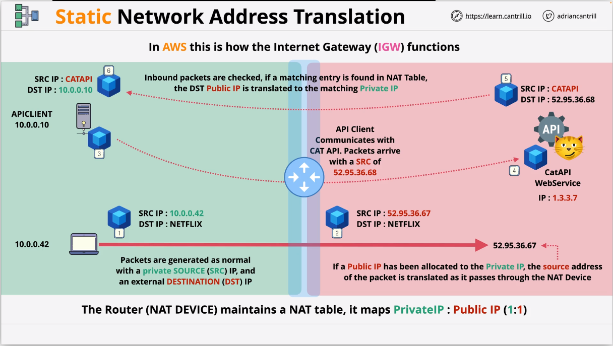
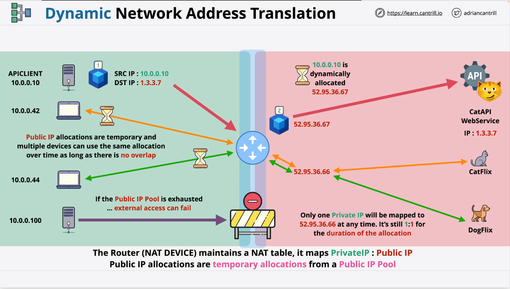

- [NAT (Network Address Translation)](#nat-network-address-translation)
- [1. What is NAT?](#1-what-is-nat)
- [2. How NAT work?](#2-how-nat-work)
  - [2.1. Static Network Address Translation (Static NAT)](#21-static-network-address-translation-static-nat)
  - [2.2. Dynamic Network Address Translation (Dynamic NAT)](#22-dynamic-network-address-translation-dynamic-nat)
  - [2.3. Port Network Address Translation (PAT)](#23-port-network-address-translation-pat)
- [IPv4 Address \& Subnet](#ipv4-address--subnet)
  - [What is IPv4](#what-is-ipv4)

## NAT (Network Address Translation)

## 1. What is NAT?

- NAT is designed to overcome IPv4 shortages.
- Translates private IPv4 address to Public => packets can flow over the public internet and then translate back in reverse.
- **Static NAT**: Translate 1 specific private address to 1 (fixed) specific public address (IGW) => Private IP address can access to Public IP address in both directions and this is how the Internet Gateway (IGW) within AWS work.
- **Dynamic NAT**: sinilar but there isn't this static allocation. Instead you have a pool of public IP address to use and these are allocated as needed. This method of NAT is generally used when you have a large number of private IP address and want them all to have internet access via public IPs, but when you have less public IP addresses then private IP addresses.
- **Port Address Translation (PAT)**: Many private to 1 public (NAT Gateway or NAT instances use within AWS).

## 2. How NAT work?

### 2.1. Static Network Address Translation (Static NAT)

- Ở giữa là Static NAT. Bên trái là private IP (server: 10.0.0.10, laptop: 10.0.0.42) và phía bên phải (màu đỏ) là public IP (CatPI WebService" 1.3.3.7).

- Private IP addresses không thể tương tác trực tiếp với Public IP addresses nên cần có NAT để traslate private IP thành public IP để có thể truy cập đến CatAPI WebService.

- The Router or NAT device maintains what's know as a NAT table and in the case of static Network Address Translation the NAT tavle stores a one-to-one device mapping between private IP and public IP. Any private device which is enabled whill have a dedicated allocated public IPv4

- Khi Laptop: 10.0.0.42 muốn gọi đến Netflix sẽ tạo ra một packet(SRC IP: 10.0.0.42 và DST IP: NETFLIX). Giả sử public IP: 52.95.36.67 được gán cho Laptop => bảng NAT table sẽ là private IP(10.0.0.42) map 1:1 với public IP (52.95.36.67). Khi packet đi qua NAT device thì source addess của packet sẽ thay đổi từ private IP sang public IP và kết quả sẽ có một packet mới (SRC IP: 52.95.36.67 và DSC IP: NETFLIX).

- API Client khi tương tác với CatAPI WebService sẽ tạo ra một packet(SRC IP: 10.0.0.10, DSC IP: 1.3.3.7). API Client được gán với public IP: 52.95.36.68 => NAT Table (Private IP: 10.0.0.10 map 1:1 Public IP: 52.95.36.68) => Đi qua NAT Device thì packet sẽ đổi SRC IP từ 10.0.0.10 sang 52.95.36.68. Ở phía CatAPI WebService khi response về thì packet (SRC IP: CATAPI, DST IP: 52.95.36.68) => đi qua NAT Device thì packet SRC IP: sẽ mapping lại từ Public IP sẽ đổi thành privateIP.

### 2.2. Dynamic Network Address Translation (Dynamic NAT)

- Phía Public IP (52.95.36.67, 52.95.36.66) và phía private IPs (10.0.0.10, 10.0.0.42, 10.0.0.44, 10.0.0.100). Không thể sử dụng static NAT để gán cho mỗi private IP một public IP vì chi có 2 Public IP thôi.

- Tạo một paket (SRC: 10.0.0.10 và DST IP: 1.3.3.7) => đi qua NAT device hoặc router
- Nếu server: 10.0.0.100 muốn gọi tới CatAPI khi đi qua NAT device hoặc router mà không còn PublicIP trong pool thì request này sẽ bị lỗi.

### 2.3. Port Network Address Translation (PAT)

// write contents here

## IPv4 Address & Subnet

### What is IPv4

- 0.0.0.0 -> 255.255.255.255