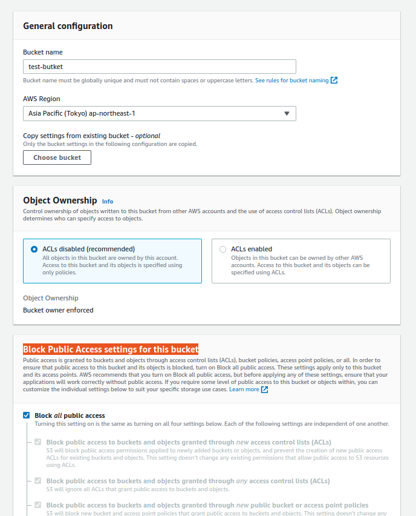
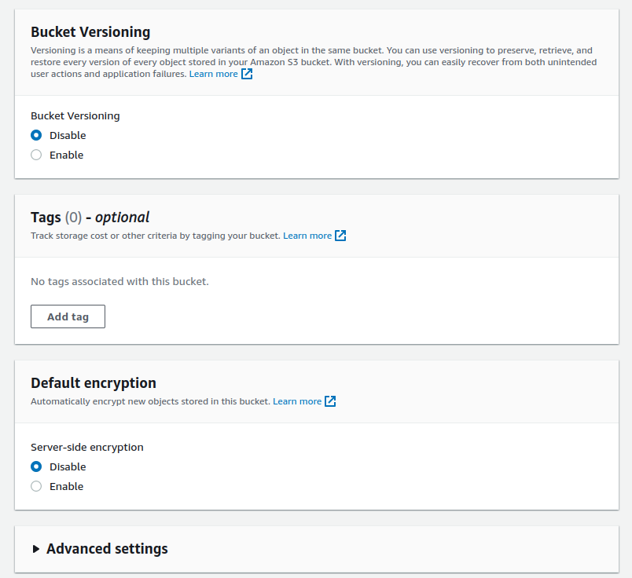
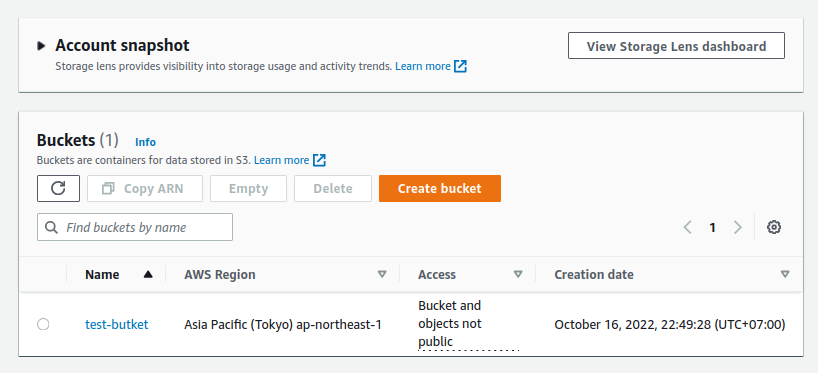
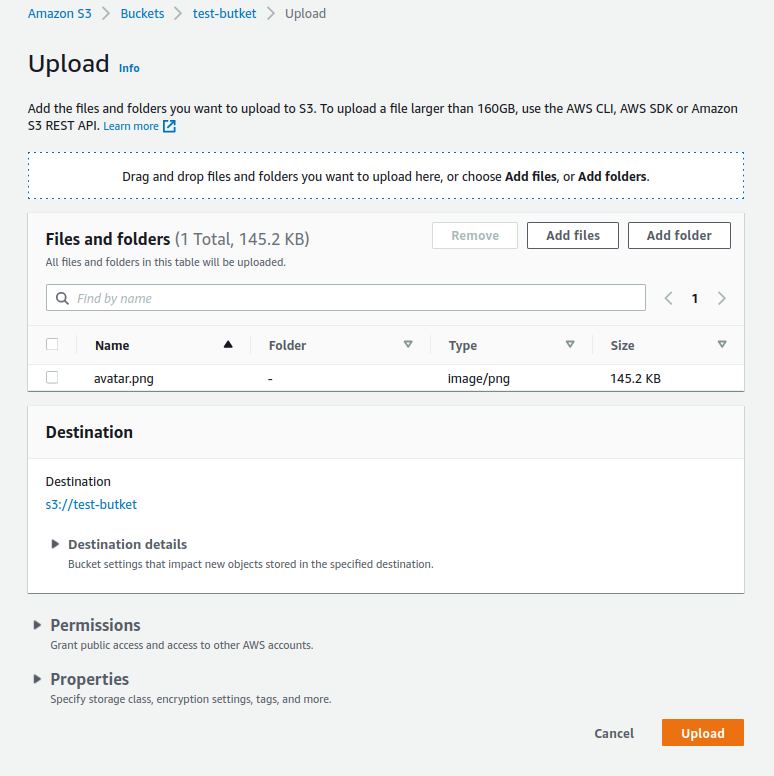
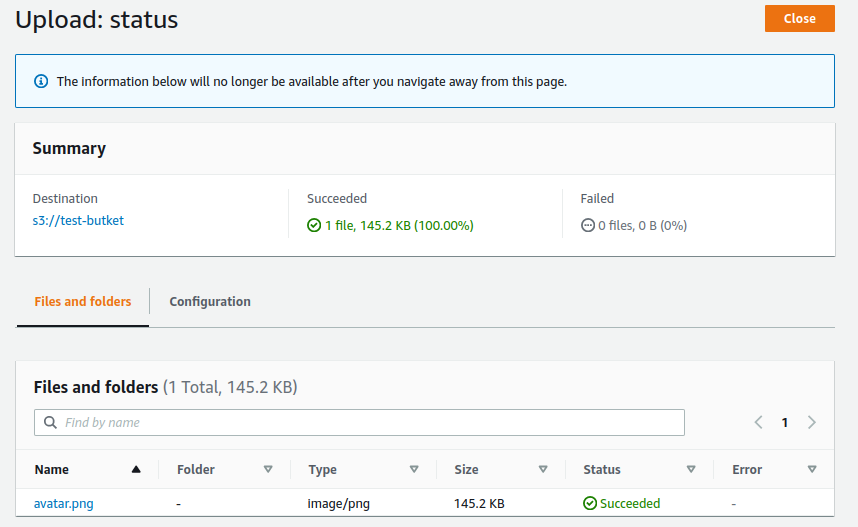
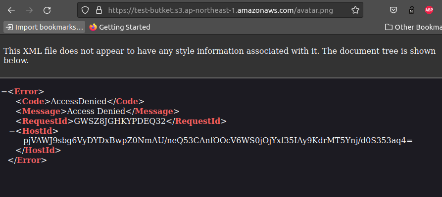

# AWS S3 (Simple storage service)

- [AWS S3 (Simple storage service)](#aws-s3-simple-storage-service)
  - [**1. Store data challenges**](#1-store-data-challenges)
  - [**2. What is an object store**](#2-what-is-an-object-store)
  - [**3. Amazon S3**](#3-amazon-s3)
  - [**1.1 S3 bucket**](#11-s3-bucket)
  - [**1.2 S3 Object**](#12-s3-object)
  - [**1.3 Metadata**](#13-metadata)
  - [**2. Hands On**](#2-hands-on)
  - [**2.1 Tạo bucket**](#21-tạo-bucket)
  - [**2.2 Upload files to S3**](#22-upload-files-to-s3)
  - [**3. Setting Permissions in S3**](#3-setting-permissions-in-s3)

## **1. Store data challenges**

Khi mà lưu trữ data thì có 2 vấn đề sau:

1. Số lượng của data thì luôn tăng.
2. phải đảm bảo đc rằng dữ liệu không bị mất mát.

Sẽ tìm hiểu AWS S3 là `object storage` giúp mình lưu được số lượng dữ liệu `near-unlimited` thông qua internet, và data của bạn sẽ luôn được lưu ở nhiều hơn một máy chủ điều này sẽ giảm thiểu khả năng bị mất mát dữ liệu.

## **2. What is an object store**

Data được quản lý bởi file và các folders, mỗi file đại điện cho data. Một `objects store` là data được lưu giống như objects. Mỗi object thì chứa các thông tin về data vd: globally unique identifier (GUID), metadata (mô tả về data), và data (bản thân data, vd: image, json, csv,...).

## **3. Amazon S3**

AWS S3 cung cấp dịch vụ lưu trữ data (objects storage). Có thể lưu và retrieve data thông qua API. S3 đảm bảo bạn có thể lưu unlimited data, và data lưu trên S3 là `availability` and `durability`.

- `Availability`: Tỉ lệ mà có thể access được vào data và đã lưu trước đó ở S3. AWS S3 đảm bảo 99.99% uptime. 1 ngày S3 có thể down khoảng 1m26s, 43m49s 1 tháng, 8h45m56s mỗi năm.
- `Durability`: Tỉ lệ mà dữ liệu lưu trên S3 bị mất. AWS S3 đảm bảo 99.999999999%, nói chung là dữ liệu lưu trên S3 ít có khả năng bị mất. S3 là service ở scope là `region`, có nghĩa là data sẽ được sao lưu ở các AZ trong `region`.

Dữ liệu ở trên S3 có thể là bất cứ loại data nào, vd: image, video, json, csv,... Một Object lưu trên S3 max là 5T. Có thể tương tác với S3 thông qua internet sử dụng https để upload hoặc download object, tương tác với S3 thông qua `Management Console`, `CLI`, `SDKs`.

## **1.1 S3 bucket**

Một `S3 bucket` giống như là một directory, có thể tạo nhiều các sub folder bên trong. `S3 bucket` có thể được định nghĩa một số các quyền, storage rules cho tất của các files mà `S3 bucket` chứa. S3 là một global service (vì cái bucketName sẽ là unique trên toàn cầu, vd: đặt một cái bucketName= "helloworld" thì sẽ không có ai dùng lại được cái bucketName="helloworld" cho đến khi bucket bị xóa đi.) nhưng `S3 bucket` lại được defined ở region level (bên trong region là các AZ (Availability Zones) có nghĩa là các data được upload lên S3 sẽ được sao lưu ở các AZ bên trong Region).

## **1.2 S3 Object**

AWS S3 là một key-value store, key sẽ đại diện cho virtual folder structure đã tạo trên cloud. `s3://bucket-name/directories/filename`.
VD: `s3://logs/pythonlogs/12-2-12.txt`

- `logs`: là tên bucket.
- `pythonlogs`: là thư mục được tạo bởi S3.
- `12-2-12.txt`: là tên file
  S3 có thể lưu được nhiều loại objects, dung lượng lên đến 5T và có thể multiple upload.

## **1.3 Metadata**

Metadata là data được lưu trong object, và lưu thêm các thông tin liên quan đến data.

## **2. Hands On**

Phần này sẽ là hands on, thực hiện tạo, xóa object trong bucket.

## **2.1 Tạo bucket**

- Vào AWS Console -> tìm dịch vụ S3 -> tạo bucket.

  

  - Bucket name: `test-bucket` cái tên này là unique.
  - AWS Region: `ap-northeast-1`.
  - Block Public Access settings for this bucket: Phần này tạm thời chưa setting gì cả để default, sẽ học về các permisstions và setting sau.

- Cấu hình phần `Bucket Versioning`, `Tag`, `Default encryption`

  

  - Phần `Bucket Versioning` nếu mà enable thì sẽ đánh version cho object như git, các object sẽ có version, data cũ thì sẽ không bị mất đi. Đánh version thì cũng tăng thêm chi phí, nhưng bây giờ thì cứ tạm thời disable.
  - Phần `Tag` có thể thêm tag cho bucket để mô tả thêm cái bucket này dùng cho cái gì.
  - Phần `Default encryption` thì sẽ tìm hiểu và cấu hình sau.

- Ấn create bucket

  

## **2.2 Upload files to S3**

Ấn Upload thôi là oke.

Đã upload thành công file lên S3.

Thực hiên view file vừa upload lên S3 thì thấy AccessDenied, vì thấy bucket đang để là not public nên sẽ không truy cập đc file từ bên ngoài.

## **3. Setting Permissions in S3**
