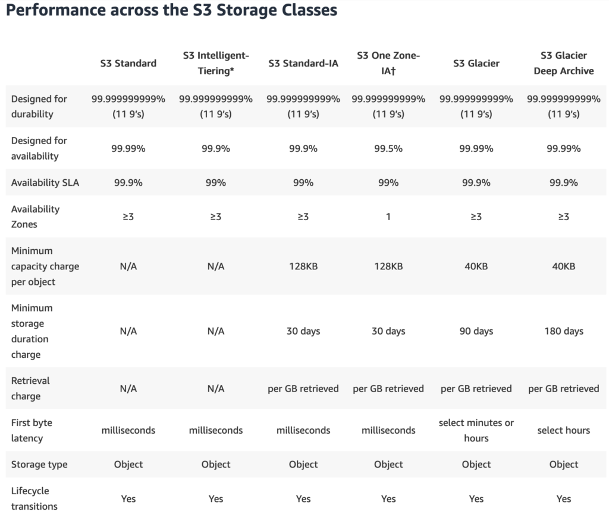

# AWS S3 (Simple storage service)


- [AWS S3 (Simple storage service)](#aws-s3-simple-storage-service)
  - [**1. What is Amazon S3?**](#1-what-is-amazon-s3)
  - [**2. Những ưu điểm của S3**](#2-những-ưu-điểm-của-s3)
    - [**Horizontally Scalable**](#horizontally-scalable)
    - [**Consistently Available**](#consistently-available)
    - [**Durability**](#durability)
    - [**Integrations with Other AWS Services**](#integrations-with-other-aws-services)
  - [**3. S3 Core Concepts**](#3-s3-core-concepts)
    - [**Buckets**](#buckets)
    - [**Objects**](#objects)
    - [**S3 Storage Classes**](#s3-storage-classes)
    - [**Data Protection**](#data-protection)
    - [**Access**](#access)
    - [**Auditing**](#auditing)
  - [**4. Labs**](#4-labs)
  - [**5. Resources**](#5-resources)

## **1. What is Amazon S3?**

S3 stands for **S**imple **S**torage **S**ervice and is **object storage** service built by AWS. I like to think of S3 as something simalar to Dropbox or Google Drive in the sense that that you can store any type of objects to S3. Example you can store video, file,...

You can store big files, small files, media content, source code, email, json and basically anything that you can think of. Keep inx mind though for a single object, there is a maximum size limit of **5 TB**.

## **2. Những ưu điểm của S3**

### **Horizontally Scalable**

**Performance** is another reason many users flock to S3 as an object storage solution. S3 is an extremely scalable solution. S3 no limit to the amount of content you can upload.

The nice thing abloud S3 is that it can support applications that need to PUT or GET objects at very hight throughputs, and still experiendce very very low latancies. For example, can build application that needed to read s3 object out of a bucket at at over 50 read calls **PER SECOND**. Volum size from around 50KB to 100KB, but latencies were always low (often lower than 100ms). 

### **Consistently Available**

// add some contents here.

### **Durability**

// add some contents here.

### **Integrations with Other AWS Services**

Có thể sử dụng S3 kết hợp với các service khác trên AWS. VD có thể sử dụng S3 **event** để tương tác với lambda function. Có thể trigger một lambda function mỗi khi một S3 object được upload.

Cũng có thể tự host một websites (HTML, CSS, Javascript) với Route53. Cũng có thể thêm caching bằng cách sử dụng CloudFront.

## **3. S3 Core Concepts**

### **Buckets**

Hãy nghỉ một bucket giống như foler trong máy tính, bản thân bucket này là một folder, bên trong bucket này có thể có các items (thường gọi là các **S3 objects**) hoặc có thể là các subfolers.

Khi tạo một bucket cần đặt tên cho bucket, cái tên của bucket sẽ là duy nhất trên toàn AWS. Bạn không thể tạo hai bucket tên là `test` hoặc `production` mặc dù hai bucket trên được tạo bởi ai đó và trên một tài khoản khác.

### **Objects**

Objects là content mà lưu trên S3 bucket. Các object này có thể là files, media, zipfile, json,... Một S3 object có size limit là **5 TB**. Object khi thực hiện upload lên S3 bucket không được vượt qua size limit trên.

Những objects có dung lượng lớn khi thực hiện upload lên S3 thì có thể sẽ gặp một số vấn đề mạng,... vì thực hiện upload objects thông qua internet. Những objects có dung lượng lớn thì có thể chia thành những file nhỏ và sử dụng tính năng multiple upload.

Truy cập các object đã upload trên S3. 
- Cách 1: Sử dụng URL với cấu trúc như sau: `http://s3.amazonaws.com/BUCKET_NAME/OBJECT_NAME`. Đây là HTTP link, có nghĩa là ai có cái link thì đều có thể được được object, nhưng mặc định sẽ không hoạt động, người tạo bucket cần phải "Chủ động" public thì mới có thể truy cập. 
- Cách 2: Sử dụng một ngôn ngữ lập trình kết hợp với [AWS SDK](https://aws.amazon.com/sdk-for-java/).

  ```java
  private static S3Client buildS3Client(Region region) {
    return S3Client.builder()
        .credentialsProvider(InstanceProfileCredentialsProvider.create())
        .region(region)
        .build();
  }

  public void listObjects(String bucketName, S3Client s3Client) {
    ListObjectsV2Iterable listObjectsV2Iterable = s3Client.listObjectsV2Paginator(builder -> builder.bucket(bucketName));

    log.info("Objects in {} bucket: ", bucketName);

    listObjectsV2Iterable.contents().stream()
      .forEach(content -> log.info("{} {} bytes", content.key(), content.size()));
  }
  ```

### **S3 Storage Classes**

S3 được sử dụng với nhiều mục đích khác nhau thì cũng có những yêu cầu khác nhau về những thứ như là "latency" và "availability". Storage Classes giải quyết vấn đề trên bằng cách cho phép bạn phân loại các objects bên trong các bucket vào những Storage Classes khác nhau, điều này sẽ dẫn đến sự khác nhau về performance và pricing models.

NOTE: 
  - Thời giam truy cập vào objects trên S3 (latency).
  - Về độ sẵn sàng của dữ liệu trên S3 (availability).
  -  (durability).

A list of storage classes:

- **Standard Tier**: Loại này là default phù hợp với những yêu cầu: Thời gian truy suất object thấp (low latency), tính sẵn sàng cao (high availability), high durability.
- **Intelligent Tier**: Loại này thì sẽ giúp tự động di chuyển data trên S3 vào các loại storage class phù hợp dựa trên tần suất truy cập.
- **Standard IA**: Loại này có thể sẽ phù hợp với những data KHÔNG được truy cập thường xuyên. Khi sử dụng loại storage class này thì thời gian truy cập sẽ lâu hơn.
- **One Zone IA**: Loại này thì cũng giống với `Standard IA`, loại này sẽ chỉ được lưu trên 1 AZ thay vì mặc định nhỏ nhất là 3 AZ nên durability thấp và giá cũng thấp (low cost).
- **Glacier**: Loại này thì sẽ phù hợp với những dữ liệu có tần suất truy cập thấp. Thời gian truy suất dữ liệu cũng lâu khoảng vài phút cho đến vài giờ.
- **Deep Glacier**: Phù hợp cho những loại dữ liệu lưu lâu dài. Thời gian lấy objects lớn trong khoảng 12h. Chi phí thì thấp nhất.
- **Outposts**: On premise S3. 



One of the nice things S3 has introduced in recent years this concept of **S3 Object lifecycle**. This feature allow you to transition objects through different transition tiers over time.

For example, you can use Objects Lifecycle sush that all objects upload to your bucket are classified as standard tier. That bucket store objects with standard tier for 30 days. 

You can defined rule to move objects into IA of infrequent access after 31 days objects uploaded. This will help reduce cost but also guarantee the same levels of performance.

Finally, after 90das, we decide to store our data into Glacier or Deep Glacier so that we can retain it for auditing. That allows us to minimize our cost burden for storage on S3 while also being policy compliant.

### **Data Protection**

AWS offers 99.99999999999% (thats 11 9’s by the way) of durability. This apply for all storage class *exept* One Zone IA with is 99.5%. This mean "losing" your data while stored in S3 are slim to none. S3 also support encryption both in transist and at rest. This mean you can be sure your data being securely transmitted and stored on the cloud.

### **Access**

Use IAM , you can define permistions as resource-base policies and attach to your buckets. That allow you control access to your bucket.

You can make your buckets public or private (default). This allow **global access** to your content provided the user has a url or can guess the name of your bucket/object.

### **Auditing**


## **4. Labs**

- [Create bucket upload to S3](https://github.com/nbthanh98/study/tree/master/learn-aws/s3/hands-on/1-create-bucket-manager-console#readme)
- [S3 with cli](https://github.com/nbthanh98/study/tree/master/learn-aws/s3/hands-on/2-upload-download-file-with-cli)
- [Upload and download file spring boot and S3](https://github.com/nbthanh98/study/tree/master/learn-aws/s3/hands-on/3-spring-boot-s3)
- [Hosting static website](https://github.com/nbthanh98/study/tree/master/learn-aws/s3/hands-on/4-static-website-hosting)

## **5. Resources**

- https://beabetterdev.com/2021/10/15/aws-s3-core-concepts-the-things-you-need-to-know/
- https://zacks.one/aws-s3-lab/
- https://medium.com/@venkatesh111/aws-s3-security-iam-policies-bucket-polices-acl-53aa73f7954a
