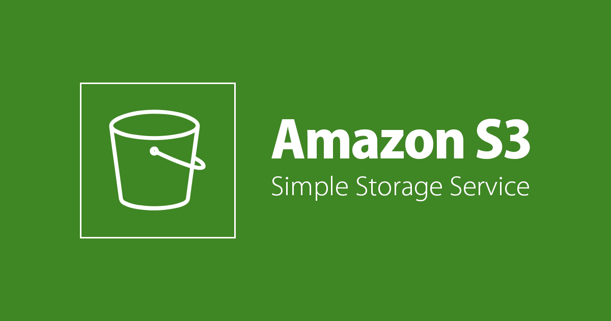
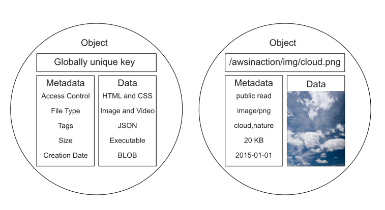
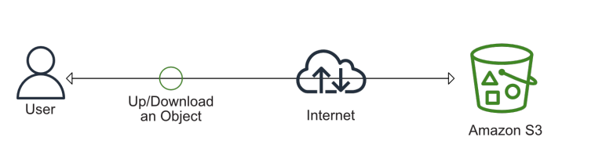
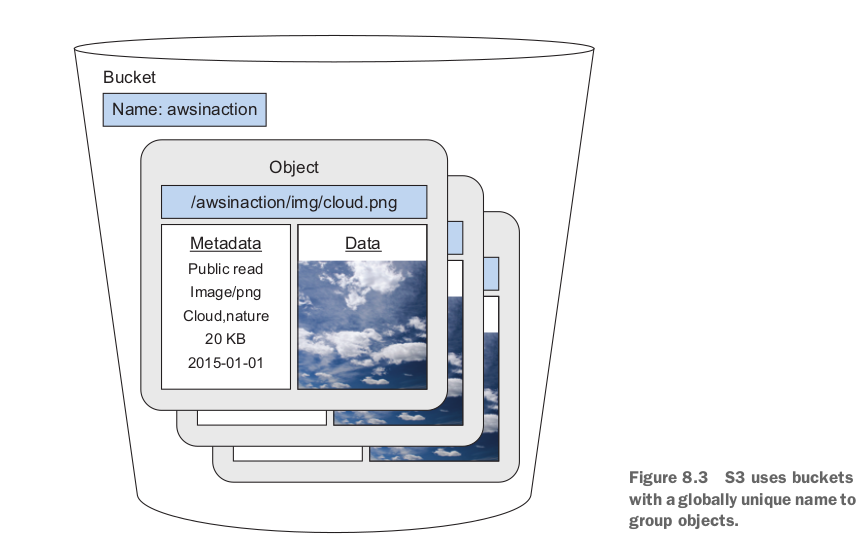

# AWS S3 (Simple storage service)

- [AWS S3 (Simple storage service)](#aws-s3-simple-storage-service)
  - [**1. Store data challenges**](#1-store-data-challenges)
  - [**2. What is an object store**](#2-what-is-an-object-store)
  - [**3. Amazon S3**](#3-amazon-s3)
  - [**3.1 S3 bucket**](#31-s3-bucket)
  - [**3.2 S3 Object**](#32-s3-object)
  - [**3.3 Metadata**](#33-metadata)
  - [**4. Hands On**](#4-hands-on)

## **1. Store data challenges**

Khi mà lưu trữ data thì có 2 vấn đề sau:

1. Số lượng của data thì luôn tăng.
2. phải đảm bảo đc rằng dữ liệu không bị mất mát.

Sẽ tìm hiểu AWS S3 là `object storage` giúp mình lưu được số lượng dữ liệu `near-unlimited` thông qua internet, và data của bạn sẽ luôn được lưu ở nhiều hơn một máy chủ điều này sẽ giảm thiểu khả năng bị mất mát dữ liệu.

## **2. What is an object store**

Data được quản lý bởi file và các folders, mỗi file đại điện cho data. Một `objects store` là data được lưu giống như objects. Mỗi object thì chứa các thông tin về data vd: globally unique identifier (GUID), metadata (mô tả về data), và data (bản thân data, vd: image, json, csv,...).

## **3. Amazon S3**

AWS S3 cung cấp dịch vụ lưu trữ data (objects storage). Có thể lưu và retrieve data thông qua API. S3 đảm bảo bạn có thể lưu unlimited data, và data lưu trên S3 là `availability` and `durability`.

- `Availability`: Tỉ lệ mà có thể access được vào data và đã lưu trước đó ở S3. AWS S3 đảm bảo 99.99% uptime. 1 ngày S3 có thể down khoảng 1m26s, 43m49s 1 tháng, 8h45m56s mỗi năm.
- `Durability`: Tỉ lệ mà dữ liệu lưu trên S3 bị mất. AWS S3 đảm bảo 99.999999999%, nói chung là dữ liệu lưu trên S3 ít có khả năng bị mất. S3 là service ở scope là `region`, có nghĩa là data sẽ được sao lưu ở các AZ trong `region`.

Dữ liệu ở trên S3 có thể là bất cứ loại data nào, vd: image, video, json, csv,... Một Object lưu trên S3 max là 5T. Có thể tương tác với S3 thông qua internet sử dụng https để upload hoặc download object, tương tác với S3 thông qua `Management Console`, `CLI`, `SDKs`.

## **3.1 S3 bucket**

S3 sử dụng `bucket` để nhóm các objects, `bucket` giống như một container chứa các objects, có thể tạo nhiều `bucket`, mỗi `bucket` sẽ có tên duy nhất (globally unique name), không thể có 2 bucket name giống nhau trên mọi region. Trong bucket có thể tạo một hoặc nhiều các folder để nhóm các data.

## **3.2 S3 Object**

AWS S3 là một key-value store, key sẽ đại diện cho virtual folder structure đã tạo trên cloud. `s3://bucket-name/directories/filename`.
VD: `s3://logs/pythonlogs/12-2-12.txt`

- `logs`: là tên bucket.
- `pythonlogs`: là thư mục được tạo bởi S3.
- `12-2-12.txt`: là tên file
  S3 có thể lưu được nhiều loại objects, dung lượng lên đến 5T và có thể multiple upload.

## **3.3 Metadata**

Metadata là data được lưu trong object, và lưu thêm các thông tin liên quan đến data.

## **4. Hands On**
