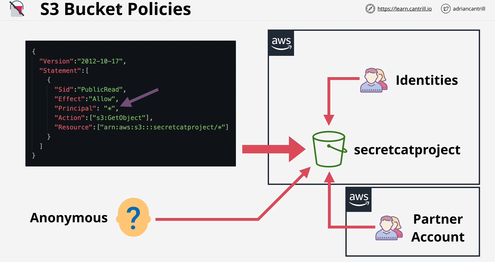

## S3 bucket policies

Bucket policies là resource-base policies, giống như indetity-base policies nhưng indetity-based policies sẽ attach vào identity, còn resource-based policies sẽ attach vào resources ở đây là S3.

Resource-based policies có thể  định nghĩa ALLOW/DENY các identity cùng hoặc khác tài khoản. Còn đối với identity-based polices thì chỉ có thể attach vào những identity cùng tài khoản.

Resousece-based policies có thể ALLOW/DENY `anonymous` principals.



Define resource-based policies:

```json
{
    "Version": "2012-10-17",
    "Statement": [
        {
            "Sid": "PublicRead",

            /*
                "Effect": "Allow" hoặc "Effect": "Deny".
            */
            "Effect": "Allow",
            /* 
                Tât cả principal đều có quyền thực hiện các hành động define trong trường "Action". 
            */
            "Principal": "*",

            /*
                Define các action sẽ ĐƯỢC PHÉP hoặc KHÔNG ĐƯỢC PHÉP làm phụ thuộc vào trường "Effect": "Allow" hay "Effect": "Deny".
            */
            "Action": ["s3:GetObject"],

            /*
                Resource sẽ tương tác.
            */
            "Resource": ["<RESOURCE_ARN>"]
        }
    ]
}
```

