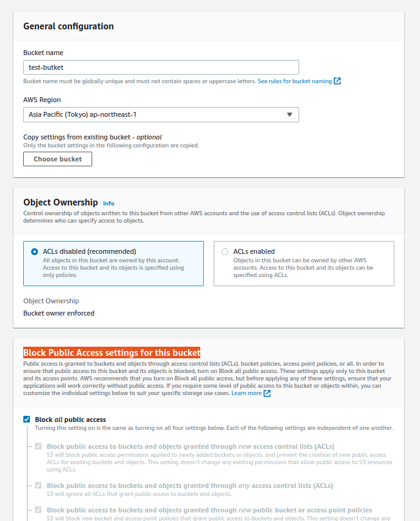
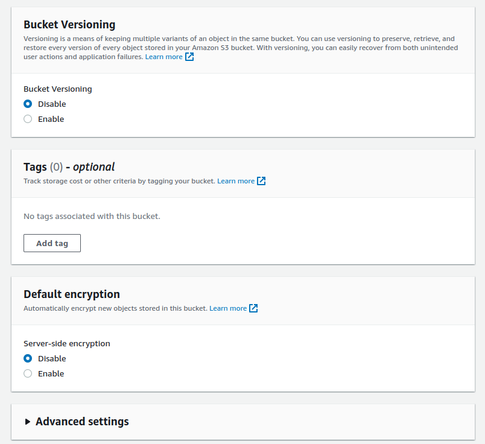
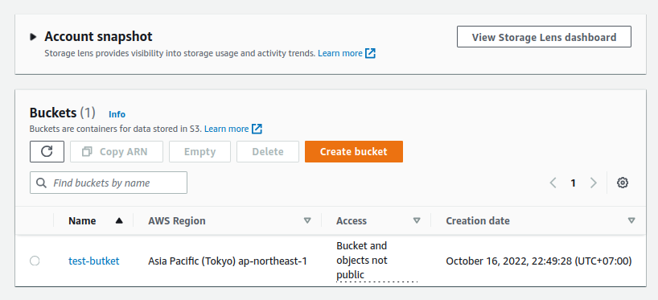
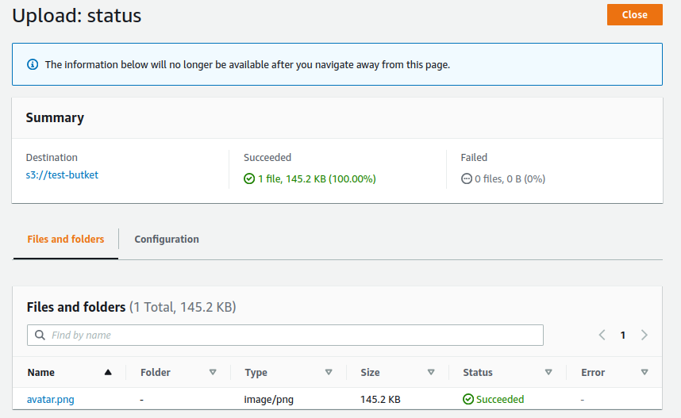
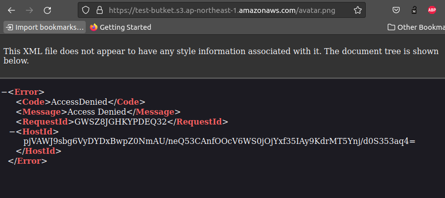

# Create bucket with management console

- [Create bucket with management console](#create-bucket-with-management-console)
  - [**1. Tạo bucket**](#1-tạo-bucket)
  - [**2. Upload files to S3**](#2-upload-files-to-s3)

## **1. Tạo bucket**

- Vào AWS Console -> tìm dịch vụ S3 -> tạo bucket.

  

  - Bucket name: `test-bucket` cái tên này là unique.
  - AWS Region: `ap-northeast-1`.
  - Block Public Access settings for this bucket: Phần này tạm thời chưa setting gì cả để default, sẽ học về các permisstions và setting sau.

- Cấu hình phần `Bucket Versioning`, `Tag`, `Default encryption`

  

  - Phần `Bucket Versioning` nếu mà enable thì sẽ đánh version cho object như git, các object sẽ có version, data cũ thì sẽ không bị mất đi. Đánh version thì cũng tăng thêm chi phí, nhưng bây giờ thì cứ tạm thời disable.
  - Phần `Tag` có thể thêm tag cho bucket để mô tả thêm cái bucket này dùng cho cái gì.
  - Phần `Default encryption` thì sẽ tìm hiểu và cấu hình sau.

- Ấn create bucket

  

## **2. Upload files to S3**

Ấn Upload thôi là oke.

Đã upload thành công file lên S3.

Thực hiên view file vừa upload lên S3 thì thấy AccessDenied, vì thấy bucket đang để là not public nên sẽ không truy cập đc file từ bên ngoài.

