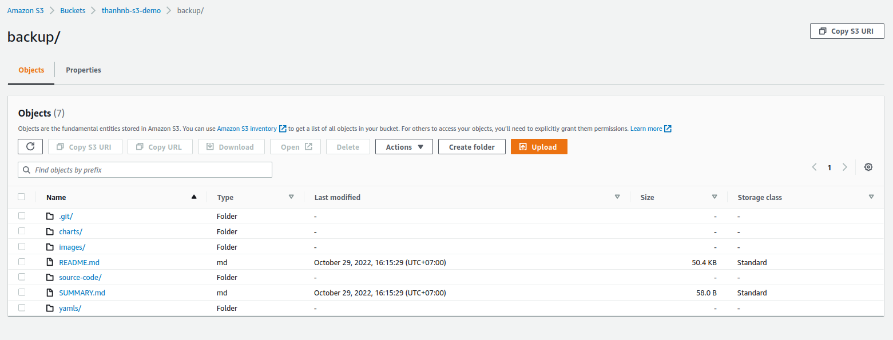

# S3 with cli

## **2. Setting Up an AWS Profile**

Cần tạo một IAM User, gán quyền vào S3 ở bước này thì là set up một AWS CLI Profile. Để setup AWS cli profile thì cần:

- AWS CLI [link](https://docs.aws.amazon.com/cli/latest/userguide/getting-started-install.html#cliv2-windows-install)
- The `Access key ID` of the IAM user.
- The `Secret access key` associated with the IAM user.
- The `Default region name`: chọn region nơi mà tạo bucket.
- The `default output format`. Use JSON for this.

Configure aws profile

```powershell
aws configure

AWS Access Key ID [****************SK56]: ..................
AWS Secret Access Key [****************Mv7+]: ..............
Default region name [us-west-1]: us-west-1
Default output format [json]: json
```

## **3. Testing AWS S3 with cli**

1. Create bucket

   ```powershell
    # cú pháp
    aws s3 mb <target> [--option]

    # tạo bucket: `thanhnb-s3-demo`
    aws s3 mb s3://thanhnb-s3-demo
    make_bucket: thanhnb-s3-demo

    # lấy danh sách bucket
    aws s3 ls
    2022-10-29 16:09:08 thanhnb-s3-demo
   ```

2. Upload file to S3 bucket

   ```powershell
   # cú pháp
   aws s3 sync $PATH s3://<$S3_BUCKET_NAME>/<$FOLDER_UPLOAD>

    # 1. $PATH: là đường dẫn file muốn upload lên S3.
    # 2. $S3_BUCKET_NAME: Thay bằng S3 bucket mà muốn upload lên.
    # 3. $FOLDER_UPLOAD: Thay bằng folder trên S3 mà muốn upload lên.

   aws s3 sync ../k8s-springboot s3://thanhnb-s3-demo/backup

    # command trên là upload folder `k8s-springboot` ở đường dẫn `../k8s-springboot`
    # Upload folder lên bucket `thanhnb-s3-demo`, upload vào folder `backup`.
    # Sẽ tùy vào size của data, tốc độ mạng thì sẽ upload nhanh hay chậm.
   ```

   Vào Web console đã thấy data được upload thành công.
   

3. Download file from S3 bucket

   ```powershell
   # Tạo mới folder để download data từ S3.
   mkdir data-s3

   # Download data from S3 bucket.
   aws s3 cp --recursive s3://<$S3_BUCKET_NAME>/<$FOLDER_S3> <$PATH_FOLDER_TO_DOWLOAD_S3_DATA>

   aws s3 cp --recursive s3://thanhnb-s3-demo/backup /home/nbt/thanhnb/study/data-s3
   ```

4. Clearn up data

   ```powershell
    # Cú pháp.
    aws s3 rb --force s3://awsinaction-$yourname

    # rb: removes the bucket.
    # --force: the force option deletes every object in the bucket before the bucket itself is deleted

    aws s3 rb --force s3://thanhnb-s3-demo
   ```
