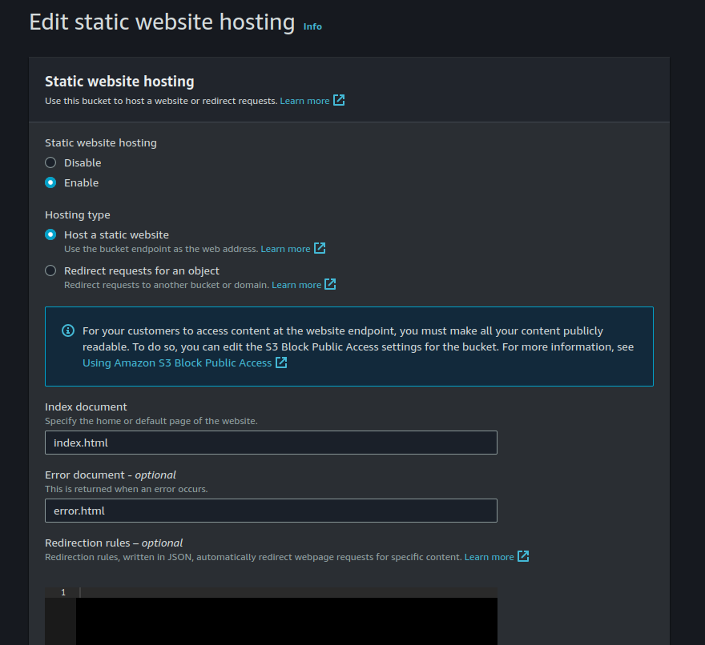
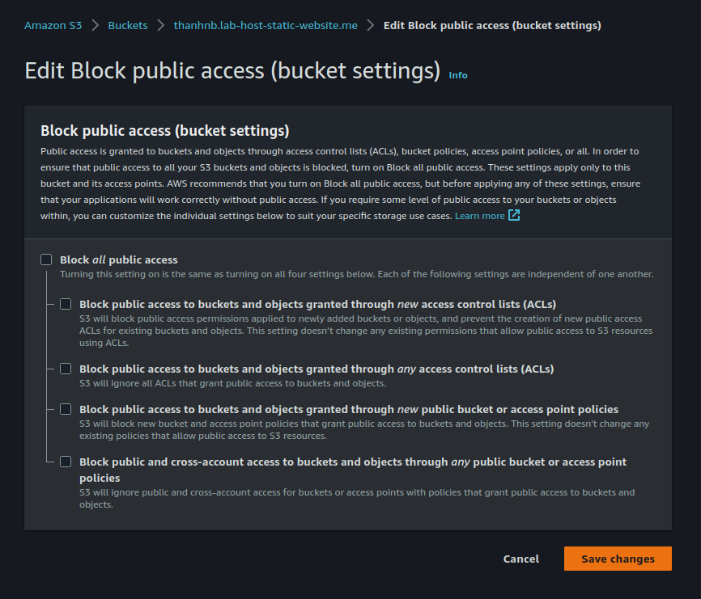
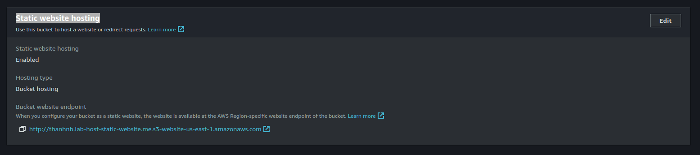
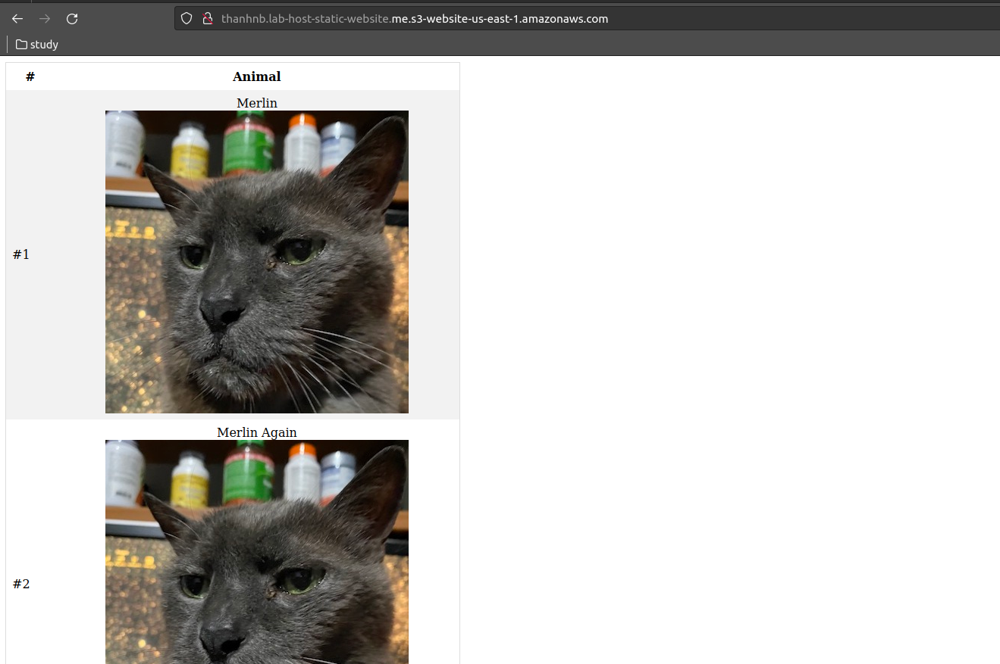

## Hosting static website with S3

Step 1: Access [AWS console](https://aws.amazon.com/console/) and login.

Step 2: Search S3 service and create bucket. For example create bucket called is `thanhnb.lab-host-static-website.me`.

Step 3: Click to properties of bucket and enable `Static website hosting`.



- `Static website hosting`: chọn enable.
- `Index document`: File default của website => File `index.html`.
- `Error document - optional`: File default của website nếu lỗi xảy ra => File `error.html`.

Sau đó ấn `Save changes`.

Step 4: Edit Block public access (bucket settings). => Bỏ tích phần `Block all public access`.



Step 5: Define resource-based policies to attached that bucket for any pricipal can access.

```json
{
    "Version": "2012-10-17",
    "Statement": [
        {
            "Sid": "PublicRead",
            "Effect": "Allow",
            "Principal": "*",
            "Action": "s3:GetObject",
            "Resource": "arn:aws:s3:::thanhnb.lab-host-static-website.me/*"
        }
    ]
}
```

Step 6: Upload files to bucket => use files within folder `/hands-on/4-static-website-hosting/source-code/website_files`.


Step 7: Access to static website with `Bucket website endpoint`.



Static website look like: 



## Resource

- [SAA C03 Cantrill](https://learn.cantrill.io/p/aws-certified-solutions-architect-associate-saa-c03)
