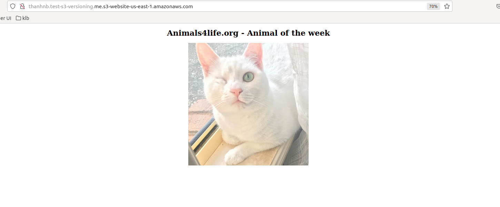

## Lab S3 Versioning

Step 1: Create bucket.

Step 2: Bucket properties -> Enable Bucket Versioning.

Step 3: Upload file in sources folder.

Step 4: Check version cua file `winkie.jpg` thi da thay sinh ra `versionID=WS.4e5BUTHmr0W8C7pWPYND5oNy_ZQsb`.

Khi truy cap s3-web-hosting se thay version hien tai cua object:

Step 5: Upload file with same key `winkie.jpg` => sinh ra them `versionID=Jh.If.qccjT4ClMUxrHd3gEB.ld0pVy3` VersionID nay se la cu version hien tai cua Object (Giong nhu image tag). Gio key `winkie.jpg` co 2 versionID khac nhau. 

Khi truy cap s3-web-hosting thi se thay versionId moi cua Object.

Step 6: Delte object without specify verionID => new versionId called `Delete marker` and current version of object is `Delete marker`.

Khi truy cap s3-web-hosting thi se khong thay object.

Step 7: Thay doi bucket tu `Enabled versioning` -> `Suspend` (Khong luu version cuar object, nhung van giu lai cac version cu truoc do).

Step 8: Sau khi thay doi bucket tu `Enabled versioning` -> `Suspend` => Object se tao them mot `versionId=null` va se la version hien tai cua object. => Khi upload trung key `winkie.jpg` thi se bi replace.

