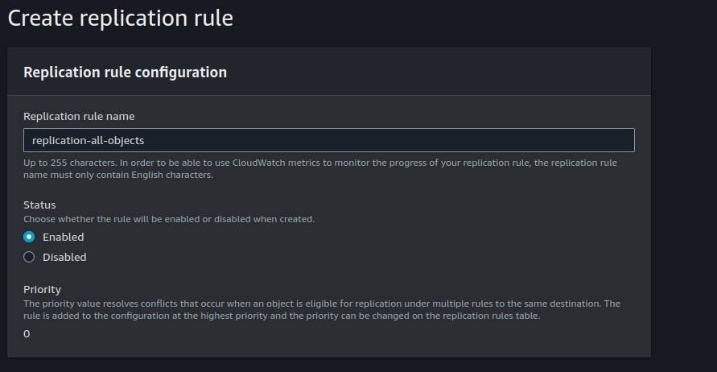

## S3 Replication

Step 1: Tạo 2 bucket ở khác region và cùng tài khoản.

- Đồng bộ object từ `source-bucket`(US East (N. Virginia) us-east-1) sang `lab.destination-bucket`(US East (Ohio) us-east-2).
- Hai bucket này cần phải bật bucket versioning. Same Region Replication(SRR) and Cross Region Replication(CRR) yêu cầu cần phải bật versioning vì có thể trong quá trình replication (replication sẽ không ngay lập tức) lại có upload một object mới cùng key nên đặt versioning để không bị lệch objects giữa source bucket và destination bucket.

Step 2: Cấu hình Bucket Replication

*1. Click `source-bucket` => tab `Management` => `Replication rules`*:

- Replication rule name: `replication-all-objects`.
- Status: `Enabled`. Enable luôn khi tạo xong replication rule.

*2. Cấu hình Source bucket*:

Phần này chọn cấu hình những objects nào sẽ được replication sang destination bucket: Tất cả objects hoặc thêm filter để lọc các objects (Prefix, tag).
 
*3. Cấu hình Destination bucket*:

- Chọn destination bucket là cùng tài khoản hay khác tài khoản: Hình trên thì chọn destination bucket là: `lab.destination-bucket` và bucket destination này ở cùng tài khoản với source bucket.

*4. Cấu hình IAM Role*: