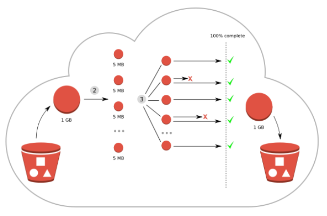

## Uploading large object to S3 bucket using multipart upload



_Credit: Internet_

Multipart upload allows you upload a single object as a set of parts. You can upload these objects parts independently in ant order. If transmisstion of any part fails, you can retransmit that part without affecting other parts. After all parts of yoir object are uploaded, Amazone S3 assembles these parts and creates the object. In general, when your object size reaches 100MB, you should consider using multipart uploads instead of upload the object in a single operation.

Using multipart upload provides the following adventages:

- **Improved throughput**: You can upload parts in parallel to improve thoughput.
- **Quick recovery from any network issues**: Smaller part size minimizes the impact of restarting a failed upload due to a network error.
- **Pause and resume object uploads**: Bạn có thể upload các phần của object theo thời gian. Sau khi bạn init multilpart upload thì bạn PHẢI chủ động hoàn thành (complete) hoặc dừng tiến trình multipart upload.

## Multipart upload process

Multipart upload được chia thành 3 bước: Bạn cần init multipart upload, sau đó upload các phần của objects lên S3, sau khi bạn đã upload hết các phần của Object lên S3 thì bạn cần gửi 1 lệnh để complete việc multipart upload. Khi AWS nhận được complete multipart upload thì AWS S3 sẽ gộp các phần của object trước đó thành một object hoàn chỉnh.

## Labs

### Multipart upload using CLI

Option 1: high level

```sh
# Set file-size:
aws configure set default.s3.max_concurrent_requests <number>

# Upload S3
aws s3 cp <large-file> s3://<bucket-name>

# Example:
aws s3 cp s3-multipart-upload.zip s3://thanhnb.test.s3-versioning
```

Option 2: low level

**Step 1**: Split large file to multiple parts

```sh
split -b <file-size> <large-file>

# Ex: chia nho file thanh cac multiple parts co file size = 50m. Ket qua chia duoc 4 file:
split -b 50m s3-multipart-upload.zip
xaa
xab
xac
xad
```
**Step 2**: Khởi tạo multiparts upload
```shell
aws s3api create-multipart-upload --bucket <bucket-name> --key <file-name-after-merge>

aws s3api create-multipart-upload --bucket thanhnb.test.s3-versioning --key s3-multipart-upload-after-merge.zip
{
    "ServerSideEncryption": "AES256",
    "Bucket": "thanhnb.test.s3-versioning",
    "Key": "s3-multipart-upload-after-merge.zip",
    "UploadId": "ApZkV0r5hYiimqvf8e8epEhjIYiNi5ogJQY3MXfEyO7b.zgVpcs1iDQoT9OLRL8UN9CzxwVWLSAf5HSL6SaY96stIOMz8.Flshvxoo_9aaql4uqGiamrp4F9diR.N8CT"
}
```

**Step 3**: Upload từng part mà đã split trước đó (bước 1)
```sh
aws s3api upload-part --bucket <BUCKET_NAME> --key <FILE_NAME_AFTER_MERGE> --part-number <PART_NUMBER> --body <FILE_PART> --upload-id <UPLOAD_ID_FROM_STEP2>

# Upload part 1:
aws s3api upload-part --bucket thanhnb.test.s3-versioning --key s3-multipart-upload-after-merge.zip --part-number 1 --body xaa --upload-id ApZkV0r5hYiimqvf8e8epEhjIYiNi5ogJQY3MXfEyO7b.zgVpcs1iDQoT9OLRL8UN9CzxwVWLSAf5HSL6SaY96stIOMz8.Flshvxoo_9aaql4uqGiamrp4F9diR.N8CT
{
    "ServerSideEncryption": "AES256",
    "ETag": "\"1ad7722b8bbe09bfc23e18b1c1cb7aaa\""
}

# Upload part 2:
aws s3api upload-part --bucket thanhnb.test.s3-versioning --key s3-multipart-upload-after-merge.zip --part-number 2 --body xab --upload-id ApZkV0r5hYiimqvf8e8epEhjIYiNi5ogJQY3MXfEyO7b.zgVpcs1iDQoT9OLRL8UN9CzxwVWLSAf5HSL6SaY96stIOMz8.Flshvxoo_9aaql4uqGiamrp4F9diR.N8CT
{
    "ServerSideEncryption": "AES256",
    "ETag": "\"af6e8ac37326dda6a2fd50366a643629\""
}

# Upload part 3:
aws s3api upload-part --bucket thanhnb.test.s3-versioning --key s3-multipart-upload-after-merge.zip --part-number 3 --body xac --upload-id ApZkV0r5hYiimqvf8e8epEhjIYiNi5ogJQY3MXfEyO7b.zgVpcs1iDQoT9OLRL8UN9CzxwVWLSAf5HSL6SaY96stIOMz8.Flshvxoo_9aaql4uqGiamrp4F9diR.N8CT
{
    "ServerSideEncryption": "AES256",
    "ETag": "\"2759bd1e4af60a4a4897123c9679eead\""
}

# Upload part 4:
aws s3api upload-part --bucket thanhnb.test.s3-versioning --key s3-multipart-upload-after-merge.zip --part-number 4 --body xad --upload-id ApZkV0r5hYiimqvf8e8epEhjIYiNi5ogJQY3MXfEyO7b.zgVpcs1iDQoT9OLRL8UN9CzxwVWLSAf5HSL6SaY96stIOMz8.Flshvxoo_9aaql4uqGiamrp4F9diR.N8CT
{
    "ServerSideEncryption": "AES256",
    "ETag": "\"d584e61e85cf0bc8a91f270e74ba419e\""
}
```

**Step 4**: (Optional) Lấy danh sách part
```sh
aws s3api list-parts --bucket DOC-EXAMPLE-BUCKET --key large_test_file --upload-id <UPLOAD_ID_FROM_STEP2>

aws s3api list-parts --bucket thanhnb.test.s3-versioning --key s3-multipart-upload-after-merge.zip --upload-id ApZkV0r5hYiimqvf8e8epEhjIYiNi5ogJQY3MXfEyO7b.zgVpcs1iDQoT9OLRL8UN9CzxwVWLSAf5HSL6SaY96stIOMz8.Flshvxoo_9aaql4uqGiamrp4F9diR.N8CT
{
    "Parts": [
        {
            "PartNumber": 1,
            "LastModified": "2023-06-11T10:03:46+00:00",
            "ETag": "\"1ad7722b8bbe09bfc23e18b1c1cb7aaa\"",
            "Size": 52428800
        },
        {
            "PartNumber": 2,
            "LastModified": "2023-06-11T10:04:45+00:00",
            "ETag": "\"af6e8ac37326dda6a2fd50366a643629\"",
            "Size": 52428800
        },
        {
            "PartNumber": 3,
            "LastModified": "2023-06-11T10:05:32+00:00",
            "ETag": "\"2759bd1e4af60a4a4897123c9679eead\"",
            "Size": 52428800
        },
        {
            "PartNumber": 4,
            "LastModified": "2023-06-11T10:06:19+00:00",
            "ETag": "\"d584e61e85cf0bc8a91f270e74ba419e\"",
            "Size": 52428800
        }
    ],
    "ChecksumAlgorithm": null,
    "Initiator": {
        "ID": "arn:aws:iam::709305504551:user/admin",
        "DisplayName": "admin"
    },
    "Owner": {
        "DisplayName": "study.thanhnb",
        "ID": "2129e41d61695601b79f8848f805aae5ed94b455b1bf3f266e25064b8eb1bfa3"
    },
    "StorageClass": "STANDARD"
}
```

**Step 5**: Tạo file json để định nghĩa cấu trúc file để AWS merge
```sh
{
    "Parts": [{
        "ETag": "1ad7722b8bbe09bfc23e18b1c1cb7aaa",
        "PartNumber":1
    },
    {
        "ETag": "af6e8ac37326dda6a2fd50366a643629",
        "PartNumber":2
    },
    {
        "ETag": "2759bd1e4af60a4a4897123c9679eead",
        "PartNumber":3
    },
    {
        "ETag": "d584e61e85cf0bc8a91f270e74ba419e",
        "PartNumber":4
    }]
}

# Merge file
aws s3api complete-multipart-upload --multipart-upload file://file-parts.json --bucket thanhnb.test.s3-versioning --key s3-multipart-upload-after-merge.zip --upload-id ApZkV0r5hYiimqvf8e8epEhjIYiNi5ogJQY3MXfEyO7b.zgVpcs1iDQoT9OLRL8UN9CzxwVWLSAf5HSL6SaY96stIOMz8.Flshvxoo_9aaql4uqGiamrp4F9diR.N8CT

{
    "ServerSideEncryption": "AES256",
    "Location": "https://s3.us-east-1.amazonaws.com/thanhnb.test.s3-versioning/s3-multipart-upload-after-merge.zip",
    "Bucket": "thanhnb.test.s3-versioning",
    "Key": "s3-multipart-upload-after-merge.zip",
    "ETag": "\"23c3b4a8fd26da55df808021fcf9b68d-4\""
}
```