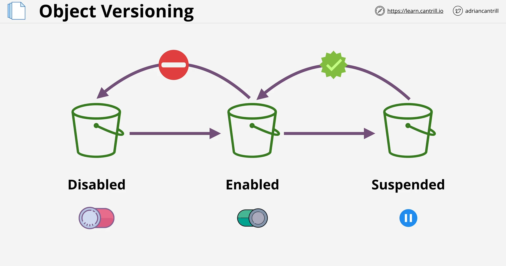
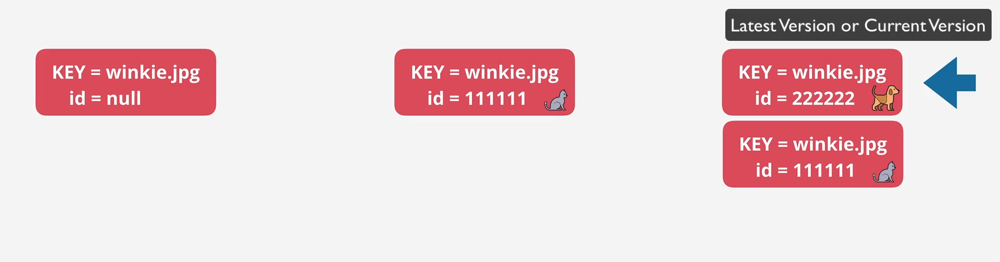
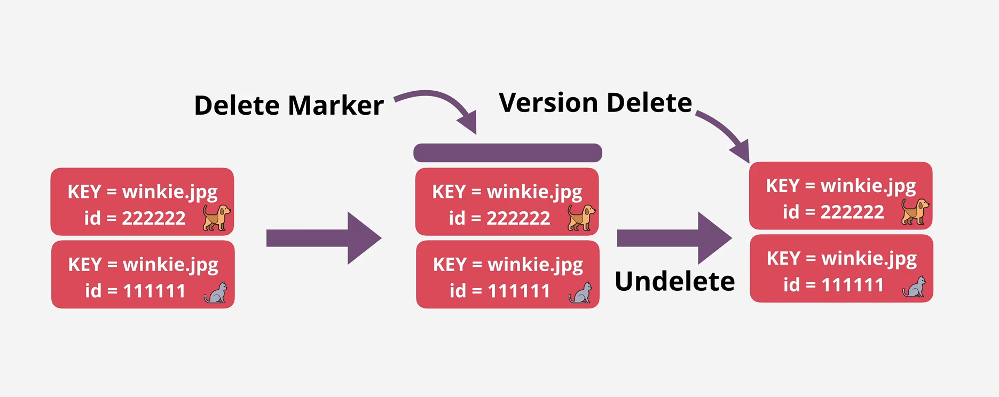

## Object versioning

Versioning lets you store **multiple versions** of objects within a bucket. Operations which would modify objects **generate a new version**.

- You can optional enable versioning of disable versioning bucket.
- You never can switch back from a bucket enabled versioning to disabled versioning.
- An enabled bucket can be moved to **suspended** and moved back to enabled.

Without versioning, each object is indetify by the object key, it is name which unique inside the bucket. If you modify an object the original version of that object is replaced.

Versioning lets you store multiple versions of an object within a bucket. Any operation modify object generate a new version of that object.

Example:

Have object `KEY=winkie.jpg and id=null` store inside a bucket called `animale`. When bucket `animale` disabled versioning ID of object always set to null.

If bucket `animale` enable versioning, S3 allocates an ID to that object. In this case `id =111111`.

If someone overide `winkie.jpg` object with another picture with same key `winkie.jpg`, S3 do not remove the original object. It allocates (phân bổ) a new ID to the newer version and it retains the old version.

Versioning cũng ảnh hưởng đến việc delete. Hình trên có 2 version của object `winkie.jpg` với ID = 111111 và ID = 222222 được lưu trong bucket `animale` đã được bật versionning.

Nếu xóa object mà không cụ thể version ID nào thì S3 sẽ thực hiện thêm một "version đặc biệt" của object đó gọi là "Delete marker".

"Delete marker" chỉ là một version mới của object, S3 thực sử thì KHÔNG xóa cái gì cả, nhưng "delete marker" version sẽ làm object này giống như là đã bị xóa rồi. Giống như là ẩn đi vậy, "Delete marker" là một version đặc biệt của một object và sẽ ẩn các version trước đó của object này.

Có thể thực sự delete một object bằng cách là khi xóa thì chỉ rõ muốn xóa version nào của object.

NOTES S3 VERSIONNING:
- Tất cả các verion của một object thì sẽ được lưu ở bucket.
- Sẽ phải trả tiền cho tất cả các version của objects. Giả sử bạn có một object 5Gb và đang có 5 version của object này => bucket sẽ có 5 * 5 = 25Gb của object.
- Có một cách duy nhất để về 0 cost đó là delete bucket và upload lại tất cả object vào một bucket mà KHÔNG bật tính năng versioning.
- Bạn có thể dừng tính năng verioning của bucket bằng cách chuyển bucket này sang `suspended`, nhưng mà bucket vẫn sẽ giữ lại các version cũ trước và vẫn phải trả tiền.

## MFA Delete

- Enable in versioning configuration.
- MFA is required to change bucket versioning state.
- MFA is required to delete versions.

