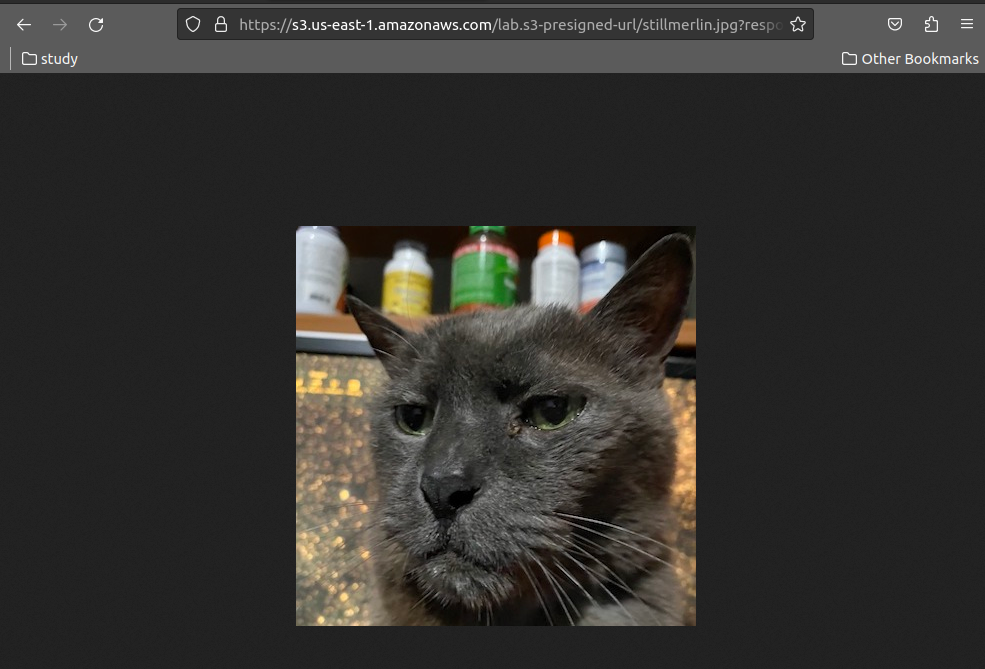

## S3 presigned URLs

- [S3 presigned URLs](#s3-presigned-urls)
  - [1. Truy cập S3 bucket](#1-truy-cập-s3-bucket)
  - [2. Sử dụng S3 presigned URLs.](#2-sử-dụng-s3-presigned-urls)
  - [3. Labs tạo presigned URL và truy cập S3 object thông qua presigned URL.](#3-labs-tạo-presigned-url-và-truy-cập-s3-object-thông-qua-presigned-url)
  - [4. Labs presigned URL link với permisstion của identity.](#4-labs-presigned-url-link-với-permisstion-của-identity)


### 1. Truy cập S3 bucket


S3 bucket mặc định là private. IAM User cần phải có quyền (attach policies) cho phép tương tác với S3 bucket thì mới có thể tương tác với S3. Giống như trên hình iamadmin được gán các policies cho phép tương tác với S3 bucket.

Để truy cập vào S3 thì có thể làm những cách sau:

- Tạo IAM identity(IAM User, IAM Role) và gán các policies để tương tác với S3 bucket.
- Cung cấp AWS Credentials.
- Configs cho S3 bucket public.

### 2. Sử dụng S3 presigned URLs.


Step 1: iamadmin dùng credentials của chính mình để yêu cầu tạo `presigned URL`.

Step 2: S3 bucket sẽ trả về presigned URL.

Step 3: Ông user khác có thể cầm cái presigned URL này để tương tác (PUT object, GET object) với S3 bucket với quyền của ông iamadmin.

NOTE: 

- Object owner có thể share các objects bằng cách tạo ra `presigned URL`, sử dụng chính credentials của object owner, sẽ có thời gian expire.

- Khi tạo `presigned URL` cho object, cần phải cung cấp security credentials và mô tả bucket, object key và HTTP method, thời gian hết hạn của `presigned URL`. Anyone who receives the presigned URL can then access the object.
- Permission của presigned URL sẽ giống với permission của identity tạo ra presigned URL.
- Không nên sử dụng tempory credentials (IAM Role) để gen `presigned URL`, vì mặc dù cho `presigned URL` vẫn chưa expire nhưng temp credentials expire thì p`resigned URL` vẫn sẽ exprire theo.

### 3. Labs tạo presigned URL và truy cập S3 object thông qua presigned URL.

Step 1: Tạo S3 bucket: `lab.s3-presigned-url` và upload objects.


Step 2: Truy cập S3 object thông qua object url: `https://s3.amazonaws.com/lab.s3-presigned-url/stillmerlin.jpg`. Thấy access denined.


Step 3: Click vào object muốn share và tạo presigned URL:


Step 4: Truy cập object thông qua presigned URL:



### 4. Labs presigned URL link với permisstion của identity.

Thưc hiện tao presigned URL sau đó thì attach thêm policies deny all action S3 vào IAM use tạo ra presigned URL.

Step 1: Tạo presigned URL với thời gian expire là 1h.

Step 2: Dùng presigned URL truy cập S3 Object


Step 3: Gán Inline policies vào IAM user tạo presigned URL

```json
{
  "Version": "2012-10-17",
  "Statement": [
    {
      "Sid": "DenyAllS3Actions",
      "Action": "s3:*",
      "Effect": "Deny",
      "Resource": "arn:aws:s3:::lab.s3-presigned-url/*"
    }
  ]
}
```
Gắn policies vào IAM User tạo ra presigned URL


Step 4: Truy cập S3 object sử dụng presigned URL trước đó.


Kết quả là không truy cập được dù presigned URL vẫn còn thời hạn => presigned URL sẽ link với permisstion của IAM User mà dùng để tạo presigned URL.