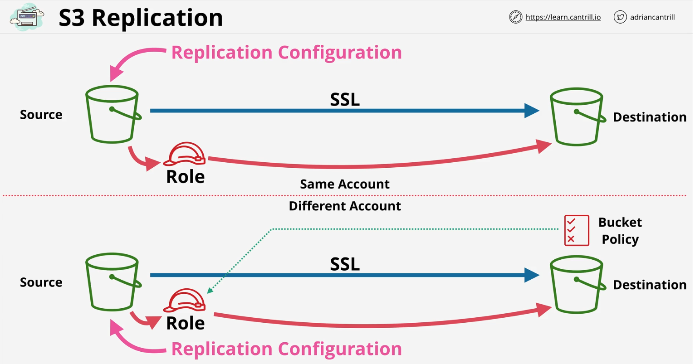

## S3 Replication

### 1. What is Cross Region Replication?

Cho phép configs để đồng bộ object từ SOURCE bucket đến DESTINATION bucket cùng hoặc khác AWS account và cùng hoặc khác region.

S3 supported 2 kiểu replication: 
- Cross-Region Replication (CRR): Cho phép replication các object từ SOURCE bucket đến DESTINATION bucket ở KHÁC region.
- Same-Region Replication (SRR): Cho phép replication các object từ SOURCE bucket đến DESTINATION bucket ở CÙNG region.

Hai kiểu replication trên chỉ khác nhau khi buckets ở cùng tài khoản hoặc khác tài khoản:

Cùng tài khoản:

- Replication configs sẽ được apply cho SOURCE bucket, cái config này thì sẽ configs S3 thực hiện đồng bộ objects (không phải ngay lập tức) từ SOURCE bucket => DESTINATION bucket.
- S3 sẽ assume IAM Role và sử dụng IAM Role để thực hiện quá trình đồng bộ objects.
- IAM Role permisstion policies cho phép nó đọc object từ SOURCE bucket và đồng bộ objects sang DESTINATION bucket.

Khác tài khoản:

- Khi configs đồng bộ objects khác tài khoản. IAM Role mặc định sẽ không trust DESTINATION account.
- Nếu configs đồng bộ objects khác tài khoản thì cần thêm bucket policies vào DESTINATION bucket và cho phép role ở SOURCE account thực hiện đồng bộ objects sang DESTINATION bucket.

### 2. S3 Replication options

1. Which objects are replicated:
   - Đồng bộ toàn bộ objects (default) hoặc một phần bằng cách tạo rule giống như filter, có thể filter objects bằng prefix hoặc tags.

2. Select which storage class the destination bucket will use: 
   - Chọn loại storage class nào mà Destination bucket sẽ sử dụng. Default thì sẽ là giống storage class với SOURCE bucket.

3. Define the ownership of the objects:
   - Nếu buckets cùng tài khoản. Default DESTINATION bucket sẽ có owned giống với SOURCE bucket.
   - Nếu buckets khác tài khoản. Default các objects bên trong DESTINATION bucket sẽ có owned là SOURCE bucket. Điều này có nghĩa là DESCTINATION accoutn sẽ không đọc được các objects này bởi vì owned đang là tài khoản khác. Trong trường hợp này bạn cũng có thể overide cái default, có thể set tất cả những objects được tạo từ DESTINATION bucket sẽ có owned là DESTINATION account.

4. Replication Time Control (RTC):
   - Adds a guaranteed level of SLA within 15 minutes for extra cost.
   - This is useful for buckets that must be in sync the whole time.

### 3. S3 Replication note

- Both buckets must have versioning enabled.
- It is a one way replication process only.
- No deletes are replicated.
- Will not replicate system events, glacier, or glacier deep archive.