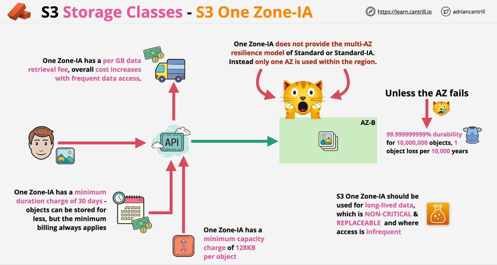

## S3 Storage classes

- [S3 Storage classes](#s3-storage-classes)
  - [1. S3 Standard](#1-s3-standard)
  - [2. S3 Standard-IA (Infrequent Access)](#2-s3-standard-ia-infrequent-access)
  - [3. S3 One Zone-IA (Infrequent Access)](#3-s3-one-zone-ia-infrequent-access)
  - [4. S3 Glacier - Instant Retrieval](#4-s3-glacier---instant-retrieval)
  - [5. S3 Glacier - Flexible Retrieval](#5-s3-glacier---flexible-retrieval)
  - [6. S3 Glacier Deep Archive](#6-s3-glacier-deep-archive)
  - [7. S3 Intelligent-Tiering](#7-s3-intelligent-tiering)

### 1. S3 Standard

<u>Đặc điểm:</u>

- `S3 Standard` là storage classes mặc định của S3 bucket.
- Objects sẽ được lưu trên nhiều AZ (availability zone) >= 3.
- `S3 Standard` 99,999999999% durability. Điều này có nghĩa rằng nếu lưu 10 triệu object trên S3 bucket, sau đó trung bình có thể mất một object mỗi 10.000 năm.
- Low latency and hight thoughput.
- `S3 Standard` nên được sử dụng cho những dữ liệu thường xuyên được truy cập (low latency) và dữ liệu quan trong, không thể thay thế (99,999999999% durability).
- Không mô tả về thời gian lưu trữ tối thiểu, dung lượng object tối thiểu.
- S3 standard has a miliseconds first by latancy and objects can be made public available (if enable static website hosting).

<u>Chi phí:</u>

- Sử dụng `S3 Standard` sẽ trả phí theo số lượng GB/tháng (S3 Standard is priced at $0.023 per GB for the first 50 TB stored per month, dropping to $0.022 per GB for the next 450 TB, then $0.021 per GB for anything over that initial 500 TB.).
- Trả phí cho transfer out, transfer in thì miễn phí.
- Trả phí khi sử dụng AWS S3 console, hoặc API/SDK sẽ phải trả phí cho các loại request. 0.005$ - PUT, COPY, POST, LIST requests (per 1,000 requests), $0.0004 - GET, SELECT, and all other requests (per 1,000 requests). Tham khảo thêm tại [S3 Pricing docs](https://aws.amazon.com/s3/pricing/).
- Không mô tả về phí khi thực hiện truy suất dữ liệu.

### 2. S3 Standard-IA (Infrequent Access)

<u>Đặc điểm:</u>

- `S3 Standard-IA` có những đặc điểm giống với `S3 Standard`(Objects sẽ được lưu trên nhiều AZ (availability zone) >= 3, 99,999999999% durability).
- Minimum 128KB charge for each object.
- Thời gian truy suất dữ liệu nhanh.
- 30 days minimum duration charge per object (Object có thể lưu ít hơn 30 ngày, nhưng khi trả phí thì vẫn áp dụng phí giống như lưu 30 ngày).
- `S3 Standard-IA` nên được sử dụng cho việc lưu trữ data lâu dài, những data quan trọng nhưng không thường xuyên được truy suất (backups data,...). Không sử dụng để lưu những file có kích thước nhỏ, KHÔNG sử dụng cho những dữ liệu tạm thời, KHÔNG sử dụng cho những dữ liệu được truy suất thường xuyên.

<u>Chi phí:</u>

- Sử dụng `S3 Standard-IA` thay vì `S3 Standard` sẽ rẻ hơn được khoảng 50%.
- Trả phí cho transfer out, transfer in thì miễn phí.
- Trả phí cho việc truy suất data trên mỗi GB.

### 3. S3 One Zone-IA (Infrequent Access)

<u>Đặc điểm:</u>

- `S3 One Zone-IA` chỉ được lưu trên 1 AZ, sẽ không giống với `S3 Standard` và `S3 Standard-IA` là được lưu trên nhiều AZ (>=3).
- Minimum 128KB charge for each object.
- Thời gian truy suất dữ liệu nhanh.
- 30 days minimum duration charge per object (Object có thể lưu ít hơn 30 ngày, nhưng khi trả phí thì vẫn áp dụng phí giống như lưu 30 ngày).
- `S3 One Zone-IA` nên được sử dụng cho việc lưu data lâu dài, những dữ liệu KHÔNG quan trọng và những dữ liệu này không thường xuyên được truy suất.

<u>Chi phí:</u>

- Chi phí sẽ rẻ hơn nhưng vì chỉ lưu trên 1 AZ nên khả năng mất dữ liệu cũng nhiều hơn só với `S3 Standard` và `S3 Standard-IA`.
- Trả phí cho việc truy suất data trên mỗi GB.

### 4. S3 Glacier - Instant Retrieval

<u>Đặc điểm:</u>

- `S3 Glacier - Instant Retrieval` có chi phí lưu trữ rẻ hơn `S3 Standard-IA` những lại đắt hơn về chi phí truy suất dữ liệu.
- Minimum 128KB charge for each object.
- 90 days minimum duration charge per object (Object có thể lưu ít hơn 90 ngày, nhưng khi trả phí thì vẫn áp dụng phí giống như lưu 90 ngày).
- Thời gian truy suất dữ liệu nhanh.
- `S3 Glacier - Instant Retrieval` nên được sử dụng cho việc lưu trữ dữ liệu lâu dài, tần suất truy suất không thường xuyên (khoảng mỗi quý) với thời gian truy suất nhanh.

<u>Chi phí:</u>

- Trả phí lưu trữ (All Storage/Month => $0.004/GB).
- Trả phí cho việc truy suất data trên mỗi GB.

### 5. S3 Glacier - Flexible Retrieval

<u>Đặc điểm:</u>

- Objects sẽ được lưu trên nhiều AZ (availability zone) >= 3, 99,999999999% durability.
- Chi phí lưu trữ bằng khoảng 1/6 so với S3 Standard.
- Objects khi được lưu với storage classes này sẽ không sẵn sàng để sử dụng luôn (giống như "object đông đá" cần phải "rã đông" thì mới sử dụng được).
- Không public access được, cần phải có quá trình truy suất. 
- 40KB minimum object capacity charge.
- 90 days minimum storage duration charge.

<u>Các phương thức truy suất:</u>

- Expedited: 1 - 5 minutes, but is the most expensive.
- Standard: 3 - 5 hours to restore.
- Bulk: 5 - 12 hours. Has the lowest cost and is good for a large set of data.

<u>Chi phí:</u>

- Trả phí lưu trữ (All Storage/Month => $0.0036/GB).
- Trả phí cho việc truy suất data trên mỗi GB.

### 6. S3 Glacier Deep Archive

<u>Đặc điểm:</u>

- Objects sẽ được lưu trên nhiều AZ (availability zone) >= 3, 99,999999999% durability.
- 40KB minimum object capacity charge.
- 180 days minimum storage duration charge.
- Không public access được, cần phải có quá trình truy suất. 

<u>Các phương thức truy suất:</u>

- Standard: 12h hours.
- Bulk: upto 48h.

<u>Chi phí:</u>

- Trả phí lưu trữ (All Storage/Month => $0.00099/GB).
- Trả phí cho việc truy suất data trên mỗi GB.

### 7. S3 Intelligent-Tiering

<u>Đặc điểm:</u>

- Storage class này sẽ monitor và tự động di chuyển các object vào các storage class khác nhau.
- Nếu object không được truy suất sau 30 ngày => di chuyển object vào Standard-IA.
- Nếu object không được truy suất sau 90 ngày => di chuyển object vào Glacier Instant Retrieval.
- Nếu object không được truy suất sau 90/180 ngày => di chuyển object vào Glacier Flexible hoặc Deep Archive 
- Nếu object được truy suất trở lại thì sẽ di chuyển object vào Frequent Access.
 
<u>Chi phí:</u>

- Sẽ phải trả thêm phí monitor và tự động di chuyển object (>128KB) giữa các storage class (0.0025/1000 objects).