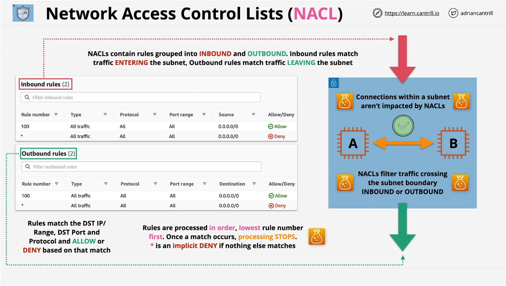
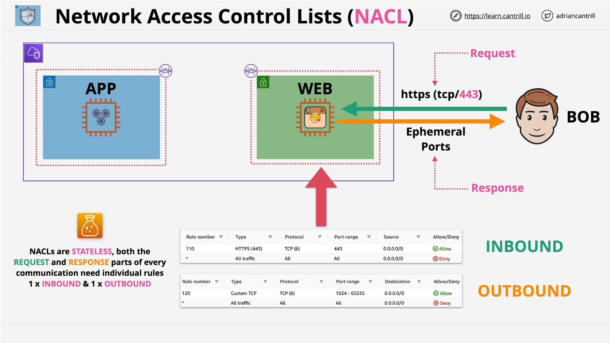
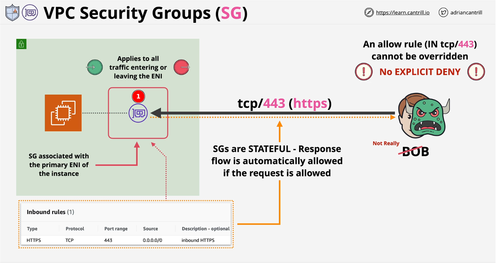

## Network access control list (NACL) and Security Group (SG)

### 1. Network access control list (NACL)

- Mỗi subnet đều có NACL.
- NACL bao quanh subnet hoạt động giống như một lớp filter các request đi vào ra subnet. Các instanceA và instanceB bên trong subnet thì có thể gọi sang nhau mà không chịu ảnh hưởng của NACL.
- Network access control list (NACL) là stateless firewall. Có nghĩa là sẽ không lưu trạng thái của connections, sẽ phải apply các rule trên cả chiều inbound (Inbound rule) và outbound (Outbound rule).
- Các rule sẽ được thực hiện theo thứ tự từ nhỏ => lớn.

*Giải thích:*

- Hình trên có 2 tier (APP và WEB). APP tier nằm trong private subnet, còn WEB tier nằm trong public subnet.
- Request đi từ Ngoài internet (BOB) gọi vào WEB tier sẽ đi qua access control list (NACL) bọc quanh WEB tier (public subnet).
- Có 2 rule InBound và Outbound:
  - Inbound rule:

    - **Rule number (110)**: Allow các request đi từ ngoài internet (source: 0.0.0.0/0) vào bên trong với type: HTTPS, Port 443.
    - **Rule number (*)**: Deny hêt tất cả các request đi vào từ internet (source: 0.0.0.0/0) mà không match với rule (110).

  - Outbound rule:

    - **Rule number (120)**: Allow các request đi từ subnet ra bên ngoài internet (source: 0.0.0.0/0). Port range (1024-65535) vì request khi call sẽ chọn một temporary port từ 1024-65535 tùy thuộc vào OS và khi response trả về thì cũng sẽ theo port mà client chọn (cái port này thì không biết trước được) nên sẽ allow port theo range.
    - **Rule number (*)**: Deny hêt tất cả các response đi ra internet (source: 0.0.0.0/0) mà không match với rule (120). 

### 2. Security Group

*Giải thích:*

- Statefull firewall, tự động detect response traffic.
- Allow (IN or OUT) request sẽ tự động allow response. Không cần phải tạo 2 rule cho mỗi communication. Sẽ không cần quan tâm đến temporary port.
- Security Group không attached vào instance, subnet mà sẽ attach vào ENI (Elastic Network Interface) (1). Khi thực hiện attach một security group vào một instance thì bản chất là attached vào primary network interface của instance đó.
- 