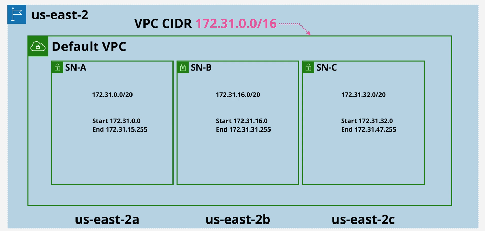

# VPC (Virtual Private Cloud) Basic

- [VPC (Virtual Private Cloud) Basic](#vpc-virtual-private-cloud-basic)
  - [1. What is VPC?](#1-what-is-vpc)
  - [2. Default VPCs](#2-default-vpcs)

## 1. What is VPC?

VPC is a service you will use to create private network inside AWS. VPCs are regional services, VPC operate from multiple availablity zones in a specific AWS region. VPCs by default is private ans isolated, services deployed into the same VPC can communicate but VPC isolated from other VPCs and from the public AWS zone and public internet. VPCs has two type inside a region:

- `Default VPC`: One `Default VPC` per region. `Default VPCs` are init created by AWS, and there is one per region create by default.
- `Custom VPC`: You can configure them any way you that you want. `Custom VPC` required you configure everything end-to-end in detail, and they are also a 100% private by default. You will use custom VPCs in almost all serious AWS Deployments because you can control all configure how you need. Configure linked to other VPCs, connect other cloud platforms and you on-premises networks.

## 2. Default VPCs

`Default VPC` in the picture above inside `us-east-2` region and 3 AZ (`us-east-2a`, `us-east-2b` and `us-east-2c`). Inside `Default VPC` has 3 subnet: `SN-A`, `SN-B` and `SN-C`.

**Default VPC facts**

- One `Default VPC` per region, you can delete default VPC and recreate it.
- `Default VPC` CIDR is always `172.31.0.0/16` and this is the same in every region.
- /20 subnet in each AZ in the region.
- Internet Gateway (IGW), Security Group (SG) and NACL which allow VPC to communicate with internet.
- Subnets assign public IPv4 addresses.