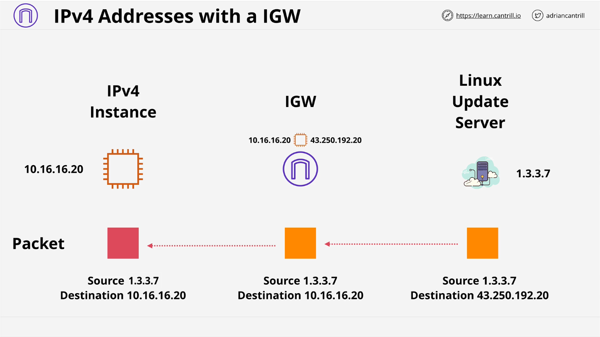
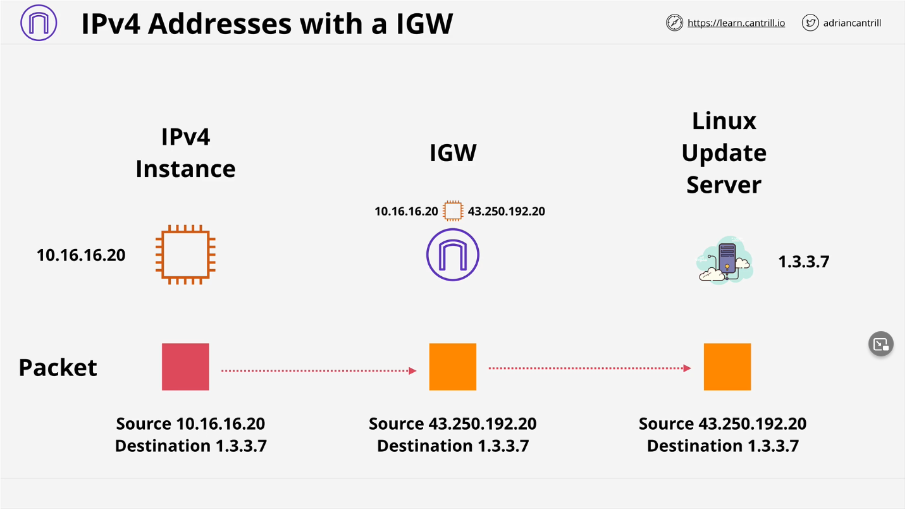

## Elastic Network Interface (ENI)

- Là **virtual network interface** có thể gắn vào instance bên trong VPC.
- ENIs chỉ tồn tại bên trong một VPC.
- Có thể có 1 Public IP và nhiều Private IP (Nếu nhiều private IP thì cần phải có 1 IP là primary).
- ENIs đã được tạo sẽ không phụ thuộc vào một instance cụ thể nào cả, sẽ không phụ thuộc vào lifetime của instance đang gắn ENI.
- Nếu instance gắn ENI fails, IP address có thể vẫn còn tồn tại bằng cách attached ENI vào một instance thay thế.

### Create EC2 and enable public IP.

- **Internet Gateway** là logical connection giữa VPC và internet. Nếu không có internet gateway thì sẽ không có connection nào giữa VPC và internet.
- Tất cả EC2 instance bên trong VPC sẽ đều có private IP. Các EC2 này có thể có public IP (Enable auto assign public IP, AWS sẽ random IP và assign khi instance khởi tạo thành công). Hoặc cũng có thể gắn **Elastic IP** (IP này sẽ không đổi).
- Thực sự thì Public IP sẽ được gắn vào **Elastic Network Interface (ENI)**. Một instance có thể có nhiều ENIs.
- Bản thân instance không biết về "public IP" hoặc "Elastic IP". Thay vào đó khi có traffic đi từ Internet ==> Public IP thì Internet Gateway sẽ xử lý translate Public IP sang Private IP và send traffic vào private IP của instance. Tương tự, chiều đi ra từ instance ==> internet gateway thì traffic sẽ đi từ Private IP của instace đến internet gateway (thay đổi sourceIP của gói tin từ private IP => public IP).

