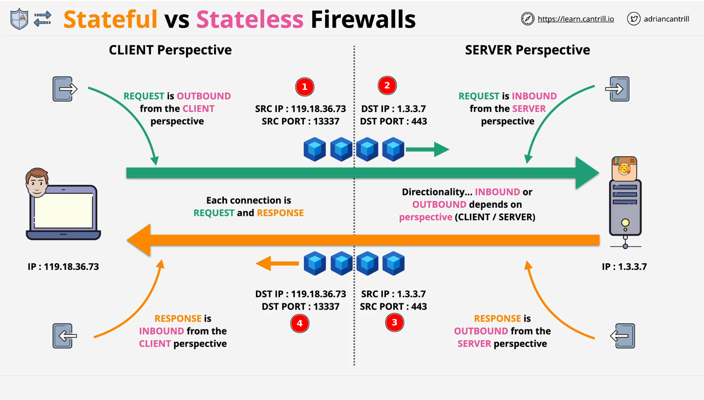
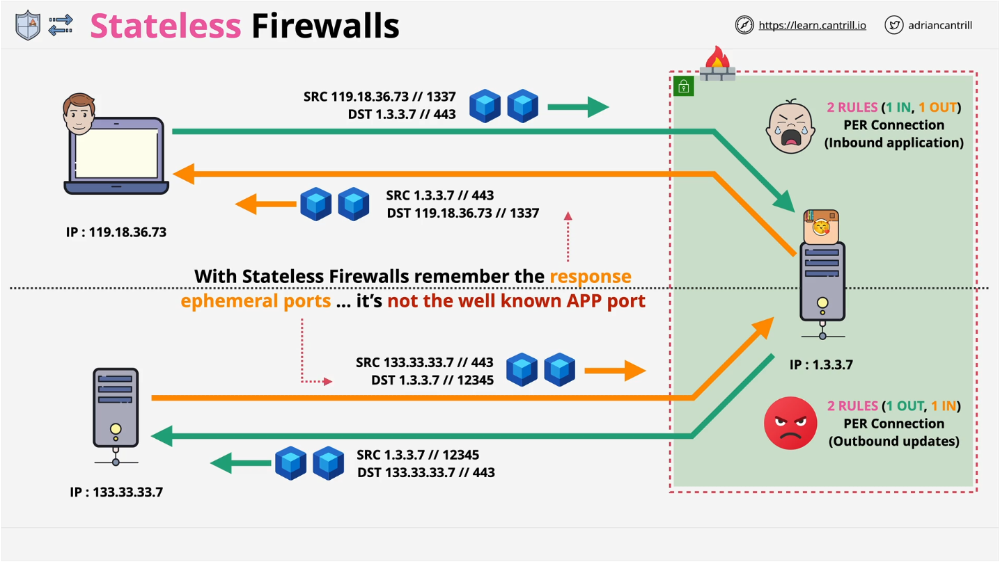
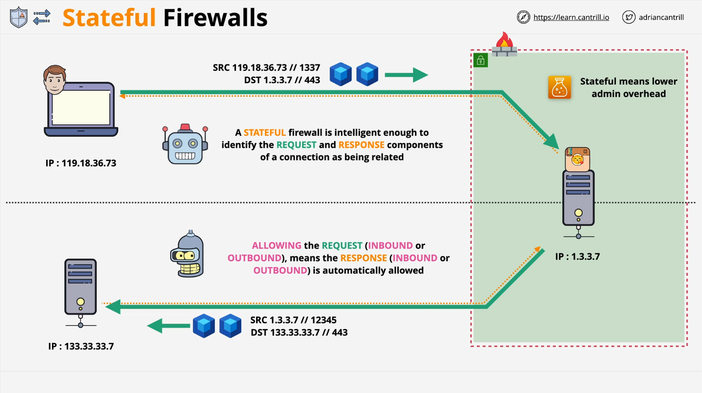

## Statefull vs Stateless Firewall

- [Statefull vs Stateless Firewall](#statefull-vs-stateless-firewall)
  - [1. Temporary or Ephemeral port](#1-temporary-or-ephemeral-port)
  - [2. Stateless firewall](#2-stateless-firewall)
  - [3. Statefull firewall](#3-statefull-firewall)

### 1. Temporary or Ephemeral port

In client-server processes that use Transmission Control Protocal/Internet Protocol (TCP/IP) or User Datagram Protocol (UDP). Client initiates comminication with a server through one of the many well-known ports (HTTP - 80; HTTPS - 443). However, because the server not initates communication, it shoult not use a well-known port to send response to client. Instead, the server use temporarily assigned port that client provides as the source port.

After communication is terminated, the port becomes available for use in other session.

Explain:

- Client (IP: 119.18.36.73) send request to server (IP: 1.3.3.7).
- (1) (2): Client pick Temporary or Ephemeral port as source port (1.24-65535 depends on OS). In this case client pick port: 13337. Client (source IP: 119.18.36.73 and source port: 13337) send request to Server (Destination IP: 1.3.3.7 and Destination port: 443).
- (3) (4): Server (Source IP: 1.3.3.7 and Source Port: 443) response to Client (Destination IP: 119.18.36.72 and Destination port: 13337). 
- Đối với ngữ cảnh của Client khi gửi request thì chính là OUTBOUND, còn đối với ngữ cảnh của Server thì khi nhận được request chính là INBOUND của Server.
- Ngược lại khi Server response cho Client. Response đi ra từ Server (OUTBOUND) đến Client (INBOUND).

### 2. Stateless firewall

Stateless firewall sẽ không nhớ được state của connections. Định nghĩa rule (allow/deny) thì phải định nghĩa trên cả 2 phần của connection (request và response).

Với Stateless firewall thì sẽ sử dụng Temporary or Ephemeral port cho phần response này, nếu định nghĩa rules cho phần response thì biết port nào mà client pick mà allow với deny cho chiều response? Câu trả lời là phải allow hoặc deny theo khoảng port (1024–65535).

### 3. Statefull firewall

Với Statefull firewall thì sẽ không cần phải defined rule trên cả inbound và outbound. Statefull firewall đủ thông minh để xác định được REQUEST và RESPONSE có liên quan. 

Nếu là Allow REQUEST (INBOUND hoặc OUTBOUND) thì RESPONSE sẽ được tự động ALLOW (INBOUND hoặc OUTBOUND). 

