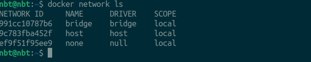
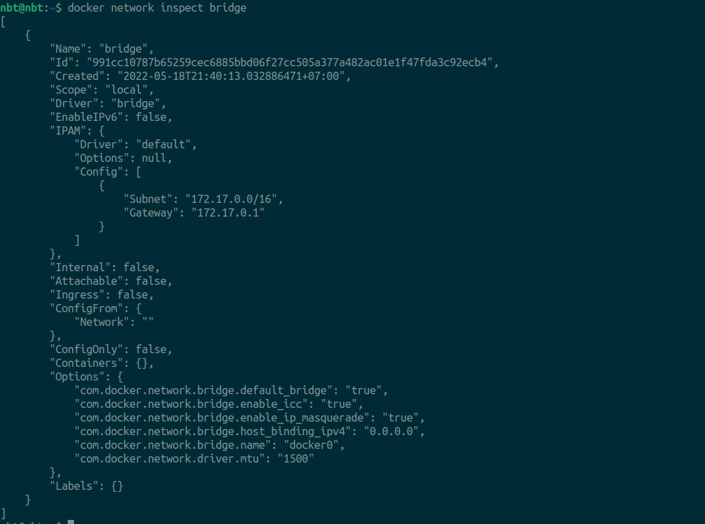
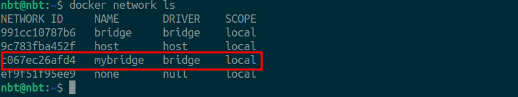

## Docker network

### 1. Basic of networking

Thông qua `Docker network` mà các containers có thể nói chuyện được với nhau, từ bên ngoài máy host có thể truy cập được vào containers. Docker network thì đang có 3 loại:



### 1.1 Bridge network

* *Bridge network là gì*:
  `Bridge network` là network **default** mà khi chung ta tạo containers mà không chỉ định cho containers sẽ kết nối vào network nào thì containers sẽ mặc định được kết nối đến network default là `Bridge network`. Có thể sử dụng command `docker network inspect bridge` để xem chi tiết network này.

  

  Mình cùng tập chung vào phần `IPAM` (IP Address Manager). Ở đây có 2 phần là thông tin là `Subnet` và `Gateway` IP addresses. Thông tin ở phần `Subnet: 172.17.0.0/16`, là đang mô tả pool IP address, sẽ được bắt đầu từ `172.17.0.0`, và default gateway sẽ là: `172.17.0.1`. Tất cả các containers kết nối đến network default này thì sẽ được gán cho IP Address từ trong pool IP bắt đầu từ `172.17.0.0`, và sẽ nhận default gateway sẽ là: `172.17.0.1`. Chúng ta cũng có thể thấy trường `Containers: {}` đang là trống, vì chưa có container nào kết nối đến default network.
* *Demo*
  Giờ mình thử tạo một container `nginx` và sẽ kết nối đến network default là `bridge`:

  ```Docker
  nbt@nbt:~$ docker run -d --name nginx-3 nginx:latest
  f67209184b946536080dbe7fd42c24fff57b0a10076194fee8f0f3b8f982aceb

  nbt@nbt:~$ docker ps
  CONTAINER ID   IMAGE          COMMAND                  CREATED         STATUS         PORTS     NAMES
  f67209184b94   nginx:latest   "/docker-entrypoint.…"   3 seconds ago   Up 2 seconds   80/tcp    nginx-3
  ```

  Giờ mình thử inspect network brigde

  ```Docker
  nbt@nbt:~$ docker network inspect bridge
  [
      {
          "Name": "bridge",
          "Id": "991cc10787b65259cec6885bbd06f27cc505a377a482ac01e1f47fda3c92ecb4",
          "Created": "2022-05-18T21:40:13.032886471+07:00",
          "Scope": "local",
          "Driver": "bridge",
          "EnableIPv6": false,
          "IPAM": {
              "Driver": "default",
              "Options": null,
              "Config": [
                  {
                      "Subnet": "172.17.0.0/16",
                      "Gateway": "172.17.0.1"
                  }
              ]
          },
          "Internal": false,
          "Attachable": false,
          "Ingress": false,
          "ConfigFrom": {
              "Network": ""
          },
          "ConfigOnly": false,
          "Containers": {
              "f67209184b946536080dbe7fd42c24fff57b0a10076194fee8f0f3b8f982aceb": {
                  "Name": "nginx-3",
                  "EndpointID": "e64830211034098890787d74a4afb238d9ced7742a30e3cd22e016d5ff37c4d9",
                  "MacAddress": "02:42:ac:11:00:02",
                  "IPv4Address": "172.17.0.2/16",
                  "IPv6Address": ""
              }
          },
          "Options": {
              "com.docker.network.bridge.default_bridge": "true",
              "com.docker.network.bridge.enable_icc": "true",
              "com.docker.network.bridge.enable_ip_masquerade": "true",
              "com.docker.network.bridge.host_binding_ipv4": "0.0.0.0",
              "com.docker.network.bridge.name": "docker0",
              "com.docker.network.driver.mtu": "1500"
          },
          "Labels": {}
      }
  ]
  ```

  Phần thông tin `Containers` đã có một container đó là container nginx của chúng ta vừa tạo kết nối vào. IP `172.17.0.2/16` của containers này cũng được lấy từ dải IP mà được gán cho brigde network.
* *Cách để tạo ra một network*:

  ```Docker
  docker network create --driver <ten driver> <ten network>

  docker network create -d bridge mybridge
  ```

  

  Cách để chạy một container và chỉ định network cho container đó là: `docker run --name <ten container> <imageName:tagName> --network <tenNetwork>`
* *Cách các containers connect với nhau*:

  ```Docker
  nbt@nbt:~$ docker ps
  CONTAINER ID   IMAGE          COMMAND                  CREATED          STATUS          PORTS     NAMES
  e8b33b2d2007   nginx:latest   "/docker-entrypoint.…"   3 minutes ago    Up 3 minutes    80/tcp    nginx-4
  f67209184b94   nginx:latest   "/docker-entrypoint.…"   28 minutes ago   Up 28 minutes   80/tcp    nginx-3


                      172.17.0.3                           172.17.0.2
                     ------------                         -------------
                     |          |                         |           | 
                     | container| --------- OK -------->  | container |
                     | nginx-4  |                         | nginx -3  | 
                     |          | <-------- OK ---------  |           |
                     ------------                         -------------
                         ||                                     ||
                         ||                                     ||
                         ||                                     ||
                         ----------------------------------------------
                         |                                            |
                         |         Docker network brigde              |
                         |                                            |
                         ----------------------------------------------

  - Container nginx3 và container nginx4 có thể gọi qua nhau được vì nó đang cùng kết nối đến 1 mạng default là `brigde`
  - Đứng ở container 3 có thể gọi container 4 như sau: gọi trực tiếp bằng IP của container4. xem IP của container thì có thể inspect container là lấy được thông tin của IP container.

  docker exec -it f67209184b94 sh
  curl http://172.17.0.3:80

  <!DOCTYPE html>
  <html>
  <head>
  <title>Welcome to nginx!</title>
  <style>
  html { color-scheme: light dark; }
  body { width: 35em; margin: 0 auto;
  font-family: Tahoma, Verdana, Arial, sans-serif; }
  </style>
  </head>
  <body>
  <h1>nginx container 4</h1>
  </body>
  </html>
  ```
* Các containers ở các network khác nhau thì không thể kết nối được với nhau.

  ```Docker
    bt@nbt:~$ docker ps 
    CONTAINER ID   IMAGE          COMMAND                  CREATED              STATUS              PORTS     NAMES
    12f5ddbcb2b5   nginx:latest   "/docker-entrypoint.…"   About a minute ago   Up About a minute   80/tcp    nginx-7
    e8b33b2d2007   nginx:latest   "/docker-entrypoint.…"   44 minutes ago       Up 44 minutes       80/tcp    nginx-4
    f67209184b94   nginx:latest   "/docker-entrypoint.…"   About an hour ago    Up About an hour    80/tcp    nginx-3

    docker exec -it f67209184b94 sh

    curl http://172.18.0.2:80
    curl: (28) Failed to connect to 172.18.0.2 port 80: Connection timed out
  ```

  Vì container `nginx-4` và `nginx-3` cùng connected đến network `bridge` còn container `nginx-7` thì connected đến network là `mybridge`, vì là container `nginx-4` và container `nginx7` đang connected đến 2 network khác nhau ==> không gọi sang được cho nhau.

### 1.2 None Network

Một `none network` có nghĩa là nó sẽ không cung cấp một cái network nào cho containers cả, các containers mà kết nối đến `none network` thì giống như kiểu bị cô lâp, các containers sẽ không thể gọi đến các container này.

Sẽ không có nhiều trường hợp sẽ sử dụng loại network này, hoặc là chỉ sử dụng cho trường hợp đặc biệt nào đó không muốn hoặc tránh việc container được gọi đến từ các container khác.
