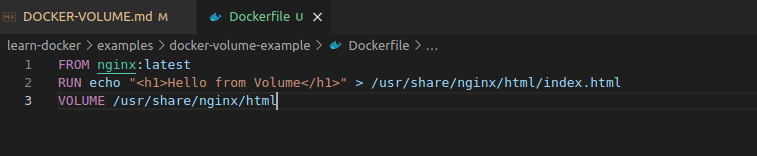

## Docker Volume

### Tài liệu tham khảo:

https://earthly.dev/blog/docker-volumes/

https://www.baeldung.com/ops/docker-volumes

### 1. Overview

Docker containers được sử dụng để chạy application một cách tách biệt. Default thì các data bên trong container sẽ bị mất. Nếu mà muốn data không bị mất thì Docker có cung cấp thêm như: `Docker volume`, `bind mount`.

### 2. What Is a Volume?

#### 2.1 The Docker File System

Docker container chạy trên container-layer (read-write layer), container-layer là layer được build lên các image layer (read-only layer). Khi chạy một Docker container thì Docker sẽ add thêm một layer mới là: container-layer (read-write layer) lên trên cùng các image layer.

Khi mà các file thay đổi bên trong container, **when the container is stopped or deleted, that read-write layer is lost.**

VD: Mình thử chạy một container nginx.
`docker run -it -d -p 8083:80 nginx:latest` thì được kết quả như hình dưới.


Giờ mình thử sửa trang index html default của nginx.

```Docker
    docker exec -it <containerID> sh
    cd /usr/share/nginx/html
    vi index.html // mình sẽ sửa thành "Hello from Thanhnb!"
```


- Giờ mình thử stop container xem thay đổi vừa rồi của mình còn được giữ không. => Kết quả là sự thay đổi vẫn được giữ nguyên, vì Docker không có tạo container mới, nên file thay đổi vẫn được giữ.
- Giờ mình xóa container đi, và run lại xem sao => Kết quả lúc này là sự thay đổi ở bước trước đã bị xóa đi rồi, vì Docker lúc này đã tạo lại container mới từ container layer, nên những sử thay đổi ở container cũ sẽ bị mất.

#### 2.2 Bind Mounts

Docker `bind mount` giúp ta kết nối từ container đến một thư mục ở trên máy host. Nó cho phép mình chia sẻ file từ máy host vào bên trong containers.

```Docker
    # tạo ra một file index.html trong đó có nội dung là: "<h1>Hello from Host</h1>".
    echo "<h1>Hello from Host</h1>" > index.html 
    docker run -it  -d --rm --name nginx -p 8084:80 -v "$(pwd)"/index.html:/usr/share/nginx/html/index.html nginx
```

Ở trên thì đang thấy là chạy command Docker run với tham số  `-v` hoặc là `--volume` là bạn đang muốn mount một file hoặc một foler từ máy host vào bên trong containers. Ở VD trên thì file ở local là `$(pwd)"/index.html` và mình muốn mount cái file `index.html` này vào bên trong folder `/usr/share/nginx/html/index.html` bên trong container `nginx`. Đây cũng có thể nói là một cách để có thể lưu dữ liệu của containers, để khi container bị xóa thì sẽ không mất dữ liệu vì mỗi lần chạy lại container thì file `index.html` ở máy host lại được mount vào bên trong containers.

#### 2.3. Docker Volumes

`bind mount` là bạn có thể mount bất cứ file hoặc là foler từ máy host vào bên trong containers.Docker volume sẽ lưu ở một chỗ  (`/var/lib/docker/volumes/` on unix systems). Docker volume có thể chia sẻ dữ liệu cho các containers running khác.

#### 2.3.1 Creating and Managing Docker Volumes

Trong phần này thì sẽ tìm hiểu cách tạo Docker volume `implicitly` and `explicitly` sau đó thì học cách khai báo docker volume từ Dockerfile. Học cách view data volume, mount volume vào bên trong container, configs volume từ docker-compose.

**1. Create a Docker Volume Implicitly**

Chúng ta có thê tạo Docker volume bằng cách sử dụng `-v` hoặc là `--volume` khi chạy docker run command.

```
-v <source>:<destination>:<options>
```

Nếu mà "source" mà là path thì đó là sử dụng `bind mount` giống như phần trước đã tìm hiểu. Còn nếu "source" là một tên, thì lúc này sẽ là sử dụng `docker volume`, lúc này docker sẽ cố gắng tìm kiếm volume có tên đã khai báo ở phần "source", nếu không có thì docker sẽ tự động tạo một volume mới có tên như khai báo ở phần "source". Thử chạy command ở phần trước với `bind mount` và giờ sẽ dung `docker volume`.

```Docker
docker run -it --rm --name nginx -p 8080:80 -v demo-earthly:/usr/share/nginx/html nginx
```


Hình trên thì ta đã thấy một volume `demo-earthly` đã được tạo ra. Sửa file index.html bên trong container, khi xóa container và chạy lại thì dữ liệu thay đổi trước đó vẫn được giữ.

**2. Create a Docker Volume Explicitly**

Sử dụng `docker volume create` command để tạo docker volume, tạo volume bằng cách này thì có thể thêm option config `volume driver`, còn tạo volume `implicitly` thì sẽ luôn luôn sử dụng `local` driver

```Docker
docker volume create --name demo-earthly
```

**3. Declare a Docker Volume from Dockerfile**

Volumes có thể được khai báo bên trong Dockerfile sử dụng `VOLUME` statement. Khai báo path mà container sẽ mount vào một Docker volume. Khi chạy containers từ Dockerfile này thì Docker sẽ tạo ra một `anonymous volume` (volume with a unique id as the name) và mount nó vào path được khai bảo ở `VOLUME` statement.


- Dòng thứ 2: đang tạo ra một file index.html với nội dụng `"<h1>Hello from Volume</h1>"` thực hiện đè vào trạng index.html default của nginx.
- Dòng thứ 3: Khai báo volume, path ở đây là: `/usr/share/nginx/html` path naỳ là path bên trong container, dữ liệu (file, folder) trong path trên thì sẽ được mount vào bên trong Docker volume. Khi chạy container thì một `anonymous volume` (volume with a unique id as the name) sẽ được tạo ra để mount.

```Docker
docker build -t docker-volume-demo -f Dockerfile .
Sending build context to Docker daemon  2.048kB
Step 1/3 : FROM nginx:latest
 ---> fa5269854a5e
Step 2/3 : RUN echo "<h1>Hello from Volume</h1>" > /usr/share/nginx/html/index.html
 ---> Running in 1a788b87b87b
Removing intermediate container 1a788b87b87b
 ---> 444f4ff8212e
Step 3/3 : VOLUME /usr/share/nginx/html
 ---> Running in 534a2126cd9b
Removing intermediate container 534a2126cd9b
 ---> 3efa0cf99e7a
Successfully built 3efa0cf99e7a
Successfully tagged docker-volume-demo:latest

docker run --name nginx-demo -it -d -p 8086:80 docker-volume-demo:latest
```


**- NOTE**: Với kiểu khai báo volume bên trong Dockerfile thì sẽ tạo ra `anonymous volume` khi tạo containers từ Docker image. MỖI LẦN TẠO MỘT CONTAINER TỪ DOCKER IMAGE TRÊN THÌ SẼ ĐỀU TẠO RA MỘT `anonymous volume` MỚI. CÁI `anonymous volume` SẼ KHÔNG BỊ XÓA ĐI KHI CONTAINER BỊ XÓA. VÌ LÀ MỖI LẦN ĐỀU TẠO RA MỘT `anonymous volume` MỚI NÊN KHI TRONG QUÁ TRÌNH CHẠY CONTAINER MÀ SINH RA DATA (FILE HOẶC LÀ FOLDER) THÌ SẼ XẢY RA VẤN ĐỀ.
VD: imageA -> containerA -> anonymous-volumeA. "ContainerA" khi chạy thi sinh ra một số data và data này được mount vào "anonymous-volumeA", nhưng khi "ContainerA" bị xóa, vào tạo một container mới "containerB" nó lại sinh ra anonymous-volume mới là "anonymous-volumeB" mà không sử dụng lại được "anonymous-volumeA" nên data khi "containerA" sinh ra khi còn chạy sẽ bị mất.

VD:

```Docker
docker run --name nginx-demo-4 -it -d -p 8088:80 docker-volume-demo:latest

docker exec -it 98476417e06a sh

vi /usr/share/nginx/html/index.html
```

Đã thay đổi text trong file index.html của nginx container thành `<h1>Hello Thanhnb11</h1>`, lúc này thì cũng đã có một anonymous volume được sinh ra.


Giờ thì thử xóa container trên và tạo lại một container ngix mới xem data thay đổi ở bước trên có được giữ hay không?

Như ta thấy thì dữ liệu thay đổi ở bước trươc đã biến mất khi tạo container mới. Lý do ở đây là vì mỗi lần tạo container mới thì sẽ lại tạo ra `anonymous volume` mới mà không sử dụng lại volume cũ => dữ liệu bị mất.

**4. Mount a Volume to a Container**

Ở những VD trên thì là đang sử dụng `-v` hoặc là `--volume` để thực hiên mount volume vào trong containers.

```Docker
-v <name>:<destination>:<options>

- <name>:
    + là path nếu muốn sử dụng `bind mount`.
    + là tên volume nếu muốn sử dụng Docker volume.

- <destination>: là foler bên trong container mà muốn mount data vào volume.
- <options>: là các option thêm khi sử dụng volume, vd: "ro": read-only,..

docker run -it -v demo-volume:/data:ro ubuntu
```

Cũng có thể sử dụng `--mount` để thực hiên mount volume.

```Docker
docker run --mount source=[volume_name],destination=[path_in_container] [docker_image]

docker run -it --name=example --mount source=demo-volume,destination=/data ubuntu
```

**5. Configure a Volume Using docker-compose**

