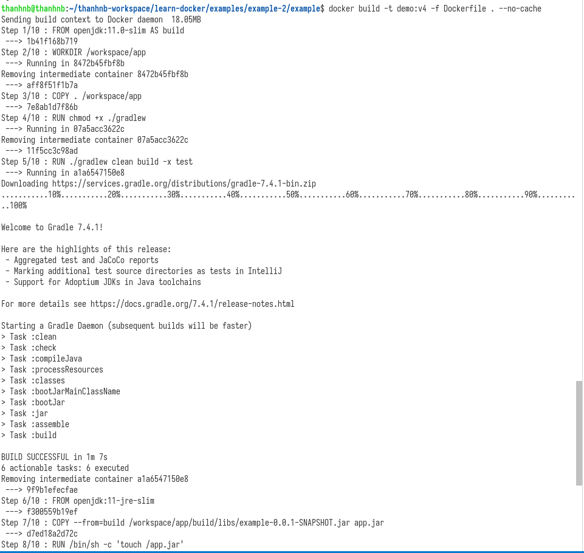
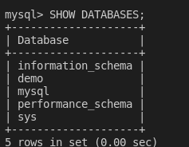

# **Docker handbook.**

- [Docker handbook](https://www.freecodecamp.org/news/the-docker-handbook/#what-is-a-container).
- Docker in action book.

## **Roadmap**

File README này được chia thành 3 phần:

- **Phần 1**: Phần này sẽ nói về các tính năng của Docker và containers. Đọc phần này sẽ giúp hiểu được cách install và uninstall software với Docker. Sẽ học cách run, manage Docker containers.
- **Phần 2**: Phần này sẽ tập chung vào cách đóng gói và xây dựng các service với Docker. Phần này cũng sẽ nói về cách hoạt động của Docker images.
- **Phần 3**: Phần này sẽ nói về Docker compose

## **1. Welcome to Docker.**

#### **Nội dung:**

- Docker là gì?
- Run first container "Hello world".
- Giới thiệu về containers.
- When, where, and why you should use Docker.

### **1. 1 Docker là gì?**

* *Docker* là tool giúp mình cài đặt các service một cách dễ dàng, cộng đồng sử dụng lớn (VD: Khi cần cài mysql5.7: chỉ cần lên dockerhub để chọn Docker image đúng version mong muốn rồi pull về run là xong, môi trường develop cần có nhiều các services cùng chạy, mà mô hình hướng tới bây giờ đó mà microservice, các service có thể cần phải có những môi trường khác nhau cho từng services. Trước khi sử dụng Docker thì các service này sẽ phải cùng cài lên một máy host => có thể dẫn đến lỗi, nhưng khi sử dụng Docker thì các service này sẽ chạy trên môi trường riêng biệt gọi là các container.)
* Docker là một platfrom, nó giúp cho chúng ta có thể đóng gói để có thể deploy - được gọi là các containers, chúng sẽ bao gồm OS cần thiết + code + các deplentdencies để có thể chạy code.

### **1. 2 Run first container "Hello world"?**

```Docker
docker run dockerinaction/hello_world
```


Explain: Ở lần chạy đầu tiên chạy `docker run dockerinaction/hello_world`,

- Step 1: Docker sẽ xem image `dockerinaction/hello_world` đã được downloaded ở máy host hay chưa?, nếu chưa thì sẽ lên Dockerhub hoặc là private docker registry để download về máy host.
- Step 2: Docker sẽ tạo container từ image `dockerinaction/hello_world` đã được download từ bước trước.
- Ở lần chạy thứ 2, lúc này thì image `dockerinaction/hello_world` đã được download ở lần chạy thứ 1, lúc này Docker sẽ chạy luôn container từ image `dockerinaction/hello_world`.

  .

### **1. 3 Giới thiệu về containers**

- Docker containers sẽ không sử dụng hardware virtualization. Các chương trình chạy bên trong Docker containers sẽ sử dụng trực tiếp với host’s Linux kernel
- Docker containers giống như một cái hộp bao gồm code và các dependencies, các containers sẽ là những môi trường riêng biệt trên máy host, một máy host có thể chạy nhiều containers mà không ảnh hưởng đến hiệu năng của máy host.
  
- Container runtime đó là Docker, sẽ nằm ở giữa containers và host OS, các containers sau đó sẽ tương tác với container runtime để có thể lấy những resources cần thiết.
  

### **1. 4 Giới thiệu về Docker image**

* Docker image là các bước để giải quyết một vấn đề gì đó (VD: trong folder example-1 thì là chạy được file my-app.sh).
* Docker image có thể được tạo từ các cách sau:
  * Commit từ container thành image.
  * Tạo Docker image từ Dockerfile.
    
  * *Explain*:

    * b1: FROM alpine -> image base này được pull từ dockerhub.
    * b2: chạy lệnh apt update để update software và dependencies.
    * b3: chạy lệnh COPY từ current folder vào folder /app bên trong container.
    * b4: Lệnh này sẽ được chạy khi container được khởi tạo. (lệnh này sẽ không chạy trên docker image).
  * Tạo docker image từ Dockerfile.

    ```docker
       docker build -t <tag name> -f Dockerfile <path Dockerfile>
       docker build -t my-image -f Dockerfile .
    ```

    Khi lệnh docker build trên thành công thì lúc này chúng ta đã có Docker image có tag name là "my-image".
  * Khi build Dockerfile trên ở lần thứ 2 thì thấy build rất nhanh? tại vì sao? cơ chế cache trong docker.

    * Mỗi một lệnh trong Dockerfile sẽ sinh ra một Docker image layer mới, các image layer này là read-only, và stack lên nhau -> tạo thành docker image.
      
      Khi thực hiện re-build image thì docker sẽ detect xem có sự thay đổi ở bước nào trong Dockerfile hay không?, nếu không thì sẽ sử dụng lại image layer đã được build trước đó (cached), nếu thay đổi thì thực hiện build lại ở bước thay đổi trở về sau.
    * Trong VD trên thì khi thực hiện re-build docker image thì thấy được là ở bước 9 đã có sự thay đổi -> các bước từ 1->8 thực hiện lấy image layer cũ, bước 9->10 thực hiện build lại.
* Cách tạo docker containers từ Docker image.
  
* Mối liên hệ giữa Docker image và docker containers
  
* Example-2: Build Docker image from Dockerfile java spring boot
  
  
  * Ở step 1/10: thì pull image `openjdk:11.0-slim` từ Dockerhub làm image base. -> được image ID `1b41f168b719`(image layer-1).
  * Ở step 2/10: Xác định thư mục làm việc sẽ là `/workspace/app` bên trong container, step này được chạy bên trong container có ID là `8472b45fbf8b` (container này sẽ bị xóa đi sau khi hết step) -> tạo được image layer mới có ID: `aff8f51f1b7a` (image layer-2).
  * Ở step 3/10: Thực hiện Copy toàn bộ code ở thư mục hiện tại vào bên trong folder `/workspace/app` bên trong container, tạo được thành image layer mới có ID: `7e8ab1d7f86b` (image layer-3).
  * Ở Step 4/10: Thực hiện việc cấp quyền cho câu lệnh `./gradlew`, step này được chạy bên trong container có ID: `07a5acc3622c` (container này sẽ bị xóa đi sau khi hết step) -> tạo được image layer mới có ID: `11f5cc3c98ad` (image layer-4).
  * Ở Step 5/10: Thực hiện lệnh `./gradlew clean build -x test`, step này được chạy bên trong container có ID: `a1a6547150e8` (container này sẽ bị xóa đi sau khi hết step) -> tạo được image layer mới có ID: `9f9b1efecfae` (image layer-5).
  * Ở Step 6/10: Thực hiện pull docker image `openjdk:11-jre-slim`, tạo được image layer mới có ID: `f300559b19ef` (image layer-6).
  * Ở Step 7/10: Thực hiện ..........., tạo được image layer mới có ID: `d7ed18a2d72c` (image layer-7).
  * Ở Step 8/10: Thực hiện `/bin/sh -c 'touch /app.jar'`, step này được chạy bên trong container có ID: `031027c5d4cb` (container này sẽ bị xóa đi sau khi hết step) ->  tạo được image layer mới có ID: `8da3ee73163f` (image layer-8).
  * Ở Step 9/10: Thực hiện `ENTRYPOINT ["java","-jar","/app.jar"]`, step này được chạy bên trong container có ID: `c57813e40d5a` (container này sẽ bị xóa đi sau khi hết step) ->  tạo được image layer mới có ID: `a1545f3ed076` (image layer-9).
  * Ở Step 10/10: Thực hiện `ENV TZ="Asia/Ho_Chi_Minh"`, step này được chạy bên trong container có ID: `6d8822e9d7e6` (container này sẽ bị xóa đi sau khi hết step) ->  tạo được image layer mới có ID: `74eca0a5e989` (image layer-10).

## **2.1 Docker Architecture Overview**


#### Docker gồm có 3 components quan trong sau:

1. **Docker Deamon:** The deamon (`dockerd`) sẽ luôn chạy và chờ commands từ **Docker Client**, nó còn có khả năng quản lý các Docker objects.
2. **Docker Client:** The client (`docker`) là các command-line, chịu trách nhiệm chính trong việc chuyển các command-line mà người dùng đưa ra đến với **Docker Deamon**.
3. **REST API:** The REST API hoạt động giống như một cầu nối, giúp cho **Docker Client** và **Docker Deamon** có thể giáo tiếp với nhau, các command-line từ người dùng sẽ được **Docker Client** nhận và sử dụng REST API để gọi đến **Docker Deamon**.

"Docker uses a client-server architecture. The Docker client talks to the Docker daemon, which does the heavy lifting of building, running, and distributing your Docker containers".

You as a user will usually execute commands using the client component. The client then use the REST API to reach out to the long running daemon and get your work done.

Nhìn hình trên điều gì thực sự xảy ra khi chúng ta chạy lệnh `docker run hello-world`:

1. `docker run hello-world` command-line, trong đó "hello-world" là tên của một image.
2. **Docker client** sẽ nói chuyện với **Docker deamon** thông qua REST API, nói với **Docker deamon** rằng cần phải chạy một container từ image `hello-world`.
3. Lúc này **Docker daemon** sẽ nhìn ở máy host xem hiện tại đã có image nào tên là `hello-world` đã được tải về trước đó hay chưa?, nếu chưa thì lên docker hub hoặc là private registry để có thể download image về máy host. Ở đây image `hello-world` không sử dụng tag thì tag mặc định khi download sẽ là `hello-world:latest`.
4. The daemon then reaches out to the default public registry which is Docker Hub and pulls in the latest copy of the hello-world image, indicated by the latest: Pulling from library/hello-world line in your terminal.
5. Docker daemon then creates a new container from the freshly pulled image.
6. Finally Docker daemon runs the container created using the hello-world image outputting the wall of text on your terminal.

```
Unable to find image 'hello-world:latest' locally
latest: Pulling from library/hello-world
0e03bdcc26d7: Pull complete
Digest: sha256:d58e752213a51785838f9eed2b7a498ffa1cb3aa7f946dda11af39286c3db9a9
Status: Downloaded newer image for hello-world:latest
```

## **2.2 Docker Container Manipulation Basics**

Trong phần này sẽ nói về các thao tác cơ bản với containers, sẽ có rất nhiều các command-line đối với containers, nhưng mà ở đây chỉ nói đến những command-line cơ bản, có thể xem nhiều thêm các command-line [ở đây](https://docs.docker.com/engine/reference/commandline/container/).

## **2.3 How to Run a Container**

Ở phần trước thì chúng ta đã sử dụng `docker run` để có thể chạy một container từ image `hello-world`, cú pháp chung đó là:

```Docker
docker run <image name>
```

```Docker
docker <object> <command> <options>
```

#### Các thành phần của command trên:

- `object`: là kiểu Docker object mà bạn muốn thao tác, nó có thể là `container`, `image`, `network`, `volume` object.
- `command`: là các task mà bạn muốn `docker deamon` thực hiện, ở ví dụ trước thì là `run` command.
- `options`: là các valid parameter có thể thêm vào để override các default của command, ví dự như là `-p` parameter này dùng để mapping port giữa máy host và port của container.

## **2.4 How to Publish a Port**

Containers là các môi trường độc lập, điều này có nghĩa là máy host không hề biết những gì đang chạy bên trong các containers => các application chạy bên trong các containers sẽ không thể truy cập được từ bên ngoài.

Để có thể truy cập được các application bên trong container từ bên ngoài, bạn sẽ phải publish port và mapping port từ máy host vào bên trong container. Cú pháp sẽ là `--publish` hoặc là `-p`.

```
--publish <host port>:<container port>
```

Khi bạn viết `--publish 8080:80` như là một options khi chạy containers thì có nghĩa là bạn đang mapping port 8080 từ máy host vào port 80 của container, điều này cũng có nghĩa các request truy cập <IP máy host>:8080 sẽ được forwarded đến port 80 bên trong container.

## **2.5 How to Use Detached Mode**

Một cái option cũng rất phổ biến của `run` command đó là `--detach` hay `-d` option. Ở các ví dụ trước thì chúng ta đang chạy ở chế độ mặc định là `--attach`, có nghĩa là khi container chạy thì cũng sẽ mở cửa sổ terminal, khi mà chúng ra đóng cái terminal này đi bằng Ctrl + C thì container cũng sẽ dừng ngay lập tức.

Để override cái default trên thì sẽ thêm một option `--detach` hay `-d` vào command-line khi chạy containers.

```
docker container run --detach --publish 8080:80 fhsinchy/hello-dock

# 9f21cb77705810797c4b847dbd330d9c732ffddba14fb435470567a7a3f46cdc
```

## **2.6 Một vài các command-line hay sử dụng**

1. List containers.

   ```
   docker container ls

   # CONTAINER ID        IMAGE                 COMMAND                  CREATED             STATUS              PORTS                  NAMES
   # 9f21cb777058        fhsinchy/hello-dock   "/docker-entrypoint.…"   5 seconds ago       Up 5 seconds        0.0.0.0:8080->80/tcp   gifted_sammet
   ```

   ```
   docker container ls --all

   # CONTAINER ID        IMAGE                 COMMAND                  CREATED             STATUS                     PORTS                  NAMES
   # 9f21cb777058        fhsinchy/hello-dock   "/docker-entrypoint.…"   2 minutes ago       Up 2 minutes               0.0.0.0:8080->80/tcp   gifted_sammet
   # 6cf52771dde1        fhsinchy/hello-dock   "/docker-entrypoint.…"   3 minutes ago       Exited (0) 3 minutes ago                          reverent_torvalds
   # 128ec8ceab71        hello-world           "/hello"                 4 minutes ago       Exited (0) 4 minutes ago                          exciting_chebyshev
   ```
2. Stop or Kill a Running Container.

   ```
   docker container stop <container identifier>
   docker container stop <container name>
   ```
3. Restart a Container

   ```
   docker container restart <container id>
   docker container restart <container name>
   ```
4. Remove container

   ```
   docker container rm <container id>
   docker container rm <container name>
   ```
5. Run a Container in Interactive Mode (chạy container xong rồi access vào bên trong contaienr luôn), thêm `--it` option.

   ```
   docker container run --rm -it ubuntu

   # root@dbb1f56b9563:/# cat /etc/os-release
   # NAME="Ubuntu"
   # VERSION="20.04.1 LTS (Focal Fossa)"
   # ID=ubuntu
   # ID_LIKE=debian
   # PRETTY_NAME="Ubuntu 20.04.1 LTS"
   # VERSION_ID="20.04"
   # HOME_URL="https://www.ubuntu.com/"
   # SUPPORT_URL="https://help.ubuntu.com/"
   # BUG_REPORT_URL="https://bugs.launchpad.net/ubuntu/"
   # PRIVACY_POLICY_URL="https://www.ubuntu.com/legal/terms-and-policies/privacy-policy"
   # VERSION_CODENAME=focal
   # UBUNTU_CODENAME=focal
   ```

## **3. Docker Image Manipulation Basics**

Ở những phần trước thì chúng ta đã dùng command `docker run` để tạo một hoặc nhiều Docker container từ một image có sẵn `hello-world` được pull từ DockerHub, hãy tưởng tượng Docker image giống như là các Classes, hoặc là template, 1 class thì có thể tạo nhiều objects => 1 Docker image có thể tạo một hoặc nhiều Docker container.

Docker  Image được tạo từ nhiều các image layers, các layers này thì stacked lên trên các layer khác và nó giống như một Object. Bên trong Docker image thì sẽ bao gồm: OS (có thể là ubuntu, centos,..) và các files, có các dependencies required để có thể chạy được application.

## **3.1 Docker images - The deep dive**

Docker image (build-time), containers (run-time)


## **3.2 Images and containers**

Nhìn ảnh ở trên thì thấy được môi quan hệ 1 Docker image -> tạo được nhiều Docker container, và còn một mối quan hệ khác nữa: bạn chỉ có thể xóa một image khi các container được tạo từ image đó phải được stop hêt.

```
$ docker image rm <image-name>
Error response from daemon: conflict: unable to remove repository reference \
"<image-name>" (must force) - container <container-id> is using its referenc\
ed image <image-id>
```

## **3.3 Images are usually small**

Mục đích của container là chạy application hoặc là service, điều này có nghĩa là các containers khi được tạo ra từ docker image cũng sẽ chứa OS và các application file required để có thể chạy được application hoặc là service. Docker image chỉ nên đủ các file system để có thể chạy được image, hãy làm cho Docker image chạy ổn định và nhỏ nhất có thể.

## **3.4 Pulling docker images**

## **3.5 Docker image regisrey (public hoặc là private)**

## **3.6 Docker image tag**

```
docker image pull <repository>:<tag>

$ docker image pull mongo:3.3.11
//This will pull the image tagged as `3.3.11`
//from the official `mongo` repository.

$ docker image pull redis:latest
//This will pull the image tagged as `latest`
//from the official `redis` repository.

$ docker image pull alpine
//This will pull the image tagged as `latest`
//from the official `alpine` repository.
```

## **3.6 Images and layers**

Docker image được tạo thành từ một hoặc nhiều image layer, các image layer này sẽ là read-only


VD: Muốn pull image ubuntu:latest

```
docker image pull ubuntu:latest

latest: Pulling from library/ubuntu
952132ac251a: Pull complete
82659f8f1b76: Pull complete
c19118ca682d: Pull complete
8296858250fe: Pull complete
24e0251a0e2c: Pull complete
Digest: sha256:f4691c96e6bbaa99d...28ae95a60369c506dd6e6f6ab
Status: Downloaded newer image for ubuntu:latest
```

## **4. The Docker container lifecycle**


* **1. CREATED state**
  
  Từ một image (các image layer sẽ là READ-ONLY), sau khi chạy lệnh `docker create` thì sẽ tạo thêm một layer mới (layer này có read/write) để chạy docker container,
  NOTE: Docker container ở state này thì vẫn chưa chạy, chỉ là tạo ra một docker container thôi.

```Docker
  docker create --name app1 nginx:alpine
```

* **2. RUNNING state**
  
  - Docker containers đang ở stop hoặc created state thì cần chạy lệnh `docker start app1` để đổi sang thành trạng thái running.
  - Hoặc có thể chạy luôn command `docker run -d --name app2 nginx:alpine` để có thể tạo ra docker containers và ở luôn trạng thái là running.
* **3. PASED state**
  
* **4. DELETE state**
  Dùng command `docker delete <...>` để xóa container, khi containers bị xóa thì dữ liệu bên trong containers cũng sẽ bị xóa. (đó là lý do chúng ta phải sử dụng Docker volume, sẽ tìm hiểu ở phần sau).

## **5. Working with storage and volumes**

Hãy thử tưởng tượng bạn chạy một database bên trong một container. Khi mà start container thì sẽ là empty databse, nhưng khi các service kết nối đến database và save một vài các dữ liệu bên trong database trên. Điều gì sẽ xảy ra với data bên trong database nếu container stop hoặc remove.

* **The problem**
  
* Ở phần trước thì cũng biết là docker containers chạy trên một image layer (read/write), trong quá trình runtime thì containers sẽ read/write trên image layer trên luôn, nếu mà docker container ở state là deleted thì toàn bộ data của container bị xóa (image layer chạy container cũng bị xóa), khi re-created lại docker containers thì sẽ tạo ra data mới.

  * *Example*:

    ```docker
      docker run --name mysql -e MYSQL_ROOT_PASSWORD=thanhnb -d -p 3306:3306  mysql:5.7
    ```

    - ví dụ ở trên chúng ta đang chạy một containers có tên là "mysql", port 3306, container này chạy trên image `mysql:5.7`
    - Connect vào mysql bên trong container và show databases

      ```
        docker exec -it <id container> sh

        mysql -u root -p

        mysql> SHOW DATABASES;
      ```

      
      Sau khi kết nỗi và tạo thêm một database nữa có tên là "demo", thì database hiện tại sẽ gồm các databse như hình trên. Vậy khi container bị xóa thì databse "demo" có còn không, câu trả lời là không vì container bị xóa thì dữ liệu bên trong container cũng bị xóa. Vậy làm sao để khi container bị xóa mà dữ liệu vẫn còn ==> giải pháp đó là "mounting".
* **The solution (MOUNTING)**
  
  Có 2 cách để có thể thực hiện mounting:

  1. Bind mounts.
  2. Volumes.

  - Volumes thì cũng có 2 kiểu đó là: Named và Anonymos
* Cách run docker containers với bind mount and volumes:

  1. Bind mount:

  ```
   sudo docker run --name mysql-2 -e MYSQL_ROOT_PASSWORD=thanhnb  -v /home/nbt/thanhnb/learn-docker/mysql-data:/var/lib/mysql  -p 3306:3306 -d mysql:5.7
  ```

  Lệnh trên sẽ thực hiện mount foler "/home/nbt/thanhnb/learn-docker/mysql-data" vào bên trong container folder "/var/lib/mysql"
  2. Volumes:* Anonymos:

  ```
    sudo docker run --name mysql-4 -e MYSQL_ROOT_PASSWORD=thanhnb  -v /var/lib/mysql  -p 3307:3306 -d mysql:5.7

    # xem volume
    sudo docker volume ls
  ```

  Sẽ tạo ra một volume được random name, được quản lý bởi docker.

  * Named:
    ```
      sudo docker run --name mysql-5 -e MYSQL_ROOT_PASSWORD=thanhnb  -v mysql_data:/var/lib/mysql  -p 3308:3306 -d mysql:5.7

      # xem volume
      sudo docker volume ls
    ```

## **6. Docker networking**

Tại sao lại cần phải có Docker networking?, vì chúng ta chạy các application bên trong các containers các containers này thì cần phải được kết nối với nhau, nói chuyện với nhau.
Docker Networking gồm có 3 thành phần sau:


1. Các thành phần của Container Network Model (CNM):

   * Sandboxs:
   * Endpoints: Giống như là network interfaces, các endpoint sẽ chịu trách nhiệm việc tạo các connection. Trong trường hợp của CNM thì nhiệm vụ của Enpoints đó là kết nối giữa "Sandboxs" và "Networks". Một endpoint chỉ có thể tạo một kết nối giữa 1 sandbox và 1 network.
   * Networks: Là một tập hợp các Enpont muốn kết nối.
     
     Hinh trên thì container A có một endpoin kết nối đến network A, và container B thì có 2 endpoint (1 endpoint kết nối đên networkA và 1 endpoint kết nối đên networkB).
2. Drivers: Cung cấp các implements giúp cho network có thể hoạt động. Nhiều Network Driver có thể hoạt động đồng thời trên Docker Engine hoặc Cluster.

   * Có 2 loại network driver: Native driver(có sẵn của Docker), remove driver(bên thứ 3 cung cấp).
   * Các kiểu Native Driver:
     
3. Single-host bridge networks
   Kiểu network đơn giản nhất của Docker đó là `single-host bridge network`.
   Từ cái tên đã nói lên 2 thứ về kiểu network này:

   * **Single-host**: nói cho chúng ta biết nó chỉ tồn tại trên một Docker host duy nhất.
   * **Bridge**: tells us that it’s an implementation of an 802.1d bridge (layer 2 switch).
     

  Hình 11.6 có 2 host là A và B cùng cài Docker, mỗi Docker host thì có một network tên là "mynet", kiểu network là bridge. 2 network ở 2 Docker host là độc lập, điều này có nghĩa là các containers ở 2 Docker host này sẽ không thể gọi trực tiếp đến nhau bởi vì chúng kết nối đến 2 network khác nhau.

  Tât cả các Docker host đều có default network là `single-host bridge network`, ở Linux thì gọi là `“bridge”` còn ở Window thì gọi là `"nat"`. Mặc định khi các containers mới được tạo ra sẽ đều cùng kết nối đến network default là `“bridge”`, trừ khi bạn tạo containers và ghi đè network default với tham số `--network`.

https://techmormo.com/posts/docker-made-easy-2-how-docker-images-work/

https://medium.com/@portainerio/using-vscode-with-portainer-managed-kubernetes-clusters-d87106421705

https://towardsdatascience.com/learn-enough-docker-to-be-useful-b0b44222eef5

https://medium.com/javarevisited/remove-the-if-else-hell-java-7927194bd2e
