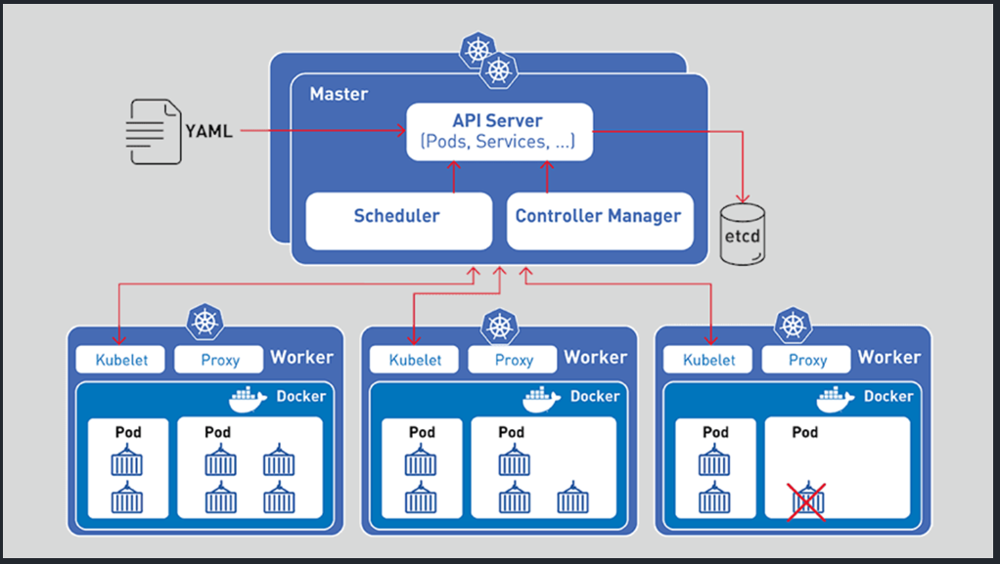

## Kubernetes Architecture

## Kubernetes Components

1. `Control Plane (Master Node)`
   Khi tương tác với Kubernetes cluster dùng command line (kubectl ...) chính là đang tương tác với Master Node. Master Node sẽ chịu trách nhiệm việc `Scheduling decisions` (Khi deploy một container thì MasterNode sẽ chịu trách nhiệm đưa ra các quyết định deploy container này ở worker Node nào.), thực hiện việc monitor (các service, node,..), ...
   * `The API server`: Tất cả các communication giữa các components đều thông qua `The API Server`. Kubernetes expose a RESTfull API, khi mình thực hiện việc apply một YAML Config file (file yaml config này sẽ định nghĩa `desired state` application. `Desired state` bao gồm những thứ như: container image dùng là gì?, Port expose là gì? Chạy bao nhiêu instance?). Cái file Yaml này mình sẽ tìm hiểu ở phần sau nhé.
   * `Etcd`: là database dùng để lưu trạng thái của cluster.
   * `The controller manager`: Thực hiện việc monitor cluster và thực hiện các hành động khi có các sự kiện xảy ra. Một số thứ Kubernetes monitor:

     * `Node controller`: Chịu trách nhiệm thông báo và phản ứng khi Node bị down.
     * `Endpoints controller`: Một Pod sẽ có IP của riêng nó, IP này sẽ thay đổi khi Pod tạo mới. Thì cần có một cái gì đó để liên tục nhìn các Pod bị xóa và cập nhật cái IP của Pod mới. Để khi User gọi vào application sẽ gọi và Pod mới chứ không phải Pod cũ. (Phần này liên quan đến Service, Pod trong Kubernetes nên sẽ giải thích kỹ hơn sau).
     * `Replicaset controller`: Replicaset là số lượng instance của application. VD: mình có STM-service (service này chuyên xử lý các nghiệm vụ về máy STM, rút tiền, nộp tiền,...). Mình muốn chạy STM-Service này 3 instance (replicatset = 3). `Replicaset controller` sẽ luôn nhìn xem STM-service của mình trên Kubernetes cluster đang có mấy instance, nếu vì một lý do nào đó không đủ số lương instance=3 thì Kubernetes sẽ tự động deploy thêm instance để đủ số lượng là 3.
     * NOTE: Cái logic chỗ `The controller manager` là: Kubernetes sẽ chạy các `watch-loop` để liên tục quan sát trạng thái hiện tại của Cluster, mục tiêu của thằng `The controller manager` là đảm bảo cho `current state` (trạng thái hiện tại ở Cluster) và `desired state` (trạng thái mong muốn define ở file yaml) là giống nhau. Thực hiện các bước như sau:
       * Lấy `desired state` (trạng thái mong muốn).
       * Quan sát `current state` (trạng thái hiện tại của Cluster).
       * Xác định sự khác biệt giữa `desired state` và `current state`.
       * Thực hiện hành động gì đó để `current state` giống với `desired state`.
   * `Scheduler`:
2. `Data plane (Worker Node)`
   Worker Node chính là nơi mà các application của mình chạy. Worker Node sẽ luông lắng nghe xem có task nào được `Master Node` assign hay không? và thực hiện report lại cho `Master Node`.
