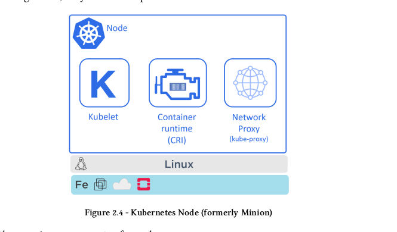

## Kubernetes Architecture


## Kubernetes Components

1. **Control Plane (Master Node)**

   Khi tương tác với Kubernetes cluster dùng command line (kubectl ...) chính là đang tương tác với Master Node. Master Node sẽ chịu trách nhiệm việc `Scheduling decisions` (Khi deploy một container thì MasterNode sẽ chịu trách nhiệm đưa ra các quyết định deploy container này ở worker Node nào.), thực hiện việc monitor (các service, node,..), ...
   * **The API server**
   
      Tất cả các communication giữa các components đều thông qua `The API Server`. Kubernetes expose a RESTfull API, khi mình thực hiện việc apply một YAML Config file (file yaml config này sẽ định nghĩa `desired state` application. `Desired state` bao gồm những thứ như: container image dùng là gì?, Port expose là gì? Chạy bao nhiêu instance?). Cái file Yaml này mình sẽ tìm hiểu ở phần sau nhé.

   * **Etcd** : là database dùng để lưu trạng thái của cluster.
   * **The controller manager** 
   
       Thực hiện việc monitor cluster và thực hiện các hành động khi có các sự kiện xảy ra. Một số thứ Kubernetes monitor:

     * **Node controller** : Chịu trách nhiệm thông báo và phản ứng khi Node bị down.
     * **Endpoints controller** : 

         Một Pod sẽ có IP của riêng nó, IP này sẽ thay đổi khi Pod tạo mới. Thì cần có một cái gì đó để liên tục nhìn các Pod bị xóa và cập nhật cái IP của Pod mới. Để khi User gọi vào application sẽ gọi và Pod mới chứ không phải Pod cũ. (Phần này liên quan đến Service, Pod trong Kubernetes nên sẽ giải thích kỹ hơn sau).

     * **Replicaset controller**: 

         Replicaset là số lượng instance của application. VD: mình có STM-service (service này chuyên xử lý các nghiệm vụ về máy STM, rút tiền, nộp tiền,...). Mình muốn chạy STM-Service này 3 instance (replicatset = 3). `Replicaset controller` sẽ luôn nhìn xem STM-service của mình trên Kubernetes cluster đang có mấy instance, nếu vì một lý do nào đó không đủ số lương instance=3 thì Kubernetes sẽ tự động deploy thêm instance để đủ số lượng là 3.

     * **NOTE**: 

         Cái logic chỗ `The controller manager` là: Kubernetes sẽ chạy các `watch-loop` để liên tục quan sát trạng thái hiện tại của Cluster, mục tiêu của thằng `The controller manager` là đảm bảo cho `current state` (trạng thái hiện tại ở Cluster) và `desired state` (trạng thái mong muốn define ở file yaml) là giống nhau. Thực hiện các bước như sau:
       * Lấy `desired state` (trạng thái mong muốn).
       * Quan sát `current state` (trạng thái hiện tại của Cluster).
       * Xác định sự khác biệt giữa `desired state` và `current state`.
       * Thực hiện hành động gì đó để `current state` giống với `desired state`.

   * **Scheduler**

      Ông `Scheduler` này sẽ luôn nhìn ông `API Server` để xem có task nào mới hay không?, `Scheduler` sẽ tìm kiếm xem có Node nào phù hợp nhất(Node có healthy không?, số lượng resource còn đủ không?) để có thể thực kiện task. Nếu mà `Schedule` không tìm được Node nào phù hợp, thì task sẽ ở trạng thái `pending`. `Scheduler` KHÔNG chịu trách nhiệm chạy task, `Scheduler` chỉ có trách nhiệm là tìm ra Node nào phù hợp nhất để chạy task.

2. **Data plane (Worker Node)**

   Worker Node chính là nơi mà các application của mình chạy. Worker Node sẽ thực hiện những task như sau:

   * Nhìn xem `API Server` có assign cho task nào mới hay không?.
   * Thực hiện các task được assign.
   * Thực hiện báo cáo lại trạng thái của task cho `Control plane (Master Node)` (via the API server).

   

   * **Kubelet**

      Kubenet giống như caption ở các Node, tất cả các task running trên Node đều phải thông qua `kublet`. `Kubelet` được cài ở tất cả các Node (gồm cả Master Node). Các task mà `kubelet` thực hiện như sau:

      * *Joining the cluster* : `kubelet` sẽ giúp khi một Node mới muốn join vào Cluster, và nói với Cluster rằng cái Node mới sẵn sàng để chạy Node mới.

      * *Running and health check of the containers* : `Kubelet` sẽ nhận PodSpec(mô tả các thông tin của Pod để Pod có thể running. VD: Pod chạy Docker image gì?, Tên của container là gì?. pullImagePolicy là gì?, có biến môi trường hay mount volume gì không?,...). Đồng thời `kubelet` cũng sẽ healcheck để đảm bảo tất cả các containers trong Pod đều running.
         ```yaml
         apiVersion: v1
         kind: Pod
         metadata:
           name: nginx
           labels:
             env: test
         spec:
           containers:
           - name: nginx
             image: nginx:latest
             imagePullPolicy: IfNotPresent
         ```

      * *Report back to `Control plane`* : Khi chạy thành công một task cụ thể nào đó thì `kubelet` sẽ report lại trạng thái của Task. Trọng trường hơp `kubelet` không thể chạy một task nào đó thì `kubelet` sẽ report lại cho `Master Node (Control plance)` để  `Master Node (Control plance)` ra lệnh cho `kubelet` làm gì tiếp theo. 
      
         VD: Khi `Master Node` assign cho `Kubelet` deploy một Pod bên trong chạy container nginx chẳng hạn. Nhưng vì một lý do nào đó `Kubelet` không chạy được task trên Node hiện tại, thì việc của `kubelet` không phải là đi tìm một Node mới để chạy task mà là report lại trạng thái của task cho `Master Node`, và `Master Node` sẽ chỉ định nó cần phải làm gì.
   
   * **Container runtime**

      `Kubelet` thì cần `container runtime` để thực hiện các task liên quan đến containers như: pulling image, starting, stoping containers. 

      Một só `container runtime` như: `containerd`,..

   * **Kube-proxy**


   