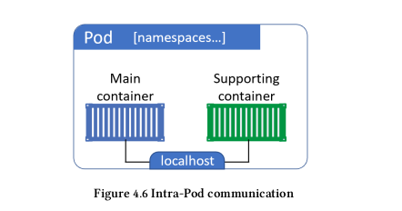
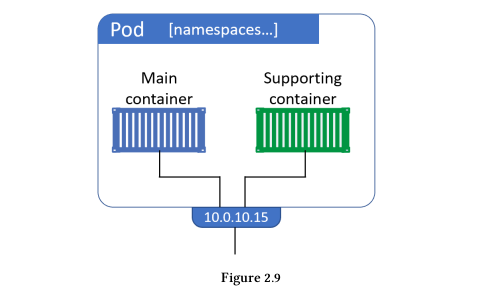

## **Working with pod.**

### **1.1 Introducing pods**

Trong Docker thì `container` được coi là đơn vị nhỏ nhất, còn với Kubernetes thì `Pod` được coi là đơn vị nhỏ nhất. Bên trong `Pod` thì có thể chứa một hoặc nhiều `containers`, các containers bên trong Pod sẽ chia sẻ storage/network. Bên trong Pod sẽ mô tả cách để chạy các containers được định nghĩa bên trong Pod (image là gì?, mount volume?, port?,..).

### **1.2 Understanding why we need pods**

- Tại sao chúng tạ lại cần đến `Pod` ?
- Taị sao không chạy luôn các `containers` trực tiếp, mà lại cần `Pod` wrap các `containers` ?

**1.2.1 Tại sao chạy nhiều containers (mỗi container chạy một process) lại tốt hơn là chạy nhiều process trong một containers.**

Hình trên là mình đang có 2 containers.  `Main container`(chạy application) và `Supporting container`(sicar hoặc một containers xử lý logs,..)

Containers thường sẽ chỉ chạy một process duy nhất PID = 1 (trừ khi bản thân process này sinh ra các process con). Nếu trong trường hợp mà chúng ra gộp 2 `containers` trên thành một `container` chạy 2 process (một process cho application, 1 process cho support-container), sẽ xảy ra trường hợp như sau:

- Trong trường hợp application bị crash thì container chứa 2 process bị restart lại, nếu mà tách ra thành 2 container thì sẽ chỉ phải restart `main-container` chạy application thôi, không phải restart `support-container` và ngược lại.

- Trong trường hợp mà `support-container` là chạy container xứ lý logs, thì khi `main-container` bị crash thì có thể `support-container` vẫn có thể logs lại vì sao `main-container` bị crash.

- Chạy mỗi một process một container cũng đảm bảo được mỗi một container chỉ làm một nghiệp vụ duy nhất thôi.

**Tóm lại** : vì những lý do trên thì hãy chạy mỗi một container một process.

**1.2.2 Tại sao chúng tạ lại cần đến Pod ?**

Vì trong thực tế chúng ta cũng cần chạy 2 containers (container chạy application và support container). Support container có thể là (side-car container trong service-mesh hoặc là container để xử lý logs,..). Nhưng vì những lý do phía trên khi chạy 2 process trong 1 container, nên mình nghĩ rằng Kubernetes mới đẻ ra thêm một ông là `Pod`, ông `Pod` này sẽ wrap 1 hoặc nhiều container và deploy trên 1 Kubernetes. Các containers trong một Pod sẽ chia sẻ `Pod environment` (This includes things like IPC namespace, shared memory, volumes, network stack and more).

- Các containers trong cùng một Pod thì có thể nói chuyện với nhau thông qua `localhost` (container-to-container within the Pod).
    

https://www.mirantis.com/blog/multi-container-pods-and-container-communication-in-kubernetes/
https://medium.com/bb-tutorials-and-thoughts/understanding-multi-container-pods-12f5780f3956
