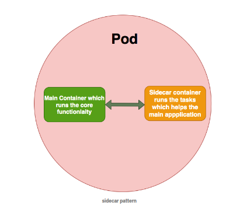
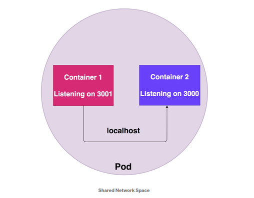

## **Working with pod.**


### **1.1 Introducing pods**

Trong Docker thì `container` được coi là đơn vị nhỏ nhất, còn với Kubernetes thì `Pod` được coi là đơn vị nhỏ nhất. Bên trong `Pod` thì có thể chứa một hoặc nhiều `containers`, các containers bên trong Pod sẽ chia sẻ storage/network. Bên trong Pod sẽ mô tả cách để chạy các containers được định nghĩa bên trong Pod (image là gì?, mount volume?, port?,..).

### **1.2 Understanding why we need pods**

- Tại sao chúng tạ lại cần đến `Pod` ?
- Taị sao không chạy luôn các `containers` trực tiếp, mà lại cần `Pod` wrap các `containers` ?

**1.2.1 Tại sao chạy nhiều containers (mỗi container chạy một process) lại tốt hơn là chạy nhiều process trong một containers.**


Hình trên là mình đang có 2 containers.  `Main container`(chạy application) và `Supporting container`(sicar hoặc một containers xử lý logs,..)

Containers thường sẽ chỉ chạy một process duy nhất PID = 1 (trừ khi bản thân process này sinh ra các process con). Nếu trong trường hợp mà chúng ra gộp 2 `containers` trên thành một `container` chạy 2 process (một process cho application, 1 process cho support-container), sẽ xảy ra trường hợp như sau:

- Trong trường hợp application bị crash thì container chứa 2 process bị restart lại, nếu mà tách ra thành 2 container thì sẽ chỉ phải restart `main-container` chạy application thôi, không phải restart `support-container` và ngược lại.

- Trong trường hợp mà `support-container` là chạy container xứ lý logs, thì khi `main-container` bị crash thì có thể `support-container` vẫn có thể logs lại vì sao `main-container` bị crash.

- Chạy mỗi một process một container cũng đảm bảo được mỗi một container chỉ làm một nghiệp vụ duy nhất thôi.

**Tóm lại** : vì những lý do trên thì hãy chạy mỗi một container một process.

**1.2.2 Tại sao chúng tạ lại cần đến Pod ?**

Vì trong thực tế chúng ta cũng cần chạy 2 containers (container chạy application và support container). Support container có thể là (side-car container trong service-mesh hoặc là container để xử lý logs,..). Nhưng vì những lý do phía trên khi chạy 2 process trong 1 container, nên mình nghĩ rằng Kubernetes mới đẻ ra thêm một ông là `Pod`, ông `Pod` này sẽ wrap 1 hoặc nhiều container và deploy trên 1 Kubernetes. Các containers trong một Pod sẽ chia sẻ `Pod environment` (This includes things like IPC namespace, shared memory, volumes, network stack and more).

**1.2.3 Define Pod**

Pod được define trong file yaml, vd dưới thì đang chạy 1 container image: `nginx:1.14.2`.
```yaml
apiVersion: v1
kind: Pod # Pod là một loại Object trong Kubernets.
metadata: # Chứa những mô tả thêm về Pod, VD: tên, label,..
  name: nginx

# Phần này chứa các thông tin của Pod, chạy bao nhiêu containers?, 
# image  là gì?, port của container,..
spec:
  containers: 
  - name: nginx
    image: nginx:1.14.2
    ports:
    - containerPort: 80
```
Giờ thì deploy Pod lên Kubernetes:
```Kubernetes
kubectl apply -f single-container-pod.yaml

# Kiểm tra trạng thái của Pod:
kubectl get po
NAME    READY   STATUS              RESTARTS   AGE
nginx   0/1     ContainerCreating   0          8s

# Pod sau khi deploy thành công:
kubectl get po
NAME    READY   STATUS    RESTARTS   AGE
nginx   1/1     Running   0          11s
```
**1.2.4 Chạy nhiều containers trong một Pod**

1. **Introduction**

    - Trong những trường hợp bình thường thì vẫn chạy một container trong một Pod, nhưng cũng sẽ có những design patterns mà yêu cầu mình chạy nhiều container trong một Pod, VD:  Sidecar pattern, Adaptor pattern, and Ambassador pattern.

        - **Sidecar pattern**

            

            Chúng ta sẽ có 1 container gọi là `Main container`(container chạy application) và thêm một container nữa gọi là `Support container` (sẽ xử lý các task như: logs, monitoring,..) tách biệt khỏi `main container`.
    
    - Những thứ có thể làm nếu chạy nhiều containers trong Pod:
        
        - Các containers trong cùng một Pod có thể tương tác với nhau thông qua `Network namespace` và `share volume`. Tất cả các containers trong cùng một Pod thì sẽ chia sẻ `Network namespace`, có nghĩa là các containers có thể gọi nhau thông qua `localhost`.
        - Tất cả các containers sẽ có cùng lifecicle, sẽ chạy cùng trên một Node.

2. **Demo**

    - **Demo Container Shared Network Namespace**
    
        Tất cả containers trong một Pod sẽ chia sẻ `network namespace` có nghĩa là: tất cả các containers đều có thể gọi nhau thông qua `localhost`.

        

        ```yaml
        apiVersion: v1
        kind: Pod
        metadata:
          name: nginx
        spec:
          containers:

          - name: nginx-1
            image: nginx:1.14.2
            ports:
            - containerPort: 80

          - name: busybox
            image: progrium/busybox
            args:
            - sleep
            - "1000000"
        ```
        ```
        kubectl apply -f multiple-container-pod.yaml 
        pod/nginx created

        kubectl get po
        NAME    READY   STATUS    RESTARTS   AGE
        nginx   2/2     Running   0          17s

        # Truy cập vào pod `nginx` và container busybox
        kubectl exec -it po/nginx -c busybox sh

        # Cài curl để thực hiện test.
        opkg-install curl

        # curl đến container nginx bằng localhost.
        / # curl http://localhost:80
        <!DOCTYPE html>
        <html>
        <head>
        <title>Welcome to nginx!</title>
        <style>
            body {
                width: 35em;
                margin: 0 auto;
                font-family: Tahoma, Verdana, Arial, sans-serif;
            }
        </style>
        </head>
        <body>
        <h1>Welcome to nginx!</h1>
        <p>If you see this page, the nginx web server is successfully installed and
        working. Further configuration is required.</p>

        <p>For online documentation and support please refer to
        <a href="http://nginx.org/">nginx.org</a>.<br/>
        Commercial support is available at
        <a href="http://nginx.com/">nginx.com</a>.</p>

        <p><em>Thank you for using nginx.</em></p>
        </body>
        </html>
        ```
https://www.mirantis.com/blog/multi-container-pods-and-container-communication-in-kubernetes/
https://medium.com/bb-tutorials-and-thoughts/understanding-multi-container-pods-12f5780f3956

https://medium.com/bb-tutorials-and-thoughts/understanding-multi-container-pods-12f5780f3956
