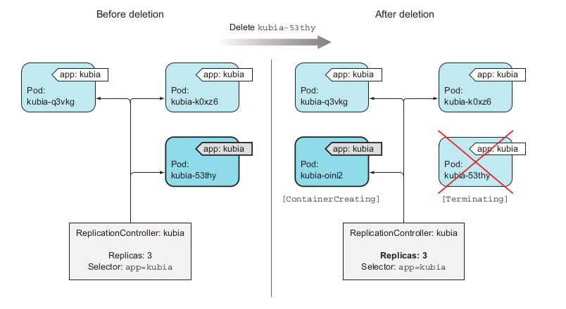
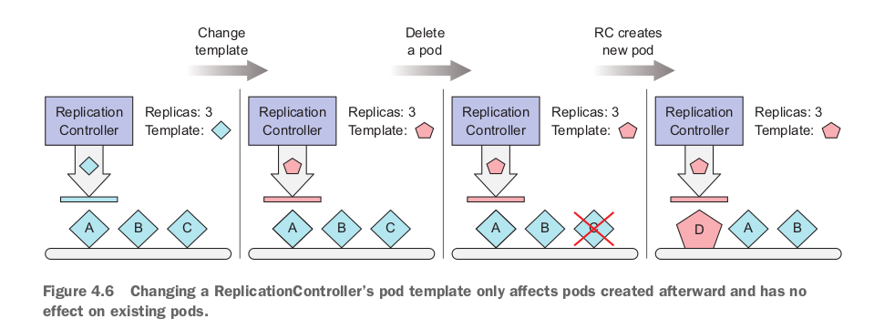

# Replication and other controllers: deploying managed pods

## **1. Giới thiệu**
Trong phần trước thì chúng ta đã biết Pod là đơn vị nhỏ nhất trong Kubernetes, học cách tạo Pod, chạy 1 hoặc nhiều containers trong một Pod, các containers trong cùng một Pod thì chia sẻ với nhau: network space, volumes,..

Pod thì chúng ta cần tạo, giám sát và quản lý bằng tay. Nhưng trong thực tế thì sẽ cần một thứ gì đó tự động giám sát, quản lý Pod tự động. Để làm những thứ như trên thì trong thực tế sẽ không tạo Pod một cách trực tiếp, mà sẽ tạo Pod thông qua `Replication Controllers` hoặc `Deployments`, lúc này việc tạo Pod và quản lý Pod sẽ do `Replication Controllers` hoặc `Deployments` làm. Trong phần này mình sẽ tìm hiểu cách mà Kubernetes check nếu container vẫn còn alive và restart container nếu bị faild và cách để quản lý các Pod.

## **2. Keeping pods healthy**

Một trong những lợi ích chính của việc sử dụng Kubernetes đó là Kubernetes có khả năng đảm bảo được các containers sẽ luôn running ở đâu đó trong cluster. Để làm điều này thì ở phần trước mình có tạo Pod, Pod sẽ được schedule vào một Node nào đó và running. Giả sử bạn tạo một Pod (2 containers), nhưng điều gì sẽ xảy ra nếu một trong 2 containers đó die? Hoặc là cả 2 containers đều die?

```
nbt@nbt:~$ kubectl get po
NAME    READY   STATUS    RESTARTS        AGE
nginx   2/2     Running   14 (3h6m ago)   4d22h
mc1     2/2     Running   13 (42s ago)    3d23h

# Thực hiện kill process của container `1st`
kubectl  exec -it po/mc1 -c 1st -- /bin/sh -c "kill 1"

# Kết quả thì thấy Pod `mc1` được restart và tạo lại container `1st`.
nbt@nbt:~$ kubectl get po -w
NAME    READY   STATUS     RESTARTS        AGE
nginx   2/2     Running    14 (3h6m ago)   4d22h
mc1     1/2     NotReady   12 (16m ago)    3d23h
mc1     2/2     Running    13 (4s ago)     3d23h

# Thực hiện kill process của containers `1st` và `2nd`.
kubectl  exec -it po/mc1 -c 1st -- /bin/sh -c "kill 1"
kubectl  exec -it po/mc1 -c 2nd -- /bin/sh -c "kill 1"

# Kết quả thì thấy Pod `mc1` được restart và tạo lại container `1st` và `2nd`.
nbt@nbt:~$ kubectl get po -w
NAME    READY   STATUS    RESTARTS        AGE
nginx   2/2     Running   14 (3h8m ago)   4d22h
mc1     2/2     Running   14 (17s ago)    3d23h
```
Qua phần demo trên thì thấy khi các containers trong Pod bị kill thì Kubernetes sẽ tự động restart containers mà mình chẳng cần phải làm gì đặc biệt với cái Pod.

*Câu hỏi ở đây là: Làm sao để Kubernetes có thể check được trạng thái có healthy hay không của application từ bên ngoài?.*

## **2.1 Introducing liveness probes**

Kubernetes có thể check nếu containers là vẫn còn alive thông qua `liveness probes`. Mình có thể  mô tả `liveness probes` cho mỗi containers trong phần mô tả Pod. Kubernetes sẽ gọi định kỳ đến `liveness probes` và thực hiện restart nếu containers trả về kết quả là fails.

Kubernetes can probe a container using one of the three mechanisms:

* Có thể sử dụng một HTTP GET request (nếu là spring boot thì có actuator, hoặc có thể viết một API). Nếu mà Kubernetes gọi vào API mà trả về response là 2xx hoặc 3xx thì được coi là healthy, còn ngược lại thì được coi là không healthy và Kubernetes sẽ thực hiện restart.
* An Exec probe executes an arbitrary command inside the container and checks the command’s exit status code. If the status code is 0, the probe is successful. All other codes are considered failures.
* A TCP Socket probe tries to open a TCP connection to the specified port of the container. If the connection is established successfully, the probe is successful. Otherwise, the container is restarted.

## **2.2 Creating an HTTP-based liveness probe** 

**1. API healcheck**

 Cùng nhìn cách để thêm `liveness prove` với spring boot application. Đối với `Spring boot` thì có endpoint để check trạng thái của service `/actuator/health`, hoặc là custom một API để  `liveness prove` thực hiện gọi vào service, nếu API trả về 2xx, 3xx thì được coi là service healthy, còn API trả về 5xx thì service unhealthy.


**2. Define liveness prove**

- **Trường hợp API trả về thành công (2xx, 3xx) khi thực hiện `liveness probe`** 
    ```yaml
    apiVersion: v1
    kind: Pod
    metadata:
      name: demo-liveness-probe
    spec:
      containers:
      - name: demo-liveness-probe
        image: thanhnb1/demo:latest
        resources:
          requests:
            memory: "64Mi"
            cpu: "250m"
          limits:
            memory: "128Mi"
            cpu: "500m"
        ports:
        - containerPort: 8080
        livenessProbe:
          httpGet:
            path: /healCheck/getStatus1
            port: 8080
    ```
    Pod manifest trên có định nghĩa `livenessProbe`, define `httpGet`, muốn nói với Kubernetes là hãy thực hiện gọi API với path là: `/healCheck/getStatus1`, port: `8080` một cách định kỳ, để đảm bảo rằng container vẫn còn running. Kubernetes sẽ thực hiện `livenessProbe` ngay sau khi container run.

    ```
    kubectl apply -f .

    kubectl get po -w
    NAME                  READY   STATUS              RESTARTS        AGE
    demo-liveness-probe   0/1     ContainerCreating   0               4s
    demo-liveness-probe   1/1     Running             0               7s
    ```
    Logs container:
    ```
    2022-07-03 16:09:27.446  INFO 1 --- [           main] com.thanhnb.study.demo.DemoApplication   : Started DemoApplication in 14.904 seconds (JVM running for 17.921)
    2022-07-03 16:09:32.263  INFO 1 --- [nio-8080-exec-1] o.a.c.c.C.[Tomcat].[localhost].[/]       : Initializing Spring DispatcherServlet 'dispatcherServlet'
    2022-07-03 16:09:32.263  INFO 1 --- [nio-8080-exec-1] o.s.web.servlet.DispatcherServlet        : Initializing Servlet 'dispatcherServlet'
    2022-07-03 16:09:32.264  INFO 1 --- [nio-8080-exec-1] o.s.web.servlet.DispatcherServlet        : Completed initialization in 1 ms
    /healCheck 1656864572457
    /healCheck 1656864582217
    /healCheck 1656864592216
    /healCheck 1656864602217
    /healCheck 1656864612217
    /healCheck 1656864622218
    /healCheck 1656864632213
    /healCheck 1656864642217
    ```
    Khi thực hiện describe po thì thấy:
    ```
    Liveness:     http-get http://:8080/healCheck/getStatus1 delay=0s timeout=1s period=10s #success=1 #failure=3

    - http-get http://:8080/healCheck/getStatus1  : API mà Liveness thực hiện gọi vào.
    - period=10s                                  : Thực hiện định kỳ sau mỗi 10s. 
    - delay=0s                                    : Liveness thực hiện ngay sau khi container started.
    - timeout=1s                                  : Thời gian timeout của API.
    - failure=3                                   : Container sẽ thực hiện restart nếu liveness faild 3 lần.
    - success=1                                   : Container được coi là healthy nếu liveness thành công 1 lần.
    ```
- **Trường hợp API trả về lỗi (4xx, 5xx) khi thực hiện `liveness probe`** 
    ```yaml
    apiVersion: v1
    kind: Pod
    metadata:
      name: demo-liveness-probe
    spec:
      containers:
      - name: demo-liveness-probe
        image: thanhnb1/demo:latest
        resources:
          requests:
            memory: "64Mi"
            cpu: "250m"
          limits:
            memory: "128Mi"
            cpu: "500m"
        ports:
        - containerPort: 8080
        livenessProbe:
          # httpGet:
          #   path: /healCheck/getStatus1
          #   port: 8080

          httpGet:
            path: /healCheck/getStatus2 # API này sẽ throw Exception và trả về responseCode = 500.
            port: 8080
    ```
    Thực hiện apply và get pods
    ```
    kubectl apply -f pod-liveness-probe.yaml
    pod/demo-liveness-probe created

    kubectl get po
    NAME                  READY   STATUS    RESTARTS        AGE
    demo-liveness-probe   1/1     Running   4 (9s ago)      2m10s
    ```
    Ở trên thì thấy container bên trong Pod `demo-liveness-probe` đang phải restart 4 lần.
    ```
    Events:
    Type     Reason     Age                From               Message
    ----     ------     ----               ----               -------
    Normal   Scheduled  72s                default-scheduler  Successfully assigned default/demo-liveness-probe to nbt
    Normal   Pulled     69s                kubelet            Successfully pulled image "thanhnb1/demo:latest" in 2.225354015s
    Normal   Pulled     39s                kubelet            Successfully pulled image "thanhnb1/demo:latest" in 2.083588449s
    Warning  Unhealthy  11s (x2 over 41s)  kubelet            Liveness probe failed: HTTP probe failed with statuscode: 500
    Normal   Killing    11s (x2 over 41s)  kubelet            Container demo-liveness-probe failed liveness probe, will be restarted
    ```
    Khi thực hiện describe pod thì thấy đang thực hiện liveness faild do API trả về responseCode=500. Liveness đã thực hiện 3 lần nhưng đều trả về 500, nên là Kubernetes thực hiện kill container và restart lại container. Khi mà container bị xóa đi và tạo lại một container mới, nhưng mà vẫn sẽ liveness faild nên vẫn sẽ thực hiện xóa container đi và tạo lại.
    
- **Overide default livenessProbe value**
    ```yaml
    livenessProbe:
    httpGet:
      path: /healthz
      port: 8080
      httpHeaders:
      - name: Custom-Header
        value: Awesome
    initialDelaySeconds: 3 # thực hiện liveness sau khi container started 3s.
    periodSeconds: 3 # thực liện liveness sau mỗi 3s
    ```
**3. Một số các lưu ý để khi thực hiện livenessProbe**

Nên luôn luôn define livenessProbe vì Kubernetes sẽ không có cách nào để biết được application của mình có đang running hay không?. Có livenessProbe thì Kubernetes sẽ biết được application của mình có đang thực sự running hay không thông qua các lần gọi API định kỳ.

- *WHAT A LIVENESS PROBE SHOULD CHECK*
    
    `LivenessProbe` thì là check trạng thái của service đã sẵn sàng để nhận request từ client hay chưa?. Nếu mà không có `livenessProbe` thì service có thể trạng thái là running nhưng thực chất là chưa thể nhận request từ client. VD: Spring boot application thì cần có thời gian để service up (khi service started), nếu khi service chưa chạy xong (service vẫn chưa started, vẫn đang logs, kết nối, ...). Nếu mà lúc này không có `livenessProbe` thì client gọi đến mà trong khi service chưa started => request bị fail.
    
- *KEEPING PROBES LIGHT*

    `LivenessProbe` API thì nên đơn giản thôi, chỉ cần trả về responseCode=200 là được. Nếu mà `LivenessProbe` API trả về response lâu quá thì cũng ảnh hưởng đến việc Kubernetes mất nhiều thời gian đển biết service có healthy hay không? để kill container và re-start container.

## **4. Creating a ReplicationController**

Application được wraper bởi Pod trong Kubernetes. Giả sử Pod bị vấn đề gì đó mà bị xóa đi thì Kubernetes làm sao để có thể tạo lại Pod?, và làm sao để Kubernetes có thể  đảm bảo được số lượng Pod trên Cluster?. `ReplicationController` dùng để làm những điều trên.

```yaml
apiVersion: v1
kind: ReplicationController
metadata:
  name: rc-demo
spec:
  replicas: 3                        # số lượng Pod mong muốn.
  selector:
    app: label-pod                   # K8s sẽ tìm được Pods thông qua labels
                                     # để thực hiện manager Pods (đảm bảo số lượng Pod).
  
  # Đây là phần mô tả cho Pod
  template:
    metadata:
      name: demo-liveness-probe       # Tên Pod.
      labels:
        app: label-pod                # Tên label của Pod.
    spec:
      containers:
        - name: demo-liveness-probe   # Tên container.
          image: thanhnb1/demo:latest
          ports:
            - containerPort: 8080
```

```
kubectl apply -f replication-controller.yaml

kubectl get po
NAME                  READY   STATUS             RESTARTS         AGE
rc-demo-q6hz5         1/1     Running            0                19s
rc-demo-mjp6n         1/1     Running            0                19s
rc-demo-n5gq5         1/1     Running            0                19s

# Thực hiện xóa Pod `po/rc-demo-mjp6n`, nhìn các pods thì thấy pod `rc-demo-mjp6n` đang bị xóa đi, và có một Pod `rc-demo-ntbzn` đang được tạo mới.

kubectl delete po/po/rc-demo-mjp6n
pod "po/rc-demo-mjp6n" deleted

rc-demo-mjp6n         1/1     Terminating        0                4m58s
rc-demo-ntbzn         0/1     Pending            0                0s
rc-demo-ntbzn         0/1     Pending            0                0s
rc-demo-ntbzn         0/1     ContainerCreating   0                0s
rc-demo-mjp6n         1/1     Terminating         0                4m58s
rc-demo-mjp6n         0/1     Terminating         0                4m58s
rc-demo-ntbzn         0/1     ContainerCreating   0                0s
rc-demo-mjp6n         0/1     Terminating         0                4m58s
rc-demo-mjp6n         0/1     Terminating         0                4m58s
rc-demo-ntbzn         1/1     Running

# Kubernetes sẽ luôn đảm bảo số lượng Pods mong muốn thông qua `ReplicationController`.
kubectl get po
NAME                  READY   STATUS             RESTARTS        AGE
rc-demo-n5gq5         1/1     Running            0               9m19s
rc-demo-pwjv5         1/1     Running            0               8m41s
rc-demo-ntbzn         1/1     Running            0               4m21s
```
Khi thực hiện apply file yaml trên thì Kubernetes sẽ tạo một object `ReplicationController` có tên là `rc-demo`, số lượng Pod mong muốn là 3, label để có thể select được Pod là: `label-pod` (label này phải giống với label của Pod). Khi mà số lượng Pod trên Kubernetes không đủ số lượng = 3, thì Kubernetes sẽ thực hiện tạo mới Pod theo phần `pod template`.



**Xem thông tin về `ReplicationController`**
```
kubectl get rc
NAME      DESIRED   CURRENT   READY   AGE
rc-demo   4         4         4       28m
```
**Demo `ReplicationController` select labels**

```
kubectl get po --show-labels
NAME                  READY   STATUS             RESTARTS         AGE     LABELS
rc-demo-q5vh9         1/1     Running            0                57m     app=label-pod,layer=backend
rc-demo-rk4t2         1/1     Running            0                59m     app=label-pod
rc-demo-pwjv5         1/1     Running            0                83m     app=label-pod
rc-demo-jr992         1/1     Running            0                3m38s   app=label-pod,layer=backend
rc-demo-sk9ln         1/1     Running            0                3m38s   app=label-pod,layer=backend
rc-demo-z4sp8         1/1     Running            0                3m38s   app=label-pod,layer=backend

-----------------------------------------------------------------------------------------------------

kubectl  describe rc/rc-demo
Name:         rc-demo
Namespace:    default
Selector:     app=label-pod,layer=backend
Labels:       app=label-pod
Annotations:  <none>
Replicas:     4 current / 4 desired
Pods Status:  4 Running / 0 Waiting / 0 Succeeded / 0 Failed
Pod Template:
  Labels:  app=label-pod
           layer=backend
  Containers:
   demo-liveness-probe:
    Image:        thanhnb1/demo:latest
    Port:         8080/TCP
    Host Port:    0/TCP
    Environment:  <none>
    Mounts:       <none>
  Volumes:        <none>
Events:           <none>

--------------------------------------------------------------------------------------------------
# Thực hiện xóa các Pod có labels: `app=label-pod`. VD pod: rc-demo-rk4t2

kubectl get po  --show-labels
NAME                  READY   STATUS             RESTARTS         AGE   LABELS
rc-demo-q5vh9         1/1     Running            0                68m   app=label-pod,layer=backend
rc-demo-pwjv5         1/1     Running            0                93m   app=label-pod
rc-demo-jr992         1/1     Running            0                14m   app=label-pod,layer=backend
rc-demo-sk9ln         1/1     Running            0                14m   app=label-pod,layer=backend
rc-demo-z4sp8         1/1     Running            0                14m   app=label-pod,layer=backend

=> Lúc này thì chỉ còn lại 1 Pod có labels: `app=label-pod`, và `ReplicationController` sẽ không tạo lại Pod vì `ReplicationController` và `Pod` đang không math labels với nhau. Để mà math label thì sẽ là điều kiện && đứng từ phía của `ReplicationController`.
```
Khi thực hiện `--show-labels` thì thấy đang có 3 pod (`app=label-pod`) và 4 Pod (`app=label-pod,layer=backend`). Vì là `ReplicationController` đang có `Selector:     app=label-pod,layer=backend` nên chỉ có 4 Pod (`app=label-pod,layer=backend`) là được manager bởi `ReplicationController`.

```
kubectl get po --show-labels
NAME                  READY   STATUS             RESTARTS         AGE   LABELS
rc-demo-q5vh9         1/1     Running            0                74m   app=label-pod,layer=backend
rc-demo-jr992         1/1     Running            0                20m   app=label-pod,layer=backend
rc-demo-sk9ln         1/1     Running            0                20m   app=label-pod,layer=backend
rc-demo-pwjv5         1/1     Running            0                99m   app=label-pod

---------------------------------------------------------------------------------------------------
kubectl describe rc/rc-demo
Name:         rc-demo
Namespace:    default
Selector:     app=label-pod
Labels:       app=label-pod
Annotations:  <none>
Replicas:     4 current / 4 desired
Pods Status:  4 Running / 0 Waiting / 0 Succeeded / 0 Failed
Pod Template:
  Labels:  app=label-pod
           layer=backend
  Containers:
   demo-liveness-probe:
    Image:        thanhnb1/demo:latest
    Port:         8080/TCP
    Host Port:    0/TCP
    Environment:  <none>
    Mounts:       <none>
  Volumes:        <none>
Events:
  Type    Reason            Age    From                    Message
  ----    ------            ----   ----                    -------
  Normal  SuccessfulDelete  3m54s  replication-controller  Deleted pod: rc-demo-z4sp8
----------------------------------------------------------------------------------------

kubectl delete po/rc-demo-pwjv5
pod "rc-demo-pwjv5" deleted

---------------------------------------------------------------------------------------

kubectl get po --show-labels
NAME                  READY   STATUS    RESTARTS       AGE   LABELS
rc-demo-q5vh9         1/1     Running   0              79m   app=label-pod,layer=backend
rc-demo-jr992         1/1     Running   0              25m   app=label-pod,layer=backend
rc-demo-sk9ln         1/1     Running   0              25m   app=label-pod,layer=backend
rc-demo-fz7jp         1/1     Running   0              7s    app=label-pod,layer=backend

`ReplicationController` thì đang có label `Selector: app=label-pod` vẫn match được với Pod (app=label-pod,layer=backend), nên khi thực hiện xóa Pod `po/rc-demo-pwjv5` thì sẽ có Pod mới được tạo để đảm bảo số lương Pod như mong muốn.
```
## **4.1 Changing the pod template**

* **Flow của việc thay đổi podTemplate**:

  

* **Demo**
  ```yaml
  apiVersion: v1
  kind: ReplicationController
  metadata:
    name: rc-demo
  spec:
    replicas: 4                        # số lượng Pod mong muốn.
    selector:
      app: label-pod                   # K8s sẽ tìm được Pods thông qua labels
                                       # để thực hiện manager Pods (đảm bảo số lượng Pod).

    # Đây là phần mô tả cho Pod
    template:
      metadata:
        name: demo-liveness-probe       # Tên Pod.
        labels:
          app: label-pod                # Tên label của Pod.
          layer: backend
      spec:
        containers:
          - name: demo-liveness-probe   # Tên container.
            image: thanhnb1/demo:latest
            ports:
              - containerPort: 8080

  kubectl apply -f replication-controller.yaml
  kubectl get po 
  NAME            READY   STATUS    RESTARTS   AGE
  rc-demo-bvvqv   1/1     Running   0          25s
  rc-demo-lfqcz   1/1     Running   0          25s
  rc-demo-trzv2   1/1     Running   0          25s
  rc-demo-qzzjk   1/1     Running   0          25s

  # Giờ thử update Pod template (thay đổi image)
  kubectl edit rc/rc-demo
  replicationcontroller/rc-demo edited

  Name:         rc-demo
  Namespace:    default
  Selector:     app=label-pod
  Labels:       app=label-pod
                layer=backend
  Annotations:  <none>
  Replicas:     4 current / 4 desired
  Pods Status:  4 Running / 0 Waiting / 0 Succeeded / 0 Failed
  Pod Template:
    Labels:  app=label-pod
             layer=backend
    Containers:
     demo-liveness-probe:
      Image:        thanhnb1/demo:v2 # Đổi từ latest sang v2.
      Port:         8080/TCP
      Host Port:    0/TCP
      Environment:  <none>
      Mounts:       <none>
    Volumes:        <none>
  Events:
    Type    Reason            Age   From                    Message
    ----    ------            ----  ----                    -------
    Normal  SuccessfulCreate  2m5s  replication-controller  Created pod: rc-demo-f6rgx
    Normal  SuccessfulCreate  2m5s  replication-controller  Created pod: rc-demo-4mmzv
    Normal  SuccessfulCreate  2m5s  replication-controller  Created pod: rc-demo-fw9k4
    Normal  SuccessfulCreate  2m5s  replication-controller  Created pod: rc-demo-c84jm

  # Nhưng mà khi thực hiện get pods thì các Pod vẫn không thay đổi image mới.
  kubectl get po
  NAME            READY   STATUS    RESTARTS   AGE
  rc-demo-fw9k4   1/1     Running   0          3m49s
  rc-demo-f6rgx   1/1     Running   0          3m49s
  rc-demo-c84jm   1/1     Running   0          3m49s
  rc-demo-4mmzv   1/1     Running   0          3m49s

  # Thực hiện describe po/
  Name:         rc-demo-fw9k4
  Namespace:    default
  Priority:     0
  Node:         nbt/192.168.1.123
  Start Time:   Thu, 07 Jul 2022 22:57:53 +0700
  Labels:       app=label-pod
                layer=backend
  Annotations:  cni.projectcalico.org/containerID: 6f989da9ccd4fa9fa8f3f6251d73be2c7d2e158434a7e9be3b4a57c7fbc23160
                cni.projectcalico.org/podIP: 10.1.28.127/32
                cni.projectcalico.org/podIPs: 10.1.28.127/32
  Status:       Running
  IP:           10.1.28.127
  IPs:
    IP:           10.1.28.127
  Controlled By:  ReplicationController/rc-demo
  Containers:
    demo-liveness-probe:
      Container ID:   containerd://1ca180f334fa99f23e21efc340e3b054f5fa0cf61553d3e733d0af5ceb68210c
      Image:          thanhnb1/demo:latest      # vẫn thấy đang dùng image cũ, không phải dùng image thanhnb1/demo:v2 như đã sửa.
      Image ID:       docker.io/thanhnb1/demo@sha256:44ae04acedb6c38ef8a80320af17071512be6a6d843e7c5b9014c2873a21dfa1
      Port:           8080/TCP
      Host Port:      0/TCP
      State:          Running
        Started:      Thu, 07 Jul 2022 22:57:56 +0700

  # Để mà các Pod ăn được image mới (thanhnb1/demo:v2) thì cần phải xóa các Pod cũ đi, để khi các Pod mới được tạo sẽ ăn theo PodTemplate mới như đã update.

  # Xóa Pod rc-demo-fw9k4
  kubectl delete po/rc-demo-fw9k4
  pod "rc-demo-fw9k4" deleted

  # Kiểm tra lại Pod mới.

  kubectl get po
  NAME            READY   STATUS    RESTARTS   AGE
  rc-demo-f6rgx   1/1     Running   0          8m23s
  rc-demo-c84jm   1/1     Running   0          8m23s
  rc-demo-4mmzv   1/1     Running   0          8m23s
  rc-demo-kvck5   1/1     Running   0          6s

  kubectl describe po/rc-demo-kvck5

  Name:         rc-demo-kvck5
  Namespace:    default
  Priority:     0
  Node:         nbt/192.168.1.123
  Start Time:   Thu, 07 Jul 2022 23:06:32 +0700
  Labels:       app=label-pod
                layer=backend
  Annotations:  cni.projectcalico.org/containerID: 8e2a28ad9041deae7a435236f8ebc58faf0db959377245061619c7369a929c7e
                cni.projectcalico.org/podIP: 10.1.28.97/32
                cni.projectcalico.org/podIPs: 10.1.28.97/32
  Status:       Running
  IP:           10.1.28.97
  IPs:
    IP:           10.1.28.97
  Controlled By:  ReplicationController/rc-demo
  Containers:
    demo-liveness-probe:
      Container ID:   containerd://04a0f75bca7b618f88c3b4fe85edcee9981a2e29e0b214c1417efcc2a4fa5686
      Image:          thanhnb1/demo:v2        # Đã thấy ăn image mới.
      Image ID:       docker.io/thanhnb1/demo@sha256:ded54c584e2ca5b4c39c231bc85a8ad50d2b0fab1e9c07686c5a78f26fbf7de2
      Port:           8080/TCP
      Host Port:      0/TCP
  ```
  `ReplicationController` có thể update được `podTemplate`, nhưng các Pod sẽ không ăn được luôn `podTemplate` mà cần phải xóa các Pod cũ, để khi tạo lại các Pod mới thì các Pod mới sẽ tạo theo `podTemplate` đã được update trước đó. Cách update này vẫn hơi tù, nhưng sẽ có cách update ngon hơn (Sẽ tìm hiểu sau).

## **4.2 S CALING UP OR DOWN A R EPLICATION C ONTROLLER**

```shell
kubectl scale rc/rc-demo --replicas=10

kubectl get po 
NAME            READY   STATUS              RESTARTS   AGE
rc-demo-f6rgx   1/1     Running             0          21m
rc-demo-c84jm   1/1     Running             0          21m
rc-demo-4mmzv   1/1     Running             0          21m
rc-demo-kvck5   1/1     Running             0          13m
rc-demo-g529s   0/1     ContainerCreating   0          3s
rc-demo-rzpm6   0/1     ContainerCreating   0          3s
rc-demo-7lb9t   0/1     ContainerCreating   0          3s
rc-demo-g6dr8   0/1     ContainerCreating   0          3s
rc-demo-4xr45   0/1     ContainerCreating   0          3s
rc-demo-xvncw   0/1     ContainerCreating   0          3s

kubectl scale rc/rc-demo --replicas=2

kubectl get po 
NAME            READY   STATUS        RESTARTS   AGE
rc-demo-f6rgx   1/1     Running       0          22m
rc-demo-4mmzv   1/1     Running       0          22m
rc-demo-7lb9t   1/1     Terminating   0          60s
rc-demo-g6dr8   1/1     Terminating   0          60s
rc-demo-rzpm6   1/1     Terminating   0          60s
rc-demo-xvncw   1/1     Terminating   0          60s
rc-demo-4xr45   0/1     Terminating   0          60s
```

> Tóm lại: `ReplicationControllers` dùng để quản lý Pod lifecycle. Nó sẽ đảm bảo số lượng Pod trên cluster bằng với số Pod mong muốn. Khi Một Pod bị xóa thì  `ReplicationControllers` sẽ tạo một Pod mới dựa trên podTemplate, `ReplicationControllers` sẽ quản lý và select các Pod thông qua labels. Có thể  UPDATE podTemplate nhưng khi apply thì các Pod cũ sẽ không ăn podTemplate mới, để các Pod ăn podTemplate mới thì cần phải xóa hết các Pod cũ. `ReplicationControllers` cho phép có thể scale up hoặc down số lượng Pod.

## **4.3 Using ReplicaSets instead of ReplicationControllers**

### **4.3.1 Defining a ReplicaSet** 
```yaml
apiVersion: apps/v1
kind: ReplicaSet
metadata:
  name: demo-rs
  labels:
    app: label-pod
spec:
  replicas: 3
  selector:
    matchLabels:
      app: label-pod
  template:
    metadata:
      labels:
        app: label-pod
    spec:
      containers:
      - name: demo-liveness-probe
        image: thanhnb1/demo:v2
        ports:
          - containerPort:  8080

kubectl apply -f replicaset.yaml

kubectl get po
NAME            READY   STATUS    RESTARTS   AGE
demo-rs-f2dmw   1/1     Running   0          88s
demo-rs-xrwnl   1/1     Running   0          88s
demo-rs-jgdq2   1/1     Running   0          88s
```