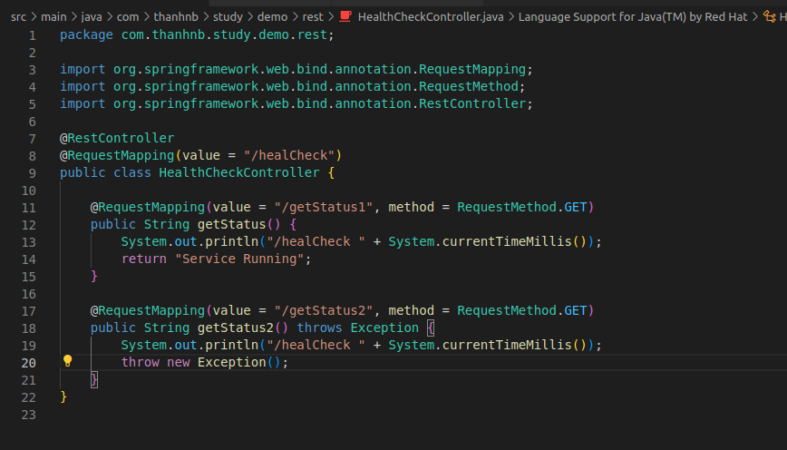
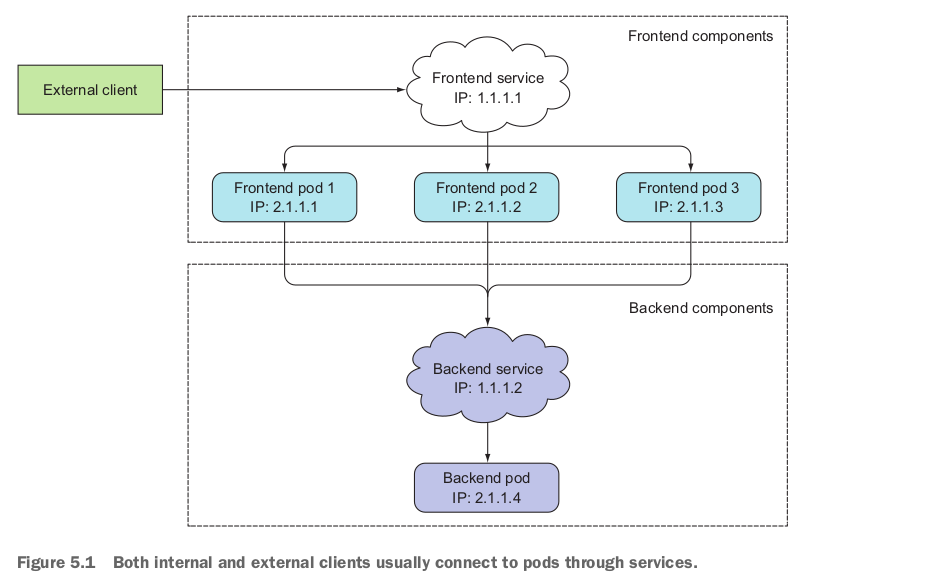
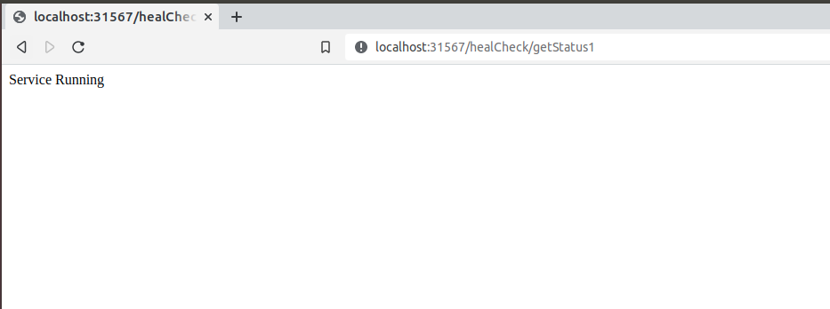
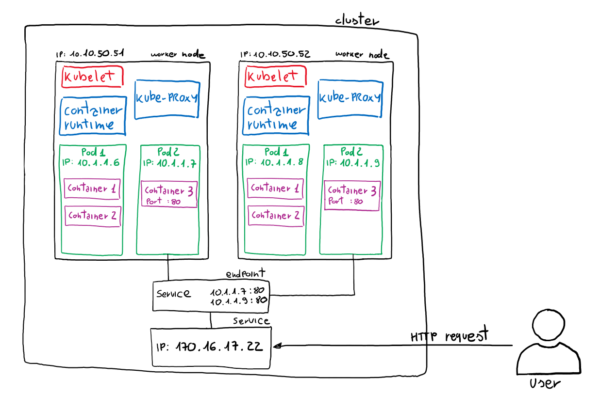
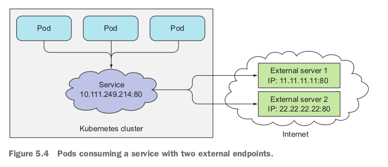
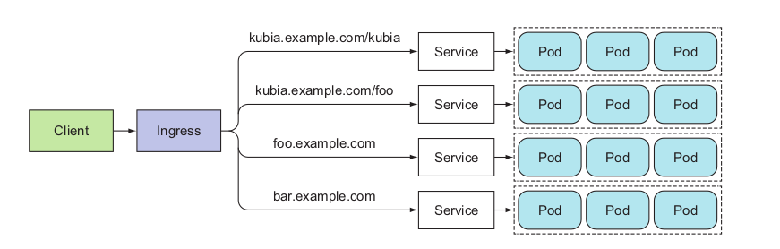
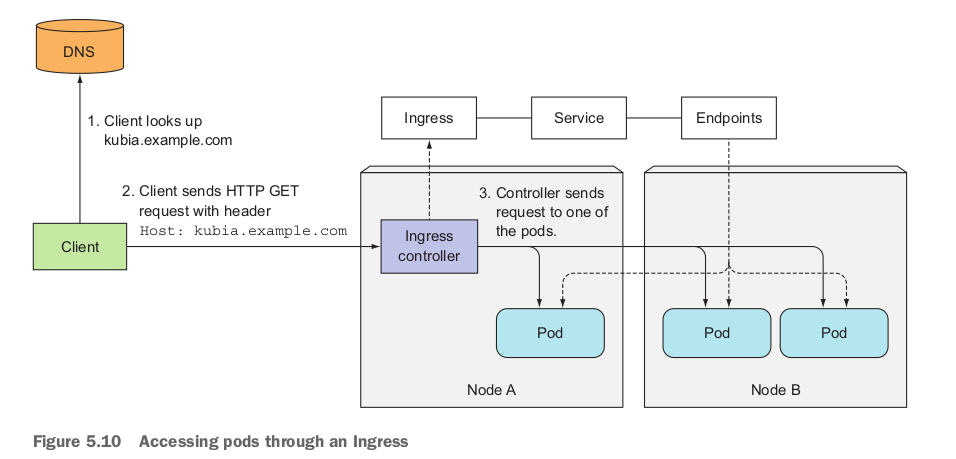

# **#Services: enabling clients to discover and talk to pods**
## **1. Giới thiệu**
Ở những phần trước thì mình có tìm hiểu các tạo Pod, sử dụng ReplicationController và ReplicaSet để quản lý lifeCycle của Pod. Trong một hệ thống (VD: Microservice) các services sẽ phải tương tác với các service khác bên trong Cluster, hoặc có thể là nhận request từ bên ngoài Cluster. Pod sẽ được assigned một IP khi scheduled vào một node nào đó, có thể access Pod thông qua IP và Port của Pod (chỉ có thể truy cập bên trong Cluster).



```shell
# Lấy IP của Pods
kubectl get po -o wide
NAME            READY   STATUS    RESTARTS      AGE   IP            NODE   NOMINATED NODE   READINESS GATES
demo-rs-jgdq2   1/1     Running   2 (76s ago)   38h   10.1.28.114   nbt    <none>           <none>
demo-rs-f2dmw   1/1     Running   2 (76s ago)   38h   10.1.28.102   nbt    <none>           <none>
demo-rs-xrwnl   1/1     Running   2 (76s ago)   38h   10.1.28.109   nbt    <none>           <none>

# Truy cập Pod thông qua IP và Port.
curl 10.1.28.114:8080/healCheck/getStatus1
Service Running
```
Nhưng sẽ có những vấn đề như sau:

1. Mỗi khi Pod bị xóa và tạo lại thì Pod sẽ được assign một IP mới. Nên nếu mà fix cứng IP của Pod để gọi thì sẽ bị sai nếu Pod bị xóa đi và tạo lại.
2. Một application có thể được chạy bởi nhiều instance (1 instance = 1 Pod), application có thể scale up và scale down, mỗi Pod lại được assign 1 IP riêng. Client thì không nên cần quan tâm về một số lượng Pod và IP của chúng. Thay vì đó nên có phải có một thứ gì đó tạm gọi là `X` đứng trước các Pod và Client chỉ quan tâm đến IP của `X` mà không cần quan tâm đến số lượng Pod và IP của Pod.

Để giải quyết tất cả những vấn đề trên thì Kubernetes giới thiệu một loại Object đó là `Service`.

## **2. Giới thiệu về Service**
Service là một loại Object của Kubernetes, service sẽ có một IP và và Port sẽ không thay đổi khi service vẫn còn tồn tại. Clients có thể gọi đến các application thông qua IP và Port của Service, các requests này sẽ được Service router đến các Pods đứng sau service. Bằng các này thì Client sẽ không cần quan tâm đến IP của Pod, vị trí của Pod (các Pods có thể được deploy ở đâu đó trên Cluster), Client chỉ cần quan tâm đến service thôi.



**Giải thích:**

Hình trên có 2 components là `front-end` (chạy 3 Pod) và `back-end` (chạy 1 Pod). Bằng việc tạo một service cho frontend pods và configs cái service này để nó có thể được access từ bên ngoài cluster, request sẽ được route vào 3 pods của frontend. Tương tự như vậy thì cũng tạo một service cho backend. Frontend có thể gọi đến backend service thông qua tên service. IP của frontend service và backend service sẽ không thay đổi nếu như 2 service này vẫn còn tồn tại.

## **3. Khởi tạo Service**

```yaml
apiVersion: v1
kind: Service                  # Loại Object là: `Service` 
metadata:                      
  name: service-1              # Tên của service: service-1
  namespace: default           # Service được deploy ở namespace default.
spec:
  selector:
    app: label-pod             # labels selector: `app: label-pod` cần match với labels của Pod.
  type: ClusterIP              # Kiểu của Service là: ClusterIP (chỉ có thể gọi được trong nội bộ Cluster).
  ports:
  - port: 80                   # Port của service: 80
    targetPort: 8080           # Port của containers mà service sẽ forward request vào.
```

Ở trên là đang định nghĩa một `Service` có tên là `service-1`, service này được deploy ở namespace default. Service này sẽ có port là 80, khi có request đến service này thì các request sẽ được route đến các Pod có labels match với labels của service là: `app: label-pod`  

**Demo**

1. Gọi các API của application thông qua IP và Port của Service (Bên trong Cluster).
2. Gọi các API của application thông qua serviceName của Service (Bên trong Cluster).


    ```shell
    kubectl apply -f 1.replicaSet.yaml 
    replicaset.apps/demo-rs create

    kubectl get po -o wide --show-labels
    NAME                  READY   STATUS    RESTARTS   AGE     IP            NODE   NOMINATED NODE   READINESS GATES   LABELS
    demo-rs-p24dm         1/1     Running   0          40m     10.1.28.110   nbt    <none>           <none>            app=label-pod
    demo-rs-hmrbg         1/1     Running   0          40m     10.1.28.112   nbt    <none>           <none>            app=label-pod
    demo-rs-tqtc5         1/1     Running   0          40m     10.1.28.103   nbt    <none>           <none>            app=label-pod

    --------------------------------------------------------------------------------------------------------------------------------

    kubectl apply -f 2.service.yaml 
    service/service-1 created

    kubectl get svc
    NAME         TYPE        CLUSTER-IP      EXTERNAL-IP   PORT(S)   AGE
    service-1    ClusterIP   10.152.183.58   <none>        80/TCP    4s

    --------------------------------------------------------------------------------------------------------------------------------
    # Get endpoint
    kubectl get ep
    NAME         ENDPOINTS                                            AGE
    kubernetes   192.168.1.123:16443                                  13d
    service-1    10.1.28.103:8080,10.1.28.110:8080,10.1.28.112:8080   33m

    #10.1.28.103:8080,10.1.28.110:8080,10.1.28.112:8080 giống với 3 IP và Port của Pod.

    --------------------------------------------------------------------------------------------------------------------------------

    # Deploy một Pod nữa cho việc test.
    kubectl apply -f pod-for-test.yaml 
    pod/pod-for-test created

    kubectl get po
    pod-for-test          1/1     Running   0          3s

    # Truy cập vào Pod
    kubectl exec -it po/pod-for-test sh
    kubectl exec [POD] [COMMAND] is DEPRECATED and will be removed in a future version. Use kubectl exec [POD] -- [COMMAND] instead.
    / # 
    / # 
    / # 

    # chạy 3 lệnh dưới để cài curl vào container bên trong pod-for-test.
    apk update
    apk upgrade
    apk add curl

    # Gửi request đến service thông qua IP và Port của service. request này sẽ được forward đến 3 Pod đứng sau service.
    / # curl 10.152.183.58:80/healCheck/getStatus1
    Service Running/ # 


    # Gửi request đến service thông qua serviceName của service. request này sẽ được forward đến 3 Pod đứng sau service.
    / # curl http://service-1/healCheck/getStatus1
    Service Running/ # 
    / # 
    ```

3. Gọi các API của application thông qua IP và Port của Service (Bên ngoài Cluster). 
    ```shell
    apiVersion: v1
    kind: Service
    metadata:
      name: service-2
      namespace: default
    spec:
      selector:
        app: label-pod

      # type=NodePort: giúp cho service có thể truy cập từ bên ngoài Cluster. 
      # Port sẽ được random trong khoảng 30000 -> 32000 nếu không mô tả một nodePort nào cụ thể thông qua trường `nodePort`.
      # nodePort: 30001  

      type: NodePort 
      ports:
      - port: 80
        targetPort: 8080

    kubectl get ep
    NAME         ENDPOINTS                                            AGE
    kubernetes   192.168.1.123:16443                                  13d
    service-2    10.1.28.103:8080,10.1.28.110:8080,10.1.28.112:8080   9m19s
    ```
    

## **4. Discovering services**
Bằng việc tạo `service`, là cách mình tạo ra một IP và PORT stable, thông qua stable IP-PORT này thì có thể gửi được các request vào Pods. Cái địa chỉ IP-PORT này sẽ không bị thay đổi cho dù số lượng Pod có tăng hoặc giảm, IP Pods có bị thay đổi. Chúng ta chỉ cần quan tâm đến địa chỉ IP-PORT này mà không cần quan tâm đến số lượng hay IP của Pods có bị thay đổi.

Có một vài vấn đề thế này:
1. VD: mình có `serviceA` --call--> `serviceB`. Thì bằng cách nào để `serviceA` có thể biết được IP và Port của `serviceB`? 
2. Mình có phải tạo `serviceB` trước và configs IP và Port của `serviceB` vào bên trong application của `serviceA` hay không?

Nếu mà phải config `serviceB` vào `serviceA` thì tù quá. Kubernetes sẽ cũng cấp một số cách để thực giải quyết những vấn đề trên:

```java
/* file application.yaml

# Dùng cho phần 4.1
clients:
    service-2:
        uri: http://${SERVICE_2_SERVICE_HOST:service-2}:${SERVICE_2_SERVICE_PORT:80}


# Dùng cho phần 4.2
# Lấy thông tin IP và Port thông qua DNS.
clients:
    service-2:
        uri: http://${SERVICE_2:service-2}
*/

@RestController
@RequestMapping(value = "/healCheck")
public class HealthCheckController {

  @Value("${clients.service-2.uri}")
  private String service2Uri;

  private final static RestTemplate restTemplate = new RestTemplate();
  private final static ObjectMapper objectMapper = new ObjectMapper();

  @RequestMapping(value = "/doSomeThing", method = RequestMethod.GET)
  public String doSomeThing() throws Exception {
      String uri = service2Uri + "/healCheck/getStatus1";
      ResponseEntity<String> response = restTemplate.getForEntity(uri, String.class);
      System.out.println("API: " + uri);
      System.out.println("Response: " + objectMapper.writeValueAsString(response));
      return response.getBody();
  }

}
```

### **4.1 DISCOVERING SERVICES THROUGH ENVIRONMENT VARIABLES**
> Templates Demo ở path: `learn-k8s/3.core-components/3.3-service/hands-on/2.discovery/discrovery-by-env`

Khi Pod started thì Kubernetes sẽ thêm một vài các biến môi trường vào bên trong Pod, trong đó có các biến môi trường IP và Port của các services có trong cluster ở thời điểm mà Pod started.

```kubernetes
kubectl apply -f .

kubectl get all 
NAME                 READY   STATUS    RESTARTS   AGE
pod/demo-service-2   1/1     Running   0          17s
pod/demo-service-1   1/1     Running   0          17s
pod/pod-for-test     1/1     Running   0          17s

NAME                 TYPE        CLUSTER-IP       EXTERNAL-IP   PORT(S)   AGE
service/kubernetes   ClusterIP   10.152.183.1     <none>        443/TCP   15d
service/service-1    ClusterIP   10.152.183.58    <none>        80/TCP    29h
service/service-2    ClusterIP   10.152.183.234   <none>        80/TCP    28h

# Xem các biến môi trường của Pod.

kubectl exec -it po/demo-service-1 sh
kubectl exec [POD] [COMMAND] is DEPRECATED and will be removed in a future version. Use kubectl exec [POD] -- [COMMAND] instead.
/ # printenv
KUBERNETES_SERVICE_PORT=443
KUBERNETES_PORT=tcp://10.152.183.1:443
LANGUAGE=en_US:en

SERVICE_1_SERVICE_HOST=10.152.183.58
SERVICE_2_SERVICE_HOST=10.152.183.234

SERVICE_1_SERVICE_PORT=80
SERVICE_2_SERVICE_PORT=80
HOSTNAME=demo-service-1
....
/ #

# Thực hiện gọi API: `/doSomeThing` của `service1` 
# Có thể edit service1 thành kiểu NodePort để gọi từ ngoài cluster hoặc là attach vào pod/pod-for-test rồi thực hiện curl.
kubectl edit service/service-1
service/service-1 edited

kubectl get svc
...
service/service-1    NodePort    10.152.183.234    <none>        80:32754/TCP   29h
...

# Call api thì nhận được logs bên dưới:
http://localhost:32754/healCheck/doSomeThing

2022-07-10 15:33:24.047  INFO 1 --- [           main] o.s.b.a.e.web.EndpointLinksResolver      : Exposing 1 endpoint(s) beneath base path '/actuator'
2022-07-10 15:33:24.245  INFO 1 --- [           main] o.s.b.w.embedded.tomcat.TomcatWebServer  : Tomcat started on port(s): 8080 (http) with context path ''
2022-07-10 15:33:24.431  INFO 1 --- [           main] com.thanhnb.study.demo.DemoApplication   : Started DemoApplication in 15.502 seconds (JVM running for 17.654)
2022-07-10 15:33:27.036  INFO 1 --- [nio-8080-exec-1] o.a.c.c.C.[Tomcat].[localhost].[/]       : Initializing Spring DispatcherServlet 'dispatcherServlet'
2022-07-10 15:33:27.037  INFO 1 --- [nio-8080-exec-1] o.s.web.servlet.DispatcherServlet        : Initializing Servlet 'dispatcherServlet'
2022-07-10 15:33:27.039  INFO 1 --- [nio-8080-exec-1] o.s.web.servlet.DispatcherServlet        : Completed initialization in 1 ms
/healCheck 1657467207148
/healCheck 1657467216711
/healCheck 1657467226717
/healCheck 1657467236714
/healCheck 1657467246715
/healCheck 1657467256710
/healCheck 1657467266713
/healCheck 1657467276711
/healCheck 1657467286716
API: http://10.152.183.234:80/healCheck/getStatus1 # chỗ này đã lấy được IP và Port của service2.
Response: {"headers":{"Content-Type":["text/plain;charset=UTF-8"],"Content-Length":["15"],"Date":["Sun, 10 Jul 2022 15:34:50 GMT"],"Keep-Alive":["timeout=60"],"Connection":["keep-alive"]},"body":"Service Running","statusCodeValue":200,"statusCode":"OK"}
......

# Nếu mà xóa `Service2`(IP sẽ thay đổi) đi thì biến môi trường trong các Pod của `service1` có được cập nhật không nhỉ?

kubectl delete service/service-2

kubectl get svc
NAME                 TYPE        CLUSTER-IP       EXTERNAL-IP   PORT(S)        AGE
service/kubernetes   ClusterIP   10.152.183.1     <none>        443/TCP        15d

#IP của service2 đã thay đổi từ `10.152.183.234` thành `10.152.183.108`.
service/service-2    ClusterIP   10.152.183.108   <none>        80/TCP         3m54s
service/service-1    NodePort    10.152.183.58    <none>        80:32754/TCP   29h

# Thực hiện call API: http://localhost:32754/healCheck/doSomeThing và thu được logs:

/healCheck 1657468826712
/healCheck 1657468836711
/healCheck 1657468846710
/healCheck 1657468856712
2022-07-10 16:01:01.745 ERROR 1 --- [nio-8080-exec-7] o.a.c.c.C.[.[.[/].[dispatcherServlet]    : Servlet.service() for servlet [dispatcherServlet] in context with path [] threw exception [Request processing failed; nested exception is org.springframework.web.client.ResourceAccessException: I/O error on GET request for "http://10.152.183.234:80/healCheck/getStatus1": Connection timed out (Connection timed out); nested exception is java.net.ConnectException: Connection timed out (Connection timed out)] with root cause

java.net.ConnectException: Connection timed out (Connection timed out)
	at java.base/java.net.PlainSocketImpl.socketConnect(Native Method) ~[na:na]
	at java.base/java.net.AbstractPlainSocketImpl.doConnect(AbstractPlainSocketImpl.java:412) ~[na:na]
	at java.base/java.net.AbstractPlainSocketImpl.connectToAddress(AbstractPlainSocketImpl.java:255) ~[na:na]
	at java.base/java.net.AbstractPlainSocketImpl.connect(AbstractPlainSocketImpl.java:237) ~[na:na]
	at java.base/java.net.Socket.connect(Socket.java:609) ~[na:na]
	at java.base/java.net.Socket.connect(Socket.java:558) ~[na:na]

# 10.152.183.234:80: IP này là IP cũ trước khi xóa `service2` => Khi xóa `service2` thì biến môi trường trong các Pods của `service1` không được cập nhật => gọi sẽ bị timeout như logs phía trên.

# Cách này có vẻ vẫn hơi tù :>
```

### **4.2 DISCOVERING SERVICES THROUGH DNS**
> Templates Demo ở path: `learn-k8s/3.core-components/3.3-service/hands-on/2.discovery/discrovery-by-dns`

Ở namespace `kube-system` có một service `kube-dns` sẽ giúp các service có thể gọi nhau qua serviceName trong cùng namespace hoặc khác namespace. Cú pháp sẽ là: `<Tên service>.<tên namespace>.svc.cluster.local`, VD: service-1.default.svc.cluster.local

```shell
kubectl get all
NAME                 READY   STATUS    RESTARTS      AGE
pod/pod-for-test     1/1     Running   0             57s
pod/demo-service-1   1/1     Running   0             57s
pod/demo-service-2   1/1     Running   1 (26s ago)   57s

NAME                 TYPE        CLUSTER-IP       EXTERNAL-IP   PORT(S)   AGE
service/kubernetes   ClusterIP   10.152.183.1     <none>        443/TCP   15d
service/service-1    ClusterIP   10.152.183.162   <none>        80/TCP    57s
service/service-2    ClusterIP   10.152.183.244   <none>        80/TCP    57s

# Attach vào pod/pod-for-tests
kubectl exec -it pod/pod-for-test sh
/ # curl http://service-1/healCheck/doSomeThing
Service Running/ # 
/ # 

# Xem logs của Pod service-1
kubectl logs -f pod/demo-service-1
...
/healCheck 1657472402623
/healCheck 1657472412624
API: http://service-2/healCheck/getStatus1
Response: {"headers":{"Content-Type":["text/plain;charset=UTF-8"],"Content-Length":["15"],"Date":["Sun, 10 Jul 2022 17:00:14 GMT"],"Keep-Alive":["timeout=60"],"Connection":["keep-alive"]},"body":"Service Running","statusCode":"OK","statusCodeValue":200}
...

# Thực hiện xóa Service-2 và tạo lại

kubectl get all
NAME                 READY   STATUS    RESTARTS       AGE
pod/pod-for-test     1/1     Running   0              3m34s
pod/demo-service-1   1/1     Running   0              3m34s
pod/demo-service-2   1/1     Running   1 (3m3s ago)   3m34s

NAME                 TYPE        CLUSTER-IP       EXTERNAL-IP   PORT(S)   AGE
service/kubernetes   ClusterIP   10.152.183.1     <none>        443/TCP   15d
service/service-1    ClusterIP   10.152.183.162   <none>        80/TCP    3m34s
# IP service-2 đã thay đổi từ `10.152.183.244` sang `10.152.183.144`
service/service-2    ClusterIP   10.152.183.144   <none>        80/TCP    4s

# Test lại xem có còn gọi được không.
kubectl exec -it pod/pod-for-test sh
kubectl exec [POD] [COMMAND] is DEPRECATED and will be removed in a future version. Use kubectl exec [POD] -- [COMMAND] instead.
/ #  curl http://service-1/healCheck/doSomeThing
Service Running/ # ^C
/ # 

# Logs Pod service-1:
...
/healCheck 1657472412624
API: http://service-2/healCheck/getStatus1
Response: {"headers":{"Content-Type":["text/plain;charset=UTF-8"],"Content-Length":["15"],"Date":["Sun, 10 Jul 2022 17:00:14 GMT"],"Keep-Alive":["timeout=60"],"Connection":["keep-alive"]},"body":"Service Running","statusCode":"OK","statusCodeValue":200}
/healCheck 1657472422624
/healCheck 1657472432674
/healCheck 1657472442622
/healCheck 1657472452625
/healCheck 1657472462621
/healCheck 1657472472624
/healCheck 1657472482624
API: http://service-2/healCheck/getStatus1
Response: {"headers":{"Content-Type":["text/plain;charset=UTF-8"],"Content-Length":["15"],"Date":["Sun, 10 Jul 2022 17:01:32 GMT"],"Keep-Alive":["timeout=60"],"Connection":["keep-alive"]},"body":"Service Running","statusCode":"OK","statusCodeValue":200}
/healCheck 1657472492622
...

# Như vậy thì dù `service2` có bị thay đổi IP thì khi gọi `service2` thông qua DNS thì vẫn gọi đươc.
```

## **5. Connecting to services living outside the cluster**
Ở phần trước thì mình có tìm hiểu về Service, service thì có IP và Port không thay đổi cho dù số lượng, IP của Pod thay đổi. Cũng tìm hiểu cách để các service gọi nhau thông qua env, hoặc mà DNS cùng namespace hoặc khác namespace. Nhưng giờ có trường hợp application của mình cần phải kết nối đến một hệ thống khác ở bên ngoài cluster thì làm thế nào?. Clients Pods running trong cluster có thể connnect đến một `external service` giống như connect đến `internal service`.

### **5.1 Introducing service endpoints**


Ở phần trước thì mình cũng có tìm hiểu về Service, các service select được các Pods thông qua `labelSelector` service cũng không link đến các Pods một các trực tiếp, sẽ có một Objects đứng giữa `Service` và `Pod` đó là `Endpoints`

```shell
kubectl describe svc/service-2
Name:              service-2
Namespace:         default
Labels:            <none>
Annotations:       <none>
Selector:          app=demo-service-2
Type:              ClusterIP
IP Family Policy:  SingleStack
IP Families:       IPv4
IP:                10.152.183.144
IPs:               10.152.183.144
Port:              <unset>  80/TCP
TargetPort:        8080/TCP
Endpoints:         10.1.28.94:8080 # IP và Port của Pod
Session Affinity:  None
Events:            <none>

kubectl get ep
NAME         ENDPOINTS             AGE
kubernetes   192.168.1.123:16443   16d
service-1    10.1.28.102:8080      22h
service-2    10.1.28.94:8080       22h
```
Khi có request đến service thì service sẽ chọn một IP-Port trong danh sách `Endpoints` để redirects request đến với Pods.

### **5.2 Manually configuring service endpoints**
> Templates Demo ở path: `learn-k8s/3.core-components/3.3-service/hands-on/3.external-service/1.service-without-labels-selector.yaml` 
```yaml

# Service tên là: `external-service`, service này accept connections ở port 80. Service không có labels selector.

apiVersion: v1
kind: Service
metadata:
  #The name of the service must match the name of the Endpoints object.
  name: external-service
spec:
  ports:
  - port: 80
---
apiVersion: v1
kind: Endpoints
metadata:
  # The name of the Endpoints object must match the name of the service.
  name: external-service
subsets:
# The IPs of the endpoints that the service will forward connections to.
- addresses:
  - ip: 11.11.11.11
  - ip: 22.22.22.22
  ports:
  - port: 80 # The target port of the endpoints.
```


Vì tạo service mà không có labels selector thì Endpoint object không được tự động tạo => phải tạo Endpoints objects bằng tay => phải update IP Endpoints bằng tay.

### **5.3 Exposing services externally through an Ingress resource**
Ở những phần trước thì đã tìm hiểu các để expose service để bên ngoài cluster có thể gọi được, NodePort, External-service. Kubernetes cũng có giới thiệu thêm một cách nữa để expose service đó là thông qua `Ingress`.

#### **5.3.1 UNDERSTANDING WHY I NGRESSES ARE NEEDED**
Ở các cách expose service khác như NodePort thì ta cần phải expose một Port ở trên Cluster, nếu mà nhiều service mà mỗi service đều expose 1 port thì điều này là không cần thiết. Có một cách khác là sử dụng `Ingress`, chỉ cần expose 1 Port và Client sẽ là người quyết định xem cliest muốn gọi vào service nào thông qua các host và path.

#### **5.3.2 Creating an Ingress resource**
Cần cài một Ingress controller, ở đây mình sẽ cài `nginx-ingress-controller`. [Tham khảo helm chart](https://github.com/bitnami/charts/tree/master/bitnami/nginx-ingress-controller/)

```bash
# install helm on ubuntu:
curl https://raw.githubusercontent.com/helm/helm/main/scripts/get-helm-3 | bash

# installing-the-chart
helm repo add bitnami https://charts.bitnami.com/bitnami
helm install my-release bitnami/nginx-ingress-controller

nbt@nbt:~$ kubectl get po
NAME                                                              READY   STATUS    RESTARTS       AGE
nginx-ingress-nginx-ingress-controller-default-backend-7b972m5k   1/1     Running   0              117s
nginx-ingress-nginx-ingress-controller-7464844899-x9cj7           1/1     Running   0              117s

```
```yml
apiVersion: networking.k8s.io/v1
kind: Ingress
metadata:
  name: nginx-ingress
  namespace: default
  annotations:
    kubernetes.io/ingress.class: nginx
    nginx.ingress.kubernetes.io/ssl-redirect: "false"
    nginx.ingress.kubernetes.io/use-regex: "true"
    nginx.ingress.kubernetes.io/rewrite-target: /$2
    nginx.ingress.kubernetes.io/add-base-url: "true"	
    nginx.ingress.kubernetes.io/enable-cors: "true"
    nginx.ingress.kubernetes.io/cors-allow-methods: "GET, PUT, POST, DELETE, PATCH, OPTIONS"
    nginx.ingress.kubernetes.io/cors-allow-headers: "x-requested-with,authorization,Content-Type,Content-Length,Authorization,credential,X-XSRF-TOKEN" 
    nginx.ingress.kubernetes.io/cors-expose-headers: "*"
    nginx.ingress.kubernetes.io/cors-allow-origin: "*"
    nginx.ingress.kubernetes.io/cors-allow-credentials: "true"
    nginx.ingress.kubernetes.io/cors-max-age: "1728000"
    nginx.ingress.kubernetes.io/proxy-body-size: 50m
    nginx.ingress.kubernetes.io/proxy-connect-timeout: "3600"
    nginx.ingress.kubernetes.io/proxy-send-timeout: "3600"
    nginx.ingress.kubernetes.io/proxy-read-timeout: "3600"
spec:
  rules:
  - host:
    http:
      paths:
      - path: /service-1(/|$)(.*)
        pathType: Prefix
        backend:
          service:
            name: service-1
            port:
              number: 80
      - path: /service-2(/|$)(.*)
        pathType: Prefix
        backend:
          service:
            name: service-2
            port:
              number: 80
```
```powershell
kubectl apply -f learn-k8s/3.core-components/3.3-service/hands-on/3.external-service/nginx-ingress-1.yaml

kubectl get ing
NAME            CLASS    HOSTS   ADDRESS         PORTS   AGE
nginx-ingress   <none>   *       192.168.1.123   80      27m

kubectl describe ing/nginx-ingress
Name:             nginx-ingress
Labels:           <none>
Namespace:        default
Address:          192.168.1.123
Ingress Class:    <none>
Default backend:  <default>
Rules:
  Host        Path  Backends
  ----        ----  --------
  *           
              /service-1(/|$)(.*)   service-1:80 (10.1.28.77:8080)
              /service-2(/|$)(.*)   service-2:80 (10.1.28.86:8080)
...
...
# Get Service
kubectl get svc
NAME                                                     TYPE           CLUSTER-IP       EXTERNAL-IP   PORT(S)                      AGE
kubernetes                                               ClusterIP      10.152.183.1     <none>        443/TCP                      22d
service-1                                                ClusterIP      10.152.183.162   <none>        80/TCP                       6d23h
service-2                                                ClusterIP      10.152.183.144   <none>        80/TCP                       6d23h
nginx-ingress-nginx-ingress-controller-default-backend   ClusterIP      10.152.183.178   <none>        80/TCP                       48m
nginx-ingress-nginx-ingress-controller                   LoadBalancer   10.152.183.242   <pending>     80:32542/TCP,443:30334/TCP   48m

# Test
curl http://localhost:32542/service-1/healCheck/getStatus1
Service Running

curl http://localhost:32542/service-2/healCheck/getStatus1
Service Running
```
Ở trên đã route được đến 2 service là: `service-1` và `service-2` mà chỉ cần expose 1 IP và Port của nginx-ingress-controller, sẽ truy cập các service thông qua host và path.



### **5.4 Troubleshooting services**
When you’re unable to access your pods through the service, you should start by going through the following list:
- First, make sure you’re connecting to the service’s cluster IP from within the cluster, not from the outside.
- Don’t bother pinging the service IP to figure out if the service is accessible (remember, the service’s cluster IP is a virtual IP and pinging it will never work).
- If you’ve defined a readiness probe, make sure it’s succeeding; otherwise the pod won’t be part of the service.
- To confirm that a pod is part of the service, examine the corresponding Endpoints object with kubectl get endpoints .
- If you’re trying to access the service through its FQDN or a part of it (for example, myservice.mynamespace.svc.cluster.local or myservice.mynamespace) and it doesn’t work, see if you can access it using its cluster IP instead of the FQDN.
- Check whether you’re connecting to the port exposed by the service and not the target port.
- Try connecting to the pod IP directly to confirm your pod is accepting connections on the correct port.
- If you can’t even access your app through the pod’s IP, make sure your app isn’t only binding to localhost.