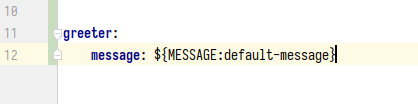
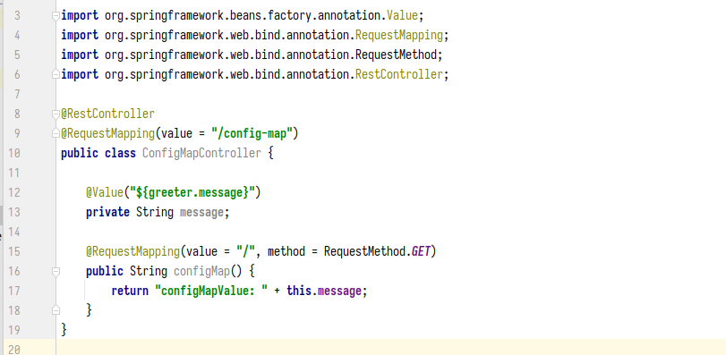

# ConfigMaps and Secrets: configuring applications

## **1. Introduction ConfigMaps**
Các Service thường có file cấu hình để tùy chỉnh theo từng môi trường vd: Develop, UAT, PROD, mỗi môi trường này đều có những biến môi trường khác nhau. Đối với việc deploy các service trên Kubernetes thì sẽ tạo ra các file configMap (chứa các biến môi trường) trương ứng với các môi trường. Sẽ có 2 cách để inject các biến môi trường vào containers: thông qua các biến môi trường, thông qua Volume.

## **1.1 Creating ConfigMap and inject varivable to container as env**
> examples file: learn-k8s/3.core-components/3.4-configmap-secret/hand-on/config-map

Mình có file application.yaml như sau:



Mình có cái controller như sau:



```yml
kind: ConfigMap
apiVersion: v1
metadata:
  name: demo-config-map          # Tên của ConfigMap
  namespace: config-map          # ConfigMap này được tạo ở namespace: `config-map`. Service đc deploy ở namespace nào thì sẽ đọc được configMap ở namespace đó.
data:                            # Phần này chứa các biến môi trường dạng key: value.
  MESSAGE: Hello nha :D    

---

apiVersion: v1
kind: Pod
metadata:
  name: demo-config-map
  namespace: config-map
  labels:
    app: demo-config-map
spec:
  containers:
  - name: demo-config-map
    image: "thanhnb1/demo:config-map"
    resources:
      limits:
        cpu: 200m
        memory: 500Mi
      requests:
        cpu: 100m
        memory: 200Mi
    env:                        # Phần naỳ đang inject các biến môi trường vào bên trong Pod.
    - name: MESSAGE             # Lấy biến môi trường tên là: "MESSAGE"
      valueFrom:
        configMapKeyRef:
          name: demo-config-map # Lấy biến môi trường ở configMap có tên là: `demo-config-map`.
          key: MESSAGE          # Biến môi trường có Key là: "MESSAGE"
    ports:
    - containerPort: 8080
      name: http

kubectl get all -n config-map -o wide
NAME                  READY   STATUS    RESTARTS   AGE    IP            NODE   NOMINATED NODE   READINESS GATES
pod/demo-config-map   1/1     Running   0          3m1s   10.1.28.111   nbt    <none>           <none>
pod/pod-for-test      1/1     Running   0          59s    10.1.28.121   nbt    <none>           <none>

kubectl exec -it pod/pod-for-test -n config-map sh 
kubectl exec [POD] [COMMAND] is DEPRECATED and will be removed in a future version. Use kubectl exec [POD] -- [COMMAND] instead.

# Gọi vào Pod "demo-config-map"
/ # curl http://10.1.28.111:8080/config-map/
configMapValue: Hello nha :D/ # ^C
/ # 

# Thực hiện print các biến môi trường trong container
kubectl exec -it pod/demo-config-map -n config-map sh
kubectl exec [POD] [COMMAND] is DEPRECATED and will be removed in a future version. Use kubectl exec [POD] -- [COMMAND] instead.
/ # printenv
KUBERNETES_SERVICE_PORT=443
KUBERNETES_PORT=tcp://10.152.183.1:443
LANGUAGE=en_US:en
HOSTNAME=demo-config-map
SHLVL=1
HOME=/root
JAVA_VERSION=jdk-11.0.15+10
TERM=xterm
KUBERNETES_PORT_443_TCP_ADDR=10.152.183.1
PATH=/opt/java/openjdk/bin:/usr/local/sbin:/usr/local/bin:/usr/sbin:/usr/bin:/sbin:/bin
KUBERNETES_PORT_443_TCP_PORT=443
KUBERNETES_PORT_443_TCP_PROTO=tcp
LANG=en_US.UTF-8
KUBERNETES_SERVICE_PORT_HTTPS=443
KUBERNETES_PORT_443_TCP=tcp://10.152.183.1:443
LC_ALL=en_US.UTF-8
JAVA_HOME=/opt/java/openjdk
MESSAGE=Hello nha :D                       # Đây là biến môi trường được inject từ ConfigMap.
KUBERNETES_SERVICE_HOST=10.152.183.1
PWD=/
```

## **1.2 Creating ConfigMap and inject varivable to container as volume**

