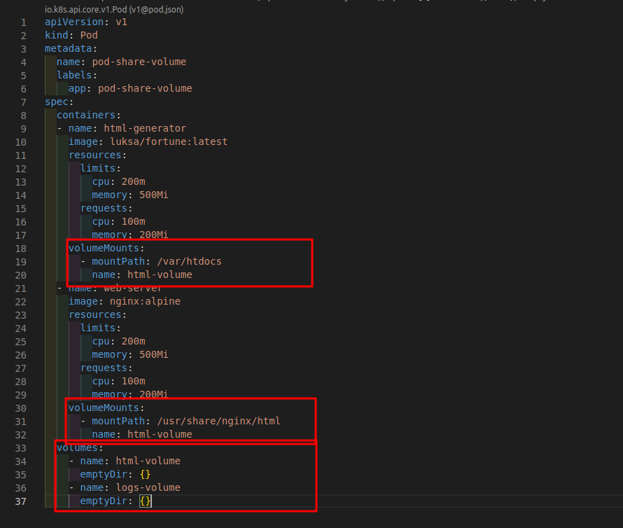
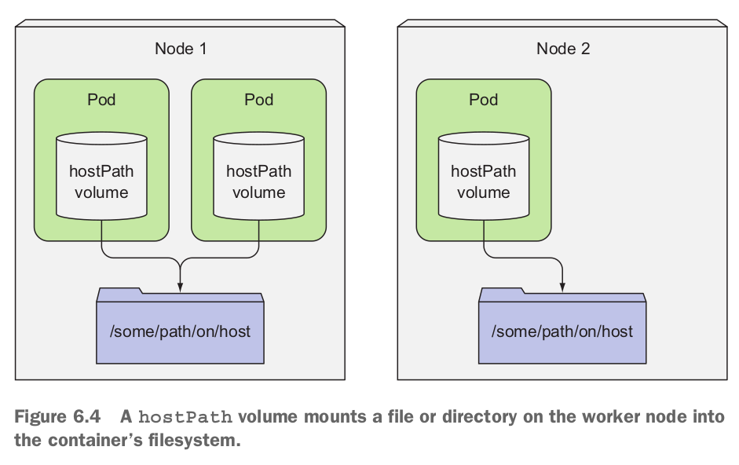
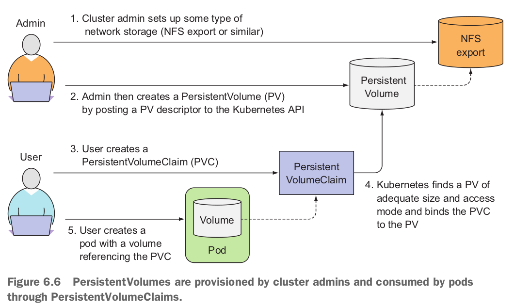
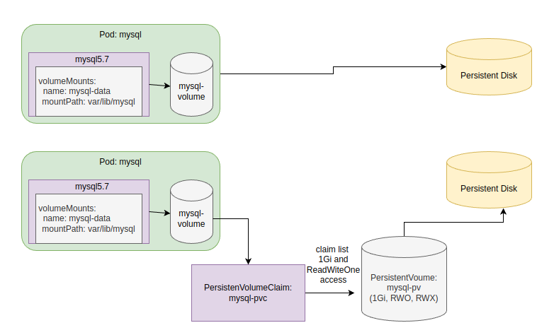

# #Volumes: attaching disk storage to containers
Ở những phần trước thì đã tìm hiểu về Pod, ReplicationController, ReplicaSet, có vấn đề là khi Pod vì một lý do nào đó mà bị xóa thì các containers bên trong Pod cũng bị xóa => dữ liệu sẽ bị mất. Trong một vài trường hợp thì mình muốn rằng dù containers bên trong Pod được tạo mới thì vẫn còn dữ liệu của containers trước đó. Kubernetes mới đẻ ra một object là `volume`.

Volume được định nghĩa như là 1 phần của Pod, có lifecycle cùng với Pod, có nghĩa là volume sẽ được tạo khi Pod started và bị xóa khi Pod deleted. Sau khi container restarted, container mới có thể nhìn thấy data trong `Volume` mà container trước đó đã tạo ra. Nếu một Pod có nhiều containers thì các containers này có thể dùng chung `volume`.

Tìm hiểu thêm về Docker Volume [Tại đây](https://github.com/nbthanh98/study/blob/master/learn-docker/DOCKER-VOLUME.md)

## **1. Introducing volumes**
Volume trong Kubernetes là một component của Pod được defined in pod’s specification. Một volume thì có thể dùng được nhiều containers bên trong 1 Pod, nhưng container nào dùng volume thì cần phải mount, có thể mount volume đến bất kỳ path nào trong container.

## **2. Using volumes to share data between containers**
Đầu tiên tập chung vào việc làm sao để có thể chia sẻ data giữa các containers bên trong Pod.

### **2.1 Using an emptyDir volume**
`emptyDir` là một loại volume. Giống như cái tên của loại volume này thì nó là một folder empty, các containers có thể chia sẻ data giữa các containers bên trong Pod. Bởi vì lifetime của loại `emptyDir` volume bị ràng buộc với Pod nên Pod bị xóa => volume cũng bị xóa theo.

- **USING AN EMPTY D IR VOLUME IN A POD**
    > file learn-k8s/3.core-components/3.3-volume/hands-on/pod-emptyDir-share-volume.yaml

    

    Ở VD trên thì đang sử dụng Volume có tên là `html-volume` và `logs-volume` có type là `emptyDir` dùng để chia sẻ dữ liệu giữa các containers bên trong Pod.

    1. Ở container: `html-generator` thì nhiệm vụ của container này là tạo ra file index.html (/var/htdocs/index.html) có nội dung khác nhau sau mỗi 10s. Container này thì có một volume có tên là: `html-volume`, mountPath: `/var/htdocs` là folder bên trong container: `html-generator`.
    2. Ở container: `web-server` thì có nhiệm vụ là view cái file index.html mà container: `html-generator` tạo ra cho người dùng xem. Container này thì có một volume có tên là: `html-volume`, mountPath: `/usr/share/nginx/html` (là folder mặc định của nginx, khi có request gọi đến thì file index.html trong folder này sẽ được hiển thị ra) là folder bên trong container: `web-server`.
    
    ```powershell
    kubectl get po -n test -o wide
    NAME                   READY   STATUS    RESTARTS      AGE     IP            NODE   NOMINATED NODE   READINESS GATES
    pod-not-share-volume   1/1     Running   1 (76m ago)   4h1m    10.1.28.103   nbt    <none>           <none>
    pod-for-test           1/1     Running   1 (76m ago)   3h59m   10.1.28.85    nbt    <none>           <none>
    pod-share-volume       2/2     Running   0             3m17s   10.1.28.102   nbt    <none>           <none>

    # Test
    kubectl exec -it po/pod-for-test -n test sh
    kubectl exec [POD] [COMMAND] is DEPRECATED and will be removed in a future version. Use kubectl exec [POD] -- [COMMAND] instead.
    / # curl http://10.1.28.102
    You own a dog, but you can only feed a cat.
    / # curl http://10.1.28.102
    When you are about to die, a wombat is better than no company at all.
		-- Roger Zelazny, "Doorways in the Sand"
    / # curl http://10.1.28.102
    Look afar and see the end from the beginning.
    
    # Ta thấy mỗi lần gọi đến IP của POD: pod-share-volume thì lại ra một đoạn text khác nhau, điều này chứng tỏ rằng container:`web-server` đang consume file index.html mà container:`html-generator` tạo ra, do cùng sử dụng volume có tên là: `html-volume` nên dữ liệu (file index.html) được chia sẻ giữa 2 containers: `html-generator` và `web-server`.
    ```

### **2.2 Using an hostPath volume**
Ở trên đã tìm hiểu volume type `emptyDir` loại volume có kiểu `emptyDir` thì sẽ bị mất đi khi Pod bị xóa, thường sẽ dùng kiểu volume này cho việc chia sẻ dữ liệu giữa các containers bên trong 1 Pod. `hostPath` volume là loại volume sẽ được mount ra bên ngoài Node, các Pods trên cùng một Node thì có thể chia sẻ dữ liệu, khác Node thì không chia sẻ được, loại volume kiểu `hostPath` sẽ không bị xóa khi Pod xóa.



```yaml
apiVersion: v1
kind: Pod
metadata:
  name: hostpath-volume
spec:
  containers:
  - name: web-server
    image: nginx:alpine
    resources:
      limits:
        cpu: 200m
        memory: 500Mi
      requests:
        cpu: 100m
        memory: 200Mi
    volumeMounts:
    - name: html-volume
      mountPath: /usr/share/nginx/html
  volumes:
    - name: html-volume
      hostPath:
        path: /home/nbt/thanhnb/study/html-volume
  restartPolicy: Always

# Tạo file index.html trong folder `/home/nbt/thanhnb/study/html-volume`
cat index.html 
<h1>ThanhNB hostPath Volume</h1>n

# Test
kubectl get po -n test -o wide
NAME                   READY   STATUS    RESTARTS       AGE     IP            NODE   NOMINATED NODE   READINESS GATES
pod-not-share-volume   1/1     Running   1 (112m ago)   4h38m   10.1.28.103   nbt    <none>           <none>
pod-for-test           1/1     Running   1 (112m ago)   4h36m   10.1.28.85    nbt    <none>           <none>
pod-share-volume       2/2     Running   0              40m     10.1.28.102   nbt    <none>           <none>
hostpath-volume        1/1     Running   0              18s     10.1.28.81    nbt    <none>           <none>
nbt@nbt:~/thanhnb/study/learn-k8s/3.core-components/3.3-volume/hands-on$ kubectl exec -it po/pod-for-test -n test sh
kubectl exec [POD] [COMMAND] is DEPRECATED and will be removed in a future version. Use kubectl exec [POD] -- [COMMAND] instead.
/ # curl http://10.1.28.81
<h1>ThanhNB hostPath Volume</h1>/ # 

# Như vậy thì file index.html trong folder `/home/nbt/thanhnb/study/html-volume` đã được mount vào folder `/usr/share/nginx/html` bên trong container `web-server`.
```

## **3 PersistentVolume and PersistentVolumeClaim**

Ở phần trước khi sử dụng Volume thì Pod sẽ phải mô tả là dùng loại volume nào? nếu là hostPath thì data sẽ được lưu ở đâu trên máy host. Đến phần này khi mà sử dụng `PersistentVolume` và `PersistentVolumeClaim` thì Pod sẽ không cần phải mô tả như các phần trước mà chỉ cần mô tả yêu cầu mong muốn size volume muốn dùng, như là mô tả RAM và memory mà containers dùng.



- Như hình trên thì người Admin sẽ là người tạo `PersistentVolume`. Trong `PersistentVolume` sẽ mô tả loại Volume sẽ dùng?, nếu là hostPath thì data sẽ được lưu ở folder nào? size của Volume là bao nhiêu?
- User sẽ là người tạo ra `PersistentVolumeClaim`. Trong `PersistentVolumeClaim` thì mô tả yêu cầu của volume. VD: size của volume là bao nhiêu? accessMode là gì?
- Pod sẽ sử dụng `PersistentVolumeClaim` mà không cần quan tâm gì nữa. Kubernetes sẽ phải đi tìm `PersistentVolume` phù hợp với những yêu cầu của `PersistentVolumeClaim` để bind data của Pod vào `PersistentVolume`, nếu mà không có `PersistentVolume` nào thỏa mãn yêu cầu thì Pod sẽ ở trạng thái `pennding`.

### **3.1 Creating PersistentVolume**
> file: learn-k8s/3.core-components/3.3-volume/hands-on/pv-and-pvc/pv.yaml

```yml
apiVersion: v1
kind: PersistentVolume
metadata:
  name: mysql-pv
  labels:
    type: local
spec:
  storageClassName: manual
  capacity:
    storage: 5Gi # Volume này có size = 5Gi
  accessModes:
    - ReadWriteOnce # có nghĩa `PersistentVolume` này chỉ có thể được sử dụng bởi 1 Client.
  hostPath:
    path: /home/nbt/thanhnb/study/data-volumes/mysql-pv # Vì sử dụng volumeType là hostPath nên cần khai báo đường dẫn đến folder chứa data.

kubectl get pv
NAME       CAPACITY   ACCESS MODES   RECLAIM POLICY   STATUS      CLAIM   STORAGECLASS   REASON   AGE
mysql-pv   5Gi        RWO            Retain           Available           manual                  5s

# `PersistentVolume` mysql-pv đang ở trạng thái `Available` vì chưa có `PersistentVolumeClaim` nào claim.
```
### **3.2 Creating PersistentVolumeClaim**
> file: learn-k8s/3.core-components/3.3-volume/hands-on/pv-and-pvc/pvc.yaml

```yaml
apiVersion: v1
kind: PersistentVolumeClaim
metadata:
  name: mysql-pv-claim          # cái tên `mysql-pv-claim` sẽ được dùng ở Pod.
spec:
  storageClassName: manual
  accessModes:                  # Yêu cầu `PersistentVolume` có accessMode là `ReadWriteOnce`.
    - ReadWriteOnce
  resources:
    requests:
      storage: 5Gi             # Yêu cầu size volume tối thiểu là 5Gi.

# Trạng thái của `PersistentVolumeClaim`: mysql-pv-claim đang là Bound(đã có ràng buộc) có nghĩa là đã claim được `PersistentVolume`. Nếu không thì nó sẽ ở trạng thái Pennding, và khi describe pvc ra thì thấy message sau:
Annotations:   <none>
Finalizers:    [kubernetes.io/pvc-protection]
Capacity:      
Access Modes:  
VolumeMode:    Filesystem
Used By:       <none>
Events:
  Type    Reason                Age               From                         Message
  ----    ------                ----              ----                         -------
  Normal  WaitForFirstConsumer  6s (x2 over 19s)  persistentvolume-controller  waiting for first consumer to be created before binding

kubectl get pvc -n test
NAME                 STATUS   VOLUME     CAPACITY   ACCESS MODES   STORAGECLASS       AGE
mysql-pv-claim       Bound    mysql-pv   5Gi        RWO            manual             10s
mysql-pv-claim-2     Pending                                       microk8s-hostpath   4s

# Nhìn thấy `PersistentVolume` đã được claim bởi `PersistentVolumeClaim` có tên là: mysql-pv-claim ở namespace: test.
kubectl get pv
NAME       CAPACITY   ACCESS MODES   RECLAIM POLICY   STATUS   CLAIM                 STORAGECLASS   REASON   AGE
mysql-pv   5Gi        RWO            Retain           Bound    test/mysql-pv-claim   manual                  11m
```
Note the abbreviations used for the access modes:
- `RWO` — `ReadWriteOnce` —Only a single node can mount the volume for reading and writing.
- `ROX` — `ReadOnlyMany` —Multiple nodes can mount the volume for reading.
- `RWX` — `ReadWriteMany` —Multiple nodes can mount the volume for both reading and writing.

### **3.3 Creating Pod using PersistentVolumeClaim**

```yml
apiVersion: v1
kind: Pod
metadata:
  name: mysql-57
spec:
  containers:
  - name: mysq-57
    image: mysql:5.7
    resources:
      limits:
        cpu: 200m
        memory: 500Mi
      requests:
        cpu: 100m
        memory: 200Mi
    env:
      - name: MYSQL_ROOT_PASSWORD
        value: password
    ports:
      - containerPort: 3306
        name: mysql
    volumeMounts:
    - name: mysql-persistent-storage    # Tên ở `volumeMounts` và `volumes` phải giống nhau.
      mountPath: /var/lib/mysql         # Đang mount data ở folder `/var/lib/mysql` bên trong container mysql-57.
  volumes:
    - name: mysql-persistent-storage    # Tên ở `volumeMounts` và `volumes` phải giống nhau.
      persistentVolumeClaim:
        claimName: mysql-pv-claim       # Tên `mysql-pv-claim` phải giống với `persistentVolumeClaim` đã tạo trước đó.
  restartPolicy: Always

 kubectl get po -n test
NAME                   READY   STATUS    RESTARTS        AGE
mysql-57               1/1     Running   0               55s


Containers:
  mysq-57:
    Container ID:   containerd://69a2de5233e9692e8fd4e7014b957a5a2ca566d101797368c4d5f8c7470341a0
    Image:          mysql:5.7
    Image ID:       docker.io/library/mysql@sha256:bbe0e2b0a33ef5c3a983e490dcb3c1a42d623db1d5679e82f65cce3f32c8f254
    Port:           3306/TCP
    Host Port:      0/TCP
    State:          Running
      Started:      Mon, 25 Jul 2022 00:54:44 +0700
    Ready:          True
    Restart Count:  0
    Limits:
      cpu:     200m
      memory:  500Mi
    Requests:
      cpu:     100m
      memory:  200Mi
    Environment:
      MYSQL_ROOT_PASSWORD:  password
    Mounts:
      /var/lib/mysql from mysql-persistent-storage (rw)
      /var/run/secrets/kubernetes.io/serviceaccount from kube-api-access-8mqtp (ro)
Conditions:
  Type              Status
  Initialized       True 
  Ready             True 
  ContainersReady   True 
  PodScheduled      True 
Volumes:
  mysql-persistent-storage:
    Type:       PersistentVolumeClaim (a reference to a PersistentVolumeClaim in the same namespace)
    ClaimName:  mysql-pv-claim
    ReadOnly:   false
  kube-api-access-8mqtp:
    Type:                    Projected (a volume that contains injected data from multiple sources)
    TokenExpirationSeconds:  3607
    ConfigMapName:           kube-root-ca.crt
    ConfigMapOptional:       <nil>
    DownwardAPI:             true
QoS Class:                   Burstable
Node-Selectors:              <none>
Tolerations:                 node.kubernetes.io/not-ready:NoExecute op=Exists for 300s
                             node.kubernetes.io/unreachable:NoExecute op=Exists for 300s
Events:
  Type    Reason     Age    From               Message
  ----    ------     ----   ----               -------
  Normal  Scheduled  3m40s  default-scheduler  Successfully assigned test/mysql-57 to nbt
  Normal  Pulling    3m40s  kubelet            Pulling image "mysql:5.7"
  Normal  Pulled     3m26s  kubelet            Successfully pulled image "mysql:5.7" in 14.232577641s
  Normal  Created    3m26s  kubelet            Created container mysq-57
  Normal  Started    3m26s  kubelet            Started container mysq-57

# Khi Cd vao hostPath
nbt@nbt:~/thanhnb/study/data-volumes/mysql-pv$ ls
auto.cnf         ib_buffer_pool  mysql               server-cert.pem
ca-key.pem       ibdata1         mysql.sock          server-key.pem
ca.pem           ib_logfile0     performance_schema  sys
client-cert.pem  ib_logfile1     private_key.pem
client-key.pem   ibtmp1          public_key.pem
nbt@nbt:~/thanhnb/study/data-volumes/mysql-pv$ 

# Như trên thì là Pod đã được mount thành công.
```
### **3.3 Understanding the benefits of using PersistentVolumes and claims**



Bằng việc sử dụng `PersistentVolumes` và `PersistentVolumeClaim` thì sẽ dễ dàng sử dụng hơn cho các Developer, các Developer sẽ chỉ cần đưa ra các yêu cầu về volume cho các application.

```yaml
apiVersion: v1
kind: PersistentVolumeClaim
metadata:
  name: mysql-pv-claim
spec:
  storageClassName: manual
  accessModes:
    - ReadWriteOnce
  resources:
    requests:
      storage: 5Gi
```
Như file trên thì các Developer sẽ cần đưa ra các yêu cầu đối với Volume như: `storage: 5Gi`, `accessModes: ReadWriteOnce`. Việc của Kubernetes sẽ phải tìm các `PersistentVolume` phù hợp với `PersistentVolumeClaim` đã yêu cầu. Bằng việc sử dụng `PersistentVolumes` và `PersistentVolumeClaim` thì các Developer cũng sẽ không cần quan tâm kiểu Volume của `PersistentVolume` ở phía sau, nhưng việc sử dụng `PersistentVolumes` và `PersistentVolumeClaim` thì Developer cũng sẽ phải thêm mấy bước để define `PersistentVolumes` và `PersistentVolumeClaim`.

### **3.4 Recycling PersistentVolumes**
> filePath: learn-k8s/3.core-components/3.3-volume/hands-on/pv-and-pvc/pod-pv-pvc.yaml

```yaml
apiVersion: v1
kind: PersistentVolume
metadata:
  name: mysql-pv
  labels:
    type: local
spec:
  storageClassName: manual
  capacity:
    storage: 5Gi
  accessModes:
    - ReadWriteOnce
  hostPath:
    path: /home/nbt/thanhnb/study/data-volumes/mysql-pv
    
---
apiVersion: v1
kind: PersistentVolumeClaim
metadata:
  name: mysql-pv-claim
spec:
  storageClassName: manual
  accessModes:
    - ReadWriteOnce
  resources:
    requests:
      storage: 5Gi
---

apiVersion: v1
kind: Pod
metadata:
  name: mysql-57
spec:
  containers:
  - name: mysq-57
    image: mysql:5.7
    resources:
      limits:
        cpu: 200m
        memory: 500Mi
      requests:
        cpu: 100m
        memory: 200Mi
    env:
      - name: MYSQL_ROOT_PASSWORD
        value: password
    ports:
      - containerPort: 3306
        name: mysql
    volumeMounts:
    - name: mysql-persistent-storage
      mountPath: /var/lib/mysql
  volumes:
    - name: mysql-persistent-storage
      persistentVolumeClaim:
        claimName: mysql-pv-claim
  restartPolicy: Always
```
Apply cái file trên:
```powershell
kubectl apply -f pod-pv-pvc.yaml -n test
persistentvolume/mysql-pv created
persistentvolumeclaim/mysql-pv-claim created
pod/mysql-57 created

kubectl get all -n test
NAME           READY   STATUS    RESTARTS   AGE
pod/mysql-57   1/1     Running   0          10s

kubectl get pv
NAME       CAPACITY   ACCESS MODES   RECLAIM POLICY   STATUS   CLAIM                 STORAGECLASS   REASON   AGE
mysql-pv   5Gi        RWO            Retain           Bound    test/mysql-pv-claim   manual                  23s

kubectl get pvc -n test
NAME             STATUS   VOLUME     CAPACITY   ACCESS MODES   STORAGECLASS   AGE
mysql-pv-claim   Bound    mysql-pv   5Gi        RWO            manual         27s

# Như trên thấy thì `PersistentVolume: mysql-pv` đã ràng buộc với `PersistentVolumeClaim: mysql-pv-claim` và Pod đang ở trạng thái running.

# Giờ thử thực hiện xóa Pod: mysql-57 và PersistentVolumeClaim: mysql-pv-claim:
kubectl delete po/mysql-57 -n test
pod "mysql-57" deleted

kubectl delete pvc/mysql-pv-claim -n test
persistentvolumeclaim "mysql-pv-claim" deleted

# Thực hiện taọ lại `PersistentVolumeClaim: mysql-pv-claim` để xem nó có thể ràng buộc lại với `PersistentVolume: mysql-pv` như cũ hay không:
kubectl apply -f pod-pv-pvc.yaml -n test
persistentvolumeclaim/mysql-pv-claim created

kubectl get pvc -n test
NAME             STATUS    VOLUME   CAPACITY   ACCESS MODES   STORAGECLASS   AGE
mysql-pv-claim   Pending                                      manual         8s

kubectl get pv
NAME       CAPACITY   ACCESS MODES   RECLAIM POLICY   STATUS     CLAIM                 STORAGECLASS   REASON   AGE
mysql-pv   5Gi        RWO            Retain           Released   test/mysql-pv-claim   manual                  2m8s

# Trạng thái của PVC đang là peding, trạng thái của PV đang là: `Released` chứ không phải là `Bound` như trước.
# Một vài trạng thái của PV:
# 1. Available : Ở trạng thái này là PV đã sẵn sàng để được sử dụng bởi PVC.
# 2. Bound     : Ở trạng thái này là PV đã được assigned cho PVC.
# 3. Released  : Ở trạng thái này là PVC mà assigned cho PV đã bị xóa, nhưng Cluster chưa reclaimed resource.
# 4. Failed    : Ở trạng thái này là PV đang bị tạo lỗi, thực hiện describe PV để xem lỗi là gì.

# Khi mà tạo lại Pod thì có thể gặp lỗi này:
Conditions:
  Type           Status
  PodScheduled   False 
Volumes:
  mysql-persistent-storage:
    Type:       PersistentVolumeClaim (a reference to a PersistentVolumeClaim in the same namespace)
    ClaimName:  mysql-pv-claim
    ReadOnly:   false
  kube-api-access-6g5jm:
    Type:                    Projected (a volume that contains injected data from multiple sources)
    TokenExpirationSeconds:  3607
    ConfigMapName:           kube-root-ca.crt
    ConfigMapOptional:       <nil>
    DownwardAPI:             true
QoS Class:                   Burstable
Node-Selectors:              <none>
Tolerations:                 node.kubernetes.io/not-ready:NoExecute op=Exists for 300s
                             node.kubernetes.io/unreachable:NoExecute op=Exists for 300s
Events:
  Type     Reason            Age   From               Message
  ----     ------            ----  ----               -------
  Warning  FailedScheduling  30s   default-scheduler  0/1 nodes are available: 1 pod has unbound immediate PersistentVolumeClaims. preemption: 0/1 nodes are available: 1 Preemption is not helpful for scheduling.
```
> *When a user is done with their volume, they can delete the PVC objects from the API that allows reclamation of the resource. The reclaim policy for a PersistentVolume tells the cluster what to do with the volume after it has been released of its claim. Currently, volumes can either be Retained, Recycled, or Deleted.*

**1. RECLAIMING PERSISTENT VOLUMES MANUALLY**

Bạn sẽ setting cho `persistentVolumeReclaimPolicy: Retain`. `Retain` có nghĩa là mặc dù xóa PVC, data vẫn sẽ được giữ lại và sẽ không có PVC nào khác có thể claim cái data này (Giống như trường hợp trên sẽ không có PVC nào Claim lại được). Mình cần phải làm có PV STATUS từ `Released` sang `Available` để có thể ràng buộc lại với PVC: có thể xóa PV đi tạo lại.

// TODO: Làm Demo phần này: If you want to reuse the same storage asset, create a new PersistentVolume with the same storage asset definition.

```powershell
kubectl delete pv/mysql-pv -n test
warning: deleting cluster-scoped resources, not scoped to the provided namespace
persistentvolume "mysql-pv" deleted

# tạo lại PVC 
kubectl get pvc -n test
NAME             STATUS   VOLUME     CAPACITY   ACCESS MODES   STORAGECLASS   AGE
mysql-pv-claim   Bound    mysql-pv   5Gi        RWO            manual         4s

# Tạo lại PV
kubectl get pv -n test
NAME       CAPACITY   ACCESS MODES   RECLAIM POLICY   STATUS   CLAIM                 STORAGECLASS   REASON   AGE
mysql-pv   5Gi        RWO            Retain           Bound    test/mysql-pv-claim   manual

# Sau khi tạo lại thì đã thấy PV và PVC đã ràng buộc lại được với nhau.
```
**2. RECLAIMING PERSISTENT VOLUMES AUTOMATICALLY**

- **Setting PerrsistentVolume persistentVolumeReclaimPolicy: Recycle**
    
    ```yml
    apiVersion: v1
    kind: PersistentVolume
    metadata:
      name: mysql-pv
      labels:
        type: local
    spec:
      storageClassName: manual
      persistentVolumeReclaimPolicy: Recycle
      capacity:
        storage: 5Gi
      accessModes:
        - ReadWriteOnce
      hostPath:
        path: /tmp/data-volumes/mysql-pv
    ```
    Demo:
    ```powershell
    kubectl get po -n test
    NAME         READY   STATUS    RESTARTS   AGE
    mysql-57-2   1/1     Running   0          3s
    mysql-57-1   1/1     Running   0          3s


    kubectl get pv,pvc -n test
    NAME                        CAPACITY   ACCESS MODES   RECLAIM POLICY   STATUS   CLAIM                 STORAGECLASS   REASON   AGE
    persistentvolume/mysql-pv   5Gi        RWO            Recycle          Bound    test/mysql-pv-claim   manual                  9s

    NAME                                   STATUS   VOLUME     CAPACITY   ACCESS MODES   STORAGECLASS   AGE
    persistentvolumeclaim/mysql-pv-claim   Bound    mysql-pv   5Gi        RWO            manual         9s
    
    # Thực hiện delete Pod và persistentvolumeclaim/mysql-pv-claim
    kubectl delete po/mysql-57-2 -n test
    pod "mysql-57-2" deleted
    
    kubectl delete po/mysql-57-1 -n test
    pod "mysql-57-1" deleted
    
    kubectl delete persistentvolumeclaim/mysql-pv-claim -n test
    persistentvolumeclaim "mysql-pv-claim" deleted

    # Get lại PV và PVC thì thấy PVC đã bị xóa và PV STATUS đang là Released
    kubectl get pv,pvc -n test
    NAME                        CAPACITY   ACCESS MODES   RECLAIM POLICY   STATUS     CLAIM                 STORAGECLASS   REASON   AGE
    persistentvolume/mysql-pv   5Gi        RWO            Recycle          Released   test/mysql-pv-claim   manual                  62s

    # Thực hiện tạo lại PVC
     kubectl apply -f pod-pv-pvc-recycle.yaml -n test
    persistentvolumeclaim/mysql-pv-claim created
    
    # Get lại PV, PVC, lúc này thì thấy PVC đã ràng buộc được với PV, và PV đã đổi trạng thái từ Released -> Bound
    kubectl get pv,pvc -n test
    NAME                        CAPACITY   ACCESS MODES   RECLAIM POLICY   STATUS   CLAIM                 STORAGECLASS   REASON   AGE
    persistentvolume/mysql-pv   5Gi        RWO            Recycle          Bound    test/mysql-pv-claim   manual                  101s

    NAME                                   STATUS   VOLUME     CAPACITY   ACCESS MODES   STORAGECLASS   AGE
    persistentvolumeclaim/mysql-pv-claim   Bound    mysql-pv   5Gi        RWO            manual         3s

    # Tạo lại Pod
    kubectl get po -n test
    NAME         READY   STATUS    RESTARTS      AGE
    mysql-57-2   1/1     Running   0             18s
    mysql-57-1   1/1     Running   2 (15s ago)   18s
    ```
    
- **Setting PerrsistentVolume persistentVolumeReclaimPolicy: Delete**

    ```yml
    apiVersion: v1
    kind: PersistentVolume
    metadata:
      name: mysql-pv
      labels:
        type: local
    spec:
      storageClassName: manual
      persistentVolumeReclaimPolicy: Delete
      capacity:
        storage: 5Gi
      accessModes:
        - ReadWriteOnce
      hostPath:
        path: /tmp/data-volumes/mysql-pv
    ```
    Demo:

    ```powershell
    # Lấy PV, PVC. Thấy PV và PVC đang ràng buộc nhau, và PV RECLAIM POLICY đang là Delete.
    kubectl get pv,pvc -n test
    NAME                        CAPACITY   ACCESS MODES   RECLAIM POLICY   STATUS   CLAIM                 STORAGECLASS   REASON   AGE
    persistentvolume/mysql-pv   5Gi        RWO            Delete           Bound    test/mysql-pv-claim   manual                  3m32s

    NAME                                   STATUS   VOLUME     CAPACITY   ACCESS MODES   STORAGECLASS   AGE
    persistentvolumeclaim/mysql-pv-claim   Bound    mysql-pv   5Gi        RWO            manual         3m5s

    # Thực hiện xóa PVC
    kubectl delete persistentvolumeclaim/mysql-pv-claim -n test
    persistentvolumeclaim "mysql-pv-claim" deleted
    
    # Mình thấy sau khi xóa PVC thì PV cũng tự động xóa luôn
    kubectl get pv,pvc -n test
    No resources found
    ```