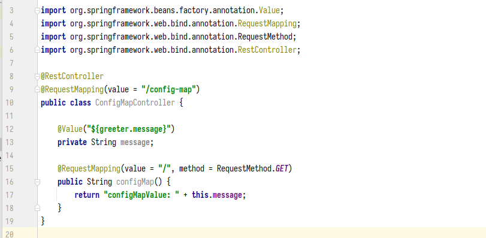

# ConfigMaps and Secrets: configuring applications

## **1. Introduction ConfigMaps**
Các Service thường có file cấu hình để tùy chỉnh theo từng môi trường vd: Develop, UAT, PROD, mỗi môi trường này đều có những biến môi trường khác nhau. Đối với việc deploy các service trên Kubernetes thì sẽ tạo ra các file configMap (chứa các biến môi trường) trương ứng với các môi trường. Sẽ có 2 cách để inject các biến môi trường vào containers: thông qua các biến môi trường, thông qua Volume.

## **1.1 Creating ConfigMap and inject varivable to container as env**
> examples file: learn-k8s/3.core-components/3.4-configmap-secret/hand-on/config-map

Mình có file application.yaml như sau:


Mình có cái controller như sau:



```yml
kind: ConfigMap
apiVersion: v1
metadata:
  name: demo-config-map          # Tên của ConfigMap
  namespace: config-map          # ConfigMap này được tạo ở namespace: `config-map`. Service đc deploy ở namespace nào thì sẽ đọc được configMap ở namespace đó.
data:                            # Phần này chứa các biến môi trường dạng key: value.
  MESSAGE: Hello nha :D    

---

apiVersion: v1
kind: Pod
metadata:
  name: demo-config-map
  namespace: config-map
  labels:
    app: demo-config-map
spec:
  containers:
  - name: demo-config-map
    image: "thanhnb1/demo:config-map"
    resources:
      limits:
        cpu: 200m
        memory: 500Mi
      requests:
        cpu: 100m
        memory: 200Mi
    env:                        # Phần naỳ đang inject các biến môi trường vào bên trong Pod.
    - name: MESSAGE             # Lấy biến môi trường tên là: "MESSAGE"
      valueFrom:
        configMapKeyRef:
          name: demo-config-map # Lấy biến môi trường ở configMap có tên là: `demo-config-map`.
          key: MESSAGE          # Biến môi trường có Key là: "MESSAGE"
    ports:
    - containerPort: 8080
      name: http

kubectl get all -n config-map -o wide
NAME                  READY   STATUS    RESTARTS   AGE    IP            NODE   NOMINATED NODE   READINESS GATES
pod/demo-config-map   1/1     Running   0          3m1s   10.1.28.111   nbt    <none>           <none>
pod/pod-for-test      1/1     Running   0          59s    10.1.28.121   nbt    <none>           <none>

kubectl exec -it pod/pod-for-test -n config-map sh 
kubectl exec [POD] [COMMAND] is DEPRECATED and will be removed in a future version. Use kubectl exec [POD] -- [COMMAND] instead.

# Gọi vào Pod "demo-config-map"
/ # curl http://10.1.28.111:8080/config-map/
configMapValue: Hello nha :D/ # ^C
/ # 

# Thực hiện print các biến môi trường trong container
kubectl exec -it pod/demo-config-map -n config-map sh
kubectl exec [POD] [COMMAND] is DEPRECATED and will be removed in a future version. Use kubectl exec [POD] -- [COMMAND] instead.
/ # printenv
KUBERNETES_SERVICE_PORT=443
KUBERNETES_PORT=tcp://10.152.183.1:443
LANGUAGE=en_US:en
HOSTNAME=demo-config-map
SHLVL=1
HOME=/root
JAVA_VERSION=jdk-11.0.15+10
TERM=xterm
KUBERNETES_PORT_443_TCP_ADDR=10.152.183.1
PATH=/opt/java/openjdk/bin:/usr/local/sbin:/usr/local/bin:/usr/sbin:/usr/bin:/sbin:/bin
KUBERNETES_PORT_443_TCP_PORT=443
KUBERNETES_PORT_443_TCP_PROTO=tcp
LANG=en_US.UTF-8
KUBERNETES_SERVICE_PORT_HTTPS=443
KUBERNETES_PORT_443_TCP=tcp://10.152.183.1:443
LC_ALL=en_US.UTF-8
JAVA_HOME=/opt/java/openjdk
MESSAGE=Hello nha :D                       # Đây là biến môi trường được inject từ ConfigMap.
KUBERNETES_SERVICE_HOST=10.152.183.1
PWD=/
```

## **1.2 Creating ConfigMap and inject varivable to container as volume**

Có thể mount các biến configs dưới dạng volume, đối với cách inject theo dạng biến môi trường thì những project cần ít thì oke nhưng nếu mà nhiều configs thì cái file Pod.yaml hay deployment.yaml sẽ bị rất dài.

```yml
kind: ConfigMap
apiVersion: v1
metadata:
  name: cm-as-volume
  namespace: config-map
data:
  application.yaml: |-
    # Lấy thông tin IP và Port thông qua biến môi trường.
    # clients:
    #     service-2:
    #         uri: http://${SERVICE_2_SERVICE_HOST:service-2}:${SERVICE_2_SERVICE_PORT:80}

    # Lấy thông tin IP và Port thông qua DNS.
    clients:
        service-2:
            uri: http://${SERVICE_2:service-2}

    greeter:
        message: ${MESSAGE:message configmap as volume change}
---

apiVersion: v1
kind: Pod
metadata:
  name: demo-config-map
  namespace: config-map
  labels:
    app: demo-config-map
spec:
  containers:
  - name: demo-config-map
    image: "thanhnb1/demo:config-map"
    resources:
      limits:
        cpu: 200m
        memory: 500Mi
      requests:
        cpu: 100m
        memory: 200Mi
    ports:
    - containerPort: 8080
      name: http
    volumeMounts:
      - mountPath: /config           # Đối với spring boot thì mount vào folder config thì sẽ override được config của service.
        name: application-config     # Tên volume ở phần `volumeMounts` giống với `volumes`.
        readOnly: true               # Chỉ là readOnly.
  volumes:
    - name: application-config       # Tên volume ở phần `volumeMounts` giống với `volumes`. 
      configMap:                     
        name: cm-as-volume           # Tên configMap 
        items:
        - key: application.yaml      # Tên Key ở đây là file `application.yaml` trong file configMap.
          path: application.yaml
```

**Demo**
```bash
kubectl apply -f 4.configMap-volume.yaml -n config-map
configmap/cm-as-volume created

kubectl apply -f 3.pod-cm-volume.yaml -n config-map
pod/demo-config-map created

kubectl apply -f pod-for-test.yaml -n config-map
pod/pod-for-test created

kubectl get all -n config-map
NAME                  READY   STATUS    RESTARTS   AGE
pod/demo-config-map   1/1     Running   0          2m24s
pod/pod-for-test      1/1     Running   0          117s

kubectl exec -it pod/demo-config-map -n config-map sh

# Đã thấy configMap đc mount vào container.
/ # curl http://localhost:8080/config-map/
configMapValue: message configmap as volume change/ # ^C

# Khi printenv thì không thấy biến configs vì mình đang sử dụng cách mount file configs dưới dạng volume.
/ # printenv
KUBERNETES_SERVICE_PORT=443
KUBERNETES_PORT=tcp://10.152.183.1:443
LANGUAGE=en_US:en
HOSTNAME=demo-config-map
SHLVL=1
HOME=/root
JAVA_VERSION=jdk-11.0.15+10
TERM=xterm
KUBERNETES_PORT_443_TCP_ADDR=10.152.183.1
PATH=/opt/java/openjdk/bin:/usr/local/sbin:/usr/local/bin:/usr/sbin:/usr/bin:/sbin:/bin
KUBERNETES_PORT_443_TCP_PORT=443
KUBERNETES_PORT_443_TCP_PROTO=tcp
LANG=en_US.UTF-8
KUBERNETES_SERVICE_PORT_HTTPS=443
KUBERNETES_PORT_443_TCP=tcp://10.152.183.1:443
LC_ALL=en_US.UTF-8
JAVA_HOME=/opt/java/openjdk
KUBERNETES_SERVICE_HOST=10.152.183.1
PWD=/
/ # ^C
/ # 
```

#### **NOTE:**
  - Ở cách truyền các biến configs dưới dạng các biến môi trường, khi `ConfigMap` thay đổi thì các biến configs bên trong container sẽ không đổi theo (vì các biến này được inject lúc tạo containers, giống như phần Service Discovery phần 3.3). Để mà configs được load lại vào container thì cần xóa Pod đi tạo lại, hoặc rollout lại service nếu dùng Deployment.
  - Ở cách truyền các biến configs dưới dạng volume, khi `ConfigMap` thay đổi thì file config bên trong container cũng thay đổi theo luôn, Mình test với service (spring boot) thì vẫn cần phải xóa Pod hoặc rollout lại (chắc do spring boot thôi :D).


## **2. Secret**

`Secret` thì cũng giống với `ConfigMap`, `secret` cũng chứa các cấu hình nhưng `Secret` thường dùng để các thông tin bảo mật VD: password Database,.. dữ liệu trong `Secret` sẽ được mã hóa dưới dạng Base64.

## **2.1 Secret as environment variables**
```yml
apiVersion: v1
kind: Secret
metadata:
  name: mysecret
  namespace: secret
data:
  MESSAGE: bWVzc2FnZSBmcm9tIHNlY3JldA==

---

apiVersion: v1
kind: Pod
metadata:
  name: demo-secret
  namespace: secret
  labels:
    app: demo-secret
spec:
  containers:
  - name: demo-secret
    image: "thanhnb1/demo:config-map"
    resources:
      limits:
        cpu: 200m
        memory: 500Mi
      requests:
        cpu: 100m
        memory: 200Mi
    env:
    - name: MESSAGE
      valueFrom:
        secretKeyRef:
          name: mysecret
          key: MESSAGE
    ports:
    - containerPort: 8080
      name: http
```

**Demo**
```bash
kubectl create ns secret

kubectl apply -f . -n secret
secret/mysecret created
pod/demo-secret created

kubectl get all -n secret
NAME              READY   STATUS    RESTARTS   AGE
pod/demo-secret   1/1     Running   0          7s

# Thực hiện curl thì đã thấy load được config từ file secret.
kubectl exec -it pod/demo-secret -n secret sh
kubectl exec [POD] [COMMAND] is DEPRECATED and will be removed in a future version. Use kubectl exec [POD] -- [COMMAND] instead.

/ # 
/ # 
/ # curl http://localhost:8080/config-map/
configMapValue: message from secret/ # 

```
## **2.2 Secret as volume**

