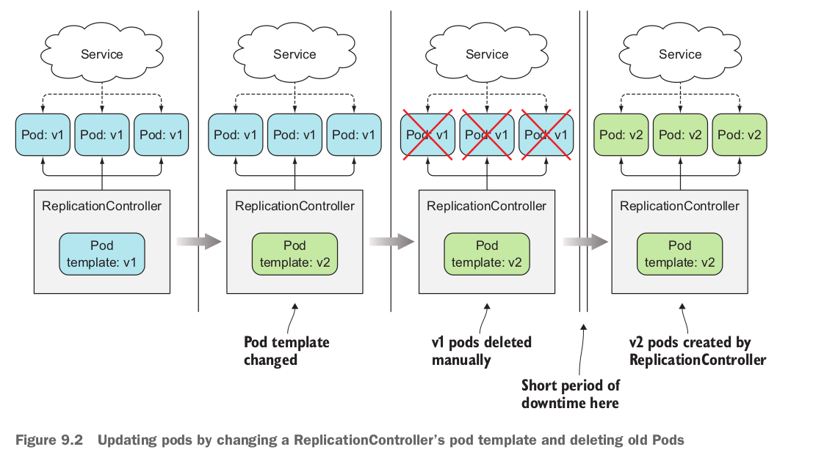
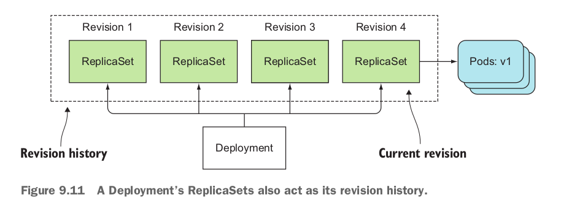

# Deployment
Những phần trước thì chúng ta đang chạy các service bên trong các `Pod`, quản lý số lượng `Pod` bằng `ReplicationController` hoặc `ReplicaSet`. Ở phần này thì giới thiệu thêm 1 Object nữa trong Kubernetes đó là: `Deployment`. Object `Deployment` sẽ có thể xử lý giống như `POd`, `ReplicationController` và `ReplicaSet` chỉ trong 1 file deployment.yaml , 
## **1. Updating version applications running in pods managed by ReplicationController or ReplicaSet**


> example file: learn-k8s/3.core-components/3.6-deployment/hands-on/ReplicationController.yaml
VD chúng ta có file ReplicationController như sau:
```yml
apiVersion: v1
kind: ReplicationController
metadata:
  name: rc-demo
spec:
  replicas: 4                        # số lượng Pod mong muốn.
  selector:
    app: label-pod                   # K8s sẽ tìm được Pods thông qua labels
                                     # để thực hiện manager Pods (đảm bảo số lượng Pod).
  
  # Đây là phần mô tả cho Pod
  template:
    metadata:
      name: demo-liveness-probe       # Tên Pod.
      labels:
        app: label-pod                # Tên label của Pod.
    spec:
      containers:
        - name: demo-liveness-probe   # Tên container.
          image: thanhnb1/demo:latest
          ports:
            - containerPort: 8080
```

**Thực hiện update image tag version**
```bash

kubectl get all -n deployment
NAME                READY   STATUS    RESTARTS        AGE
pod/rc-demo-4mbwh   1/1     Running   0               28s
pod/rc-demo-pkph5   1/1     Running   0               28s
pod/rc-demo-zbthh   1/1     Running   0               28s
pod/rc-demo-g5gq5   1/1     Running   0               28s

kubectl describe pod/rc-demo-4mbwh -n deployment
Name:         rc-demo-4mbwh
Namespace:    deployment
Priority:     0
Node:         nbt/192.168.1.123
Start Time:   Sun, 31 Jul 2022 22:20:39 +0700
Labels:       app=label-pod
Annotations:  cni.projectcalico.org/containerID: 555a6eacfd6ac8415366600a7ee531ecfe0a7adfa952f175b921795a2aa6d2ce
              cni.projectcalico.org/podIP: 10.1.28.78/32
              cni.projectcalico.org/podIPs: 10.1.28.78/32
Status:       Running
IP:           10.1.28.78
IPs:
  IP:           10.1.28.78
Controlled By:  ReplicationController/rc-demo
Containers:
  demo-liveness-probe:
    Container ID:   containerd://a0195bfbdf53b0d1021770686587c9e162b8867ff7effbbf46229f8851332f85
    Image:          thanhnb1/demo:latest # Đang chạy image tag = latest
    Image ID:       docker.io/thanhnb1/demo@sha256:44ae04acedb6c38ef8a80320af17071512be6a6d843e7c5b9014c2873a21dfa1
    Port:           8080/TCP
    Host Port:      0/TCP
    State:          Running
      Started:      Sun, 31 Jul 2022 22:20:43 +0700


# Thực hiện đổi image tag từ thanhnb1/demo:latest => thanhnb1/demo:v2
kubectl apply -f ReplicationController.yaml -n deployment
replicationcontroller/rc-demo configured

# Ta thấy POd không restart khi thay đổi image tag
kubectl get all -n deployment
NAME                READY   STATUS    RESTARTS       AGE
pod/rc-demo-4mbwh   1/1     Running   0              50s
pod/rc-demo-pkph5   1/1     Running   0              50s
pod/rc-demo-zbthh   1/1     Running   0              50s
pod/rc-demo-g5gq5   1/1     Running   0              50s

# Thấy sau khi đổi image tag thì các POd vẫn chạy image tag = latest.
kubectl describe pod/rc-demo-4mbwh -n deployment
Name:         rc-demo-4mbwh
Namespace:    deployment
Priority:     0
Node:         nbt/192.168.1.123
Start Time:   Sun, 31 Jul 2022 22:20:39 +0700
Labels:       app=label-pod
Annotations:  cni.projectcalico.org/containerID: 555a6eacfd6ac8415366600a7ee531ecfe0a7adfa952f175b921795a2aa6d2ce
              cni.projectcalico.org/podIP: 10.1.28.78/32
              cni.projectcalico.org/podIPs: 10.1.28.78/32
Status:       Running
IP:           10.1.28.78
IPs:
  IP:           10.1.28.78
Controlled By:  ReplicationController/rc-demo
Containers:
  demo-liveness-probe:
    Container ID:   containerd://a0195bfbdf53b0d1021770686587c9e162b8867ff7effbbf46229f8851332f85
    Image:          thanhnb1/demo:latest # Đang chạy image tag = latest
    Image ID:       docker.io/thanhnb1/demo@sha256:44ae04acedb6c38ef8a80320af17071512be6a6d843e7c5b9014c2873a21dfa1
    Port:           8080/TCP
    Host Port:      0/TCP
    State:          Running
      Started:      Sun, 31 Jul 2022 22:20:43 +0700

# Để mà các POd sử dụng image tag mới (v2) thay cho latest thì phải xóa hết các Pod đi, để các Pod tạo lại thì sẽ update image được.

kubectl delete pod/rc-demo-g5gq5 -n deployment
pod "rc-demo-g5gq5" deleted

kubectl get all -n deployment
NAME                READY   STATUS    RESTARTS      AGE
pod/rc-demo-4mbwh   1/1     Running   0             12m
pod/rc-demo-pkph5   1/1     Running   0             12m
pod/rc-demo-zbthh   1/1     Running   0             12m
pod/rc-demo-2tdw2   1/1     Running   0             6s  # Thấy Pod này tạo lại rồi.

# Đã thấy dùng image tag mới.
kubectl describe pod/rc-demo-2tdw2 -n deployment
Name:         rc-demo-2tdw2
Namespace:    deployment
Priority:     0
Node:         nbt/192.168.1.123
Start Time:   Sun, 31 Jul 2022 22:32:49 +0700
Labels:       app=label-pod
Annotations:  cni.projectcalico.org/containerID: a2f78536fdfd9ebfcedbd0965fcf70d8fdf8430c9deba7e74b95795066ab51f6
              cni.projectcalico.org/podIP: 10.1.28.106/32
              cni.projectcalico.org/podIPs: 10.1.28.106/32
Status:       Running
IP:           10.1.28.106
IPs:
  IP:           10.1.28.106
Controlled By:  ReplicationController/rc-demo
Containers:
  demo-liveness-probe:
    Container ID:   containerd://9bd31aa8102b09c420a2f6e9c4a9c9b162e93665e424920f355b64e04b7d963b
    Image:          thanhnb1/demo:v2
```
#### **=> TÓM LẠI:** Sẽ update được image tag nhưng phải xóa hết các Pod cũ đi để tạo lại Pod mới. 

## **2. Creating a Deployment**
Việc tạo `Deployment` cũng không khác gì so với việc tạo `ReplicationController`. `Deployment` sẽ bao gồm lable selector, replicaSet, podTemplate. Cái đặc biệt của Deployment đó là các `deployment strategy` mô tả việc update nên được làm như thế nào khi Deployment update.

## **2.1 CREATING A DEPLOYMENT MANIFEST**
> example file: learn-k8s/3.core-components/3.6-deployment/hands-on/1.deployment.yaml
```yaml
apiVersion: apps/v1
kind: Deployment                # Object là Deployment
metadata:
  name:  deployment-demo
  labels:
    app:  deployment-demo
spec:
  selector:
    matchLabels:
      app: deployment-demo
  replicas: 2                  # Số lượng Pod = 2
  template:
    metadata:
      labels:
        app:  deployment-demo
    spec:
      containers:
      - name:  deployment-demo
        image:  thanhnb1/demo:v2
        resources:
          requests:
            cpu: 100m
            memory: 100Mi
          limits:
            cpu: 100m
            memory: 100Mi
      restartPolicy: Always
```
**Demo**
```bash
kubectl apply -f 1.deployment.yaml -n deployment
deployment.apps/deployment-demo created

kubectl get all -n deployment
NAME                                   READY   STATUS    RESTARTS   AGE
pod/deployment-demo-5f589cb6c4-gbhmt   1/1     Running   0          6s
pod/deployment-demo-5f589cb6c4-c6zvq   1/1     Running   0          6s

NAME                              READY   UP-TO-DATE   AVAILABLE   AGE
deployment.apps/deployment-demo   2/2     2            2           6s

NAME                                         DESIRED   CURRENT   READY   AGE
replicaset.apps/deployment-demo-5f589cb6c4   2         2         2       6s
```
## **2.2 Updating a Deployment**
Thực hiện update image tag từ v2 -> v4 trong file deployment.
```bash
kubectl apply -f 1.deployment.yaml -n deployment
deployment.apps/deployment-demo configured

# Thấy những pod cũ đang bị xóa đi, để tạo lại các Pod mới (update image tag mới).
kubectl get all -n deployment
NAME                                   READY   STATUS        RESTARTS   AGE
pod/deployment-demo-84b7f6b884-766lb   1/1     Running       0          2s
pod/deployment-demo-5f589cb6c4-gbhmt   1/1     Terminating   0          8m3s
pod/deployment-demo-84b7f6b884-dr2kx   1/1     Running       0          1s
pod/deployment-demo-5f589cb6c4-c6zvq   1/1     Terminating   0          8m3s

NAME                              READY   UP-TO-DATE   AVAILABLE   AGE
deployment.apps/deployment-demo   2/2     2            2           8m3s

# Mỗi lần update sẽ đều tạo ra các replicaSet, replicaset cũ thì scale về 0 Pod, còn replicaset mới thì là 2 Pod như trong file deployment.
# Replicaset này sẽ phục vụ cho việc mình rollback lại về các version cũ.
NAME                                         DESIRED   CURRENT   READY   AGE
replicaset.apps/deployment-demo-84b7f6b884   2         2         2       2s   
replicaset.apps/deployment-demo-5f589cb6c4   0         0         0       8m3s

# Xem lịch sử Update của Deployment
kubectl rollout history deployment deployment-demo -n deployment
deployment.apps/deployment-demo 
REVISION  CHANGE-CAUSE
1         <none>
2         <none>

# Vì mỗi lần Update thì ReplicaSet không bị xóa đi, nên là Kubernetes có thể rollback về bất cứ version nào mà không chỉ là version trước đó.
kubectl rollout undo deployment/deployment-demo -n deployment --to-revision=1
deployment.apps/deployment-demo rolled back

# POd được tạo lại và ăn theo image tag trước đó.
 kubectl get all -n deployment
NAME                                   READY   STATUS        RESTARTS   AGE
pod/deployment-demo-5f589cb6c4-ztqrn   1/1     Running       0          5s
pod/deployment-demo-5f589cb6c4-pdz6q   1/1     Running       0          3s
pod/deployment-demo-84b7f6b884-766lb   1/1     Terminating   0          7m25s

NAME                              READY   UP-TO-DATE   AVAILABLE   AGE
deployment.apps/deployment-demo   2/2     2            2           15m

NAME                                         DESIRED   CURRENT   READY   AGE
replicaset.apps/deployment-demo-5f589cb6c4   2         2         2       15m
replicaset.apps/deployment-demo-84b7f6b884   0         0         0       7m25s
```


#### **=> NOTE:** Deployment có thể update resource, mỗi lần update thì sẽ sinh ra một replicaset phục vụ cho việc rollback, mình có thể rollback về bất cứ phiên bản nào. Số lượng phiên bản default sẽ là 10.

## **2.3 Controlling the rate of the rollout**
Khi mà update Deployment resource thì các Pod mới sẽ được tạo ra, các Pod cũ sẽ bị xóa (xóa đến lúc nào hết Pod cũ thì thôi). Kubernets cũng cung cấp cho mình cách để config cách Pod mới được tạo ra và Pod cũ bị xóa đi như thế nào thông qua việc thêm các thuộc tính của rolling update strategy.

**INTRODUCING THE MAXS URGE AND MAX UNAVAILABLE PROPERTIES OF THE ROLLING UPDATE STRATEGY**
Có 2 thuộc tính mà mình có thể thêm vào file Deployment là `maxSurge` và `maxUnavailable` được setting như là một phần của `rollingUpdate`

https://medium.com/kokster/updating-kubernetes-deployments-867421d4e337