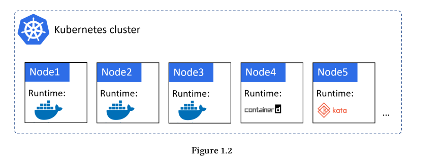
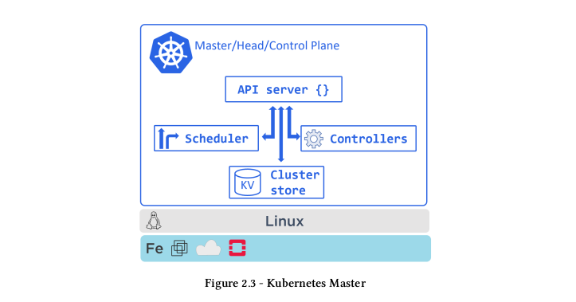

## #k8s enough to use

### 1: k8s-overview

* Khi hệ thống của chúng ta có nhiều các service => nhiều container, các containers này có thể được deploy trên nhiều node, vậy thì làm sao để các container này có thể nói chuyện được với nhau, tương tác với nhau. Thì lúc này các container cần có một người "đội trưởng", có nhiệm vụ điều phối, quản lý các containers này hoạt động hiệu quả nhất. Người đội trưởng ở đây là các orchestrator có thể kể đến như: Docker Swarm, Kubernetes,..
* ***Kuberntes có thể làm được gì?***
  * Deploy applications.
  * Scale up or down application.
  * Self-heal it when things break.
  * Perform zero-downtime rolling update and rollbacks.
  * .....
* ***Kuberntes và Docker***
  * Trong mô hình này thì bạn sẽ viết code service (java, php,...), sau đó bạn dùng Docker để đóng gói service, test, và deploy service, cái bước cuối cùng, Deploy và running service thì sẽ do Kuberntes xử lý.
  * Ví dụ bạn đang có khoản 10 Node để chạy các services, trong mỗi node thì sẽ cài *container runtime* có thể là Docker, Containerd,... Điều này có nghĩa là Docker hay các container runtime khác sẽ đứng ở dưới sẽ start, stop các container application. Kuberntes sẽ đứng ở trên nhìn toàn cảnh các node, các service, Kubernetes sẽ là người ra các quyết định như: container sẽ được chạy trên Node nào, quyết định khi nào thì cần scale up hoặc là scale down,...
    

### 2: Kubernetes core-concept

Trong phần này, thì chúng ta sẽ nói đến những components quan trọng tạo lên K8s cluster và deploy applications. Mục tiêu của phần này là giới thiệu về các components concept quan trọng trong K8s.

* Master and Nodes.
* Packaging app.
* Declarative configuration and desired state.
* Pods.
* Deployments.
* Services.

### 2.1: Kubernetes as a cluster

* Kubernetes cluster có master node và các worker node. Master node (control plane) có API, có `scheduler` cho việc assign các task đến các worker node, trạng thái của các nodes sẽ được lưu lại, nodes (master node, worker node) là nơi để chạy application.
* Cũng có thể nghĩ master node (control plane) giống như bộ não của cluster còn các worker nodes giống như cơ bắp của cluster, master node (control plane) được coi là bộ não của cluster vì master node là nơi implements tất cả những feature quan trong như: auto-scaling, zero-downtime rolling update. Worker node được coi là các cơ bắp của cluster vì nó cả ngày chạy các application code.
* Hãy tưởng tượng kubernetes cluster với một đội bóng, với đội bóng mỗi cầu thủ trên sân sẽ có những vai trò và trách nhiệm khác nhau, để cho các cầu thủ có thể hoạt động được một cách trơ tru thì cần có huấn luyện viên, hệ thông của mình cũng vậy, có rất nhiều các service, mỗi service sẽ có một nghiệm vụ riêng, để cho các service này hoạt động một các trơn tru thì nó cũng cần có một "huấn luyện viên", "huấn luyện viên" này là orchestration, và ở đây mình đang tìm hiểu kubernetes orchestration.
* Cách hoạt động của k8s cluster
  * Khi bạn code 1 service (ví dụ service Java), thì bạn cần phải đóng gói cái service này (containerization) sau đó thì deploy lên K8s cluster (k8s cluster có thể được tạo từ 1 node hoặc nhiều node), vậy khi có 1 task mới là deploy 1 serivce thì k8s nó sẽ hoạt động thế nào để có thể deploy service.
  * The master node (head, head node hay control plane), Master Node sẽ cho trách nhiệm ra những quyết định

### 2.2: Master(control plane)

Kubernetes master là một collection of system service made up the control plane of the cluster.

**1. The API server**
Tất cả các tương tác giữa các components đều phải thông qua API server.
Nó cung cấp một RESTful API cho phép bạn `POST` YAML config files to HTTPS. Những file YAML config này thường được gọi là các `manifests`, chứa các `desired state` của application. `desired state` bao gồm: container image sử dụng là gì?, port expose là gì?, có bao nhiêu Pod replicas để chạy application.
Tất cả request sẽ được API server check authen và author, config trong file YAML hợp lệ => config file sẽ được apply trên kubernetes cluster.

**2. The cluster store**
The cluster store là thành phần duy nhất là staful của control plane, nó lưu trữ các configs và trạng thái của cluster. `no cluster store, no cluster.`

**3. The controller manager**
`The controller manager` là nơi implements tất cả control loops, `The controller manager` sẽ monitor cluster và sẽ phản ứng với những vấn đề ở cluster. K8s cluster thì sẽ có mấy loại controller như: `node controller`, `endpoint controller`, `replicaset controller`, mỗi cái controller sẽ chạy liên tục theo dõi sự thay đổi từ phía của `API Server` nếu có thay đổi để đảm bảo được `current state` của cluster sẽ đúng với `desired state` (trạng thái mong muốn đạt được).
Mình có thể giải thích logic ở phần controller như sau:

* Lấy được trạng thái mong muốn(`desired state`) từ API Server. VD: tôi muốn chạy một serviceA chạy 3 instance (ở đây là 3 Pod).
* The controller manager sẽ phải quan sát trạng thái hiện tại của serviceA trên cluster đã đủ số lượng 3 Pod như mong muốn hay chưa?
* Trong trường hợp chưa đủ số lượng Pod thì cần phải tạo thêm các Pod cho serviceA, hoặc là có một hoặc nhiều Pod của serviceA bị fail thì controller manager cũng sẽ phải re-create lại các Pod làm sao cho đủ số lượng Pod mong muốn.

Mỗi loại controller manager sẽ hoạt động riêng biệt, VD: `node controller` thì sẽ chỉ quan tâm đến trạng thái của các Node có healthy hay không thôi, `replicaset controller` thì sẽ chỉ quan tâm đến các Pod của service đã được tạo ra đủ số lượng mong muốn hay chưa, và `endpoint controller` cũng vậy nó chỉ quan tâm rằng khi Pod mới được tạo ra thì IP của POd mới có được cập nhật vào Object endpoint hay không?, để đảm bảo rằng khi request đến với service thì sẽ vào Pod mới tạo chứ không phải vào Pod cũ.

**4. The scheduler**
Khi một task mới (vd: ở đây là deploy serviceA chạy 3 instance), thì yêu cầu này sẽ đến với `API-Server` (thằng này sẽ tiếp nhận các yêu cầu) --(request)--> `The scheduler`.
Nhiệm vụ của `The Scheduler` là sẽ nhìn thằng `API Server` để nhận các task, sau đó thì `The Scheduler` sẽ chọn ra một cái Worker Node phù hợp nhất để chạy task (phù hợp ở đây có thể là: Node healthy, đủ resource để có thể chạy task là tốt nhất).
Trong trường hợp nếu mà `The Scheduler` không tìm được một node nào phù hợp thì task này sẽ ở trạng thái là pending.
`The Scheduler` sẽ không chịu trách nhiệm cho việc cái task này có running hay không? mà nó chỉ có nhiệm vụ là chọn ra một cái Node phù hợp để chạy cái task (ở đây là deploy service), còn service đó deploy thế nào, có lỗi khi deploy hay không thì không quan tâm, nếu mà không chọn được Node phù hợp thì pending thôi.

**5. Túm cái quần của các thành phần trong Master Node (control plane) =))**

https://blog.devgenius.io/k8s-understand-deployment-2ec96fbcf1eas
